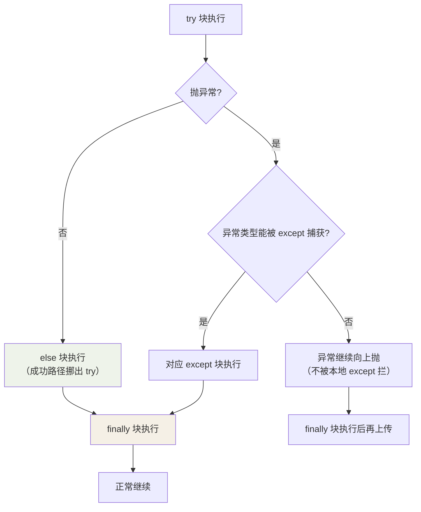
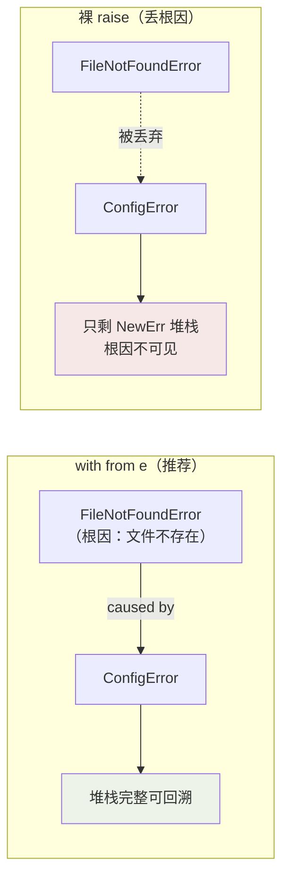

## 用一张图理解执行流向

`try / except / else / finally` 四个分支的执行时机，新手最容易搞混；
尤其**`finally` 无论结果如何都执行**、`else` 只在"无异常"时跑：



**由此可推理出三条纪律：**

- **不要裸 `except:`**——它会连 `KeyboardInterrupt`（Ctrl+C）、系统退出信号
  一起吞掉；最低限度也要 `except Exception`。
- **捕获从窄到宽排队**，子类异常放前面（否则父类的纯捕获会让子类永远
  轮不到）。
- **`else` 块的价值**：只把"可能抛异常"的最小操作包进 try，`else` 里的
  成功分支即使抛了异常，也不会被同一个 except 误捕。

## EAFP：Python 的世界观

Java 是 LBYL（Look Before You Leap，先检查再动手），Python 是
EAFP（Easier to Ask Forgiveness than Permission，先动手，出事再说）：

```python
# LBYL：检查在并发下仍可能失效，还多一次查询
if "key" in d:
    v = d["key"]
else:
    v = default

# EAFP：一步到位，"获取许可"和"使用"之间没有竞态窗口
try:
    v = d["key"]
except KeyError:
    v = default
```

EAFP 的本质：**把"检查 + 使用"合并成一次原子操作**，也让"正常路径"的代码
不被防御性判断淹没。`dict.get(key, default)`、`getattr(obj, "x", None)`
是这类模式的语法糖。

## 完整结构

```python
try:
    f = open(path)          # ① 只包可能抛异常的最小范围
    data = f.read()
except FileNotFoundError:
    log.warning("跳过 %s", path)   # ② 只捕明确的异常类型
    data = ""
except (KeyError, ValueError) as e:
    raise                      # 处理不了就原样抛出
else:
    process(data)             # ③ try 没抛异常才执行——把"成功路径"挪出 try
finally:
    f.close()                 # ④ 无论如何都执行：清理资源
```

## 异常链：raise from

```python
def load_config(path):
    try:
        return json.loads(path.read_text())
    except FileNotFoundError as e:
        raise ConfigError(f"配置缺失: {path}") from e   # 保留原始堆栈
```

不加 `from e`，原始异常的堆栈就丢了——排查时看不到"真正死因"。
`raise ... from None` 则是刻意隐藏原因，少用。

用图看 `raise from` 的价值：



## 自定义异常

```python
class AppError(Exception):
    """业务异常基类：让调用方能一把抓住所有自家错误"""

class PaymentError(AppError):
    def __init__(self, order_id: str, reason: str):
        super().__init__(reason)
        self.order_id = order_id
```

自定义异常的意义不在加逻辑，而在**给调用方一个可精确捕获的类型**：
`except AppError` 一网打尽业务错误，放行真正的程序 bug（TypeError 之类）。

## 小结

- EAFP 是 Python 惯用法：先做，捕获具体异常，别裸 except。
- `else` 收成功路径、`finally` 做清理；资源管理更推荐 `with`（见
  [pathlib 与文件 IO](/python/intermediate/stdlib/03-pathlib-io/)）。
- 转译异常时 `raise NewX() from e` 保留完整因果链。
