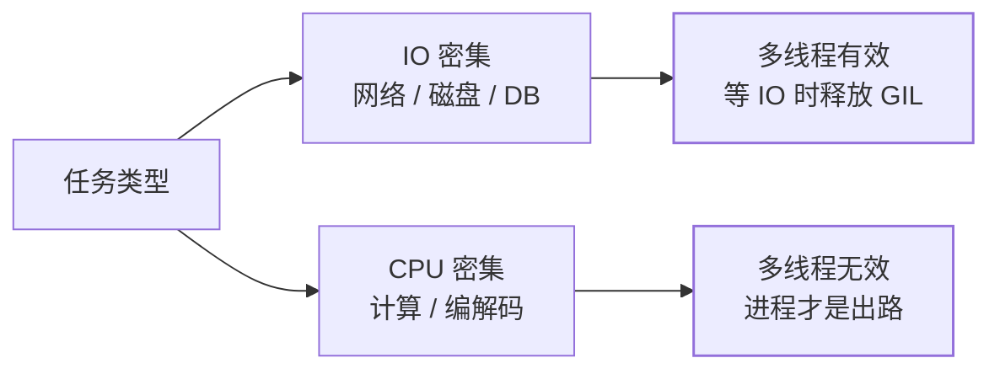

Java 程序员初见 Python 线程都会被吓一跳：由于 **GIL（全局解释器锁）**，
同一时刻只有一个线程在执行 Python 字节码。多线程无法让 CPU 密集任务变快——
但 IO 密集任务（网络、文件、数据库）依然是多线程的经典赢面，因为
**线程等 IO 时会释放 GIL**。（GIL 为什么存在，深入分析见
[GIL 深入](/python/advanced/internals/01-gil/)。）

## 两种启动方式：Thread 与线程池

```python
from threading import Thread

t = Thread(target=fetch, args=("https://example.com",))
t.start()      # 启动（对应 Java 的 thread.start()）
t.join()       # 等待结束
```

裸 Thread 适合一次性后台任务；生产代码更常用**线程池**，接口与 Java 的
ExecutorService 几乎一一对应：

```python
from concurrent.futures import ThreadPoolExecutor

with ThreadPoolExecutor(max_workers=10) as pool:
    results = list(pool.map(fetch, urls))        # 批量提交、按序返回
    future = pool.submit(fetch, url)             # 单个提交 → Future
    page = future.result(timeout=5)              # 阻塞取值（可超时）
```

`submit` 返回 `Future`——和 Java 一样是"未来结果"的占位符。

## 什么时候线程有用



经验法则：抓 100 个网页，线程池把 10 分钟压成 1 分钟；把一张大图逐像素
变换，开再多线程也只有一颗核在算。判断依据就一条：**时间花在"等"还是
"算"**。

## 锁：保护"读-改-写"序列

GIL 保证单条字节码原子，但**不保证组合操作原子**——`counter += 1` 是
读、加、写三步，线程切换可以插在中间：

```python
from threading import Lock

lock = Lock()

def inc():
    global counter
    with lock:            # 对应 Java 的 synchronized(lock)
        counter += 1
```

与 Java 的差异：没有 synchronized 关键字、没有 volatile，纪律全靠显式锁 +
`with`。更现代的答案是**少共享**——把共享状态收敛进队列。

## queue.Queue：用消息传递替代共享状态

```python
from queue import Queue

tasks = Queue()
tasks.put(item)        # 生产者（内置锁，线程安全）
item = tasks.get()     # 消费者（空时阻塞）
tasks.task_done()
tasks.join()           # 等所有任务处理完
```

`Queue` 就是 Java `BlockingQueue` 的对应物。**"队列 + worker 线程"是
Python 多线程最稳的架构**：状态只有一份、归属清晰，省掉细粒度锁设计。

## 小结

- GIL 使多线程无法并行执行字节码，但等 IO 时释放——IO 密集任务线程依然有效。
- 生产代码用 ThreadPoolExecutor/submit/Future，接口对齐 Java ExecutorService。
- `+=` 这类组合操作要显式锁；更推荐 queue.Queue 收敛共享状态。
