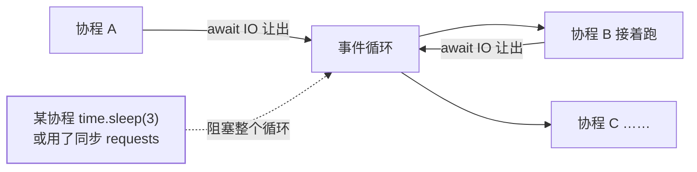

协程是生成器的进化：[生成器](/python/basic/functions/02-iterators-generators/)
用 `yield` 让出执行权的思路，推广到了整条调用链。asyncio 用**单线程 +
事件循环**实现并发：一万条并发连接不开一万条线程，而是让每个协程在"等
IO"时主动让出，循环去跑别人。

## async/await：让出与恢复

```python
import asyncio
import httpx

async def fetch(client, url):
    resp = await client.get(url)     # await：让出执行权，IO 完成后回来
    return resp.text

async def main():
    async with httpx.AsyncClient() as client:
        pages = await asyncio.gather(*[fetch(client, u) for u in urls])

asyncio.run(main())     # 建事件循环、跑 main、收尾
```

两条铁律：

1. **`async def` 定义协程函数，调用它只返回协程对象，不执行**——必须被
   `await` 或交给事件循环（`create_task`）。
2. **`await` 只能出现在 `async def` 内**——普通同步函数没有让出点。

对照 Java：CompletableFuture 是"回调编排"，async/await 是**用同步的写法
做异步的事**——`await` 以下的所有代码相当于"完成后的回调"，但读起来
是顺序逻辑。

## 阻塞是异步的毒药

事件循环是单线程的：**任何一个协程同步阻塞（time.sleep、requests.get、
重计算），全部协程跟着停**：



所以异步代码里要全链路替换：`time.sleep` → `asyncio.sleep`；
requests → `httpx.AsyncClient`；CPU 重活 → 丢进线程/进程池
（`loop.run_in_executor`）。**混用同步库是 asyncio 第一大坑**。

## Task 与 gather：并发编排

```python
async def main():
    t1 = asyncio.create_task(fetch("a"))   # 立即调度，开始执行
    t2 = asyncio.create_task(fetch("b"))
    a = await t1                            # await 之前两者已在并发跑
    b = await t2

    results = await asyncio.gather(fetch("a"), fetch("b"))  # 一起等、按序收
    done, pending = await asyncio.wait(     # 先到先得式编排
        {fetch("a"), fetch("b")}, return_when=asyncio.FIRST_COMPLETED)
```

超时与取消是内建能力——Java 里要 `Future.cancel` 加线程中断配合的活，
这里超时即取消：

```python
try:
    result = await asyncio.wait_for(slow(), timeout=2.0)
except asyncio.TimeoutError:
    ...    # slow() 已被自动 cancel，在下一个 await 点收到 CancelledError
```

## 与多线程怎么选

| 维度 | 多线程 | asyncio |
| ---- | ---- | ---- |
| 并发量 | 数十~数百（线程贵） | 数千~数万（协程轻） |
| 切换成本 | 内核态线程切换 | 用户态函数切换 |
| 生态要求 | 任意库可用 | 全链路异步库 |
| 适用 | 阻塞库为主、任务量中等 | 高并发 IO（爬虫、网关、长连接） |

两者不冲突：FastAPI 的 async 路由里调同步阻塞函数时，框架会自动把它丢进
线程池（见 [FastAPI](/python/intermediate/libs/03-fastapi/)）——两种模型
在工程里是叠加关系。

## 小结

- 协程在 await 点让出，事件循环单线程调度——高并发 IO 的正确姿势。
- 铁律：协程要被 await/create_task 才执行；一处同步阻塞卡死整个循环。
- gather 并发一组、wait_for 超时即取消；生态要求全链路异步。
