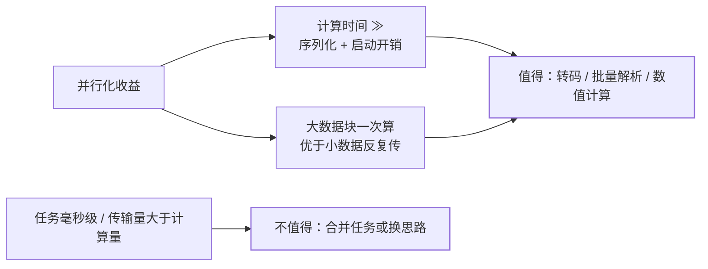

线程绕不开 GIL，**进程各自持有独立的解释器实例，天然多核并行**——这是
CPython 利用多核的正路。代价是 Java 线程没有的"隔离税"：内存不共享、
启动慢、通信要走序列化。

## 池是唯一推荐入口

```python
from concurrent.futures import ProcessPoolExecutor

def crunch(chunk):                    # 顶层函数：可被 pickle
    return sum(x * x for x in chunk)

if __name__ == "__main__":
    data = list(range(20_000_000))
    chunks = [data[i::8] for i in range(8)]      # 切成 8 块
    with ProcessPoolExecutor() as pool:
        total = sum(pool.map(crunch, chunks))    # 各块并行算，再汇总
```

三个必须遵守的规矩：

1. **`if __name__ == "__main__"` 保护**：macOS/Windows 默认以 spawn 方式
   启动子进程，会重新 import 主模块——没有保护就是递归起进程（同
   [`__main__` 惯用法](/python/basic/modules/01-modules-import/)）。
2. **函数与参数必须可 pickle**：子进程收参数、回结果都走序列化，lambda、
   闭包、打开的连接都传不过去。
3. **任务粒度要粗**：每个任务背着"启动 + 序列化"的固定成本，拆太细反而更慢。

## 成本模型：什么时候值得



任务耗时几十毫秒以下、或出入参比计算还大的场景，进程池是负优化。数值
计算优先考虑 numpy——底层 C 循环还能释放 GIL（见
[性能剖析与优化](/python/advanced/internals/04-profiling/)）。

## 进程间通信：序列化是硬边界

没有共享内存，协作只有两条路：

```python
from multiprocessing import Queue

q = Queue()
q.put({"task": 1})     # 内部走 pickle，传的是快照不是引用
print(q.get())
```

- **Queue/Pipe**：消息传递，对象经 pickle 复制过去；
- **共享内存**（`multiprocessing.Value/Array`）：真共享，但要自己配锁；
- 实际工程更多用**外置设施**：任务进 Redis/消息队列、结果落库——进程
  无状态，扩容和容错都简单（见 [Redis](/redis/)）。

## 三种并发模型怎么选

| 模型 | 原理 | 赢面 | 一句话判据 |
| ---- | ---- | ---- | ---- |
| 多线程 | 共享内存 + GIL 轮转 | IO 密集、中小并发 | 时间花在"等" |
| asyncio | 单线程事件循环 | 高并发 IO | 连接多、全链路可异步 |
| 多进程 | 独立解释器真并行 | CPU 密集 | 时间花在"算" |

混合形态也常见：asyncio 做接入层，CPU 活交给进程池
（`run_in_executor(ProcessPoolExecutor())`）。

## 小结

- 进程 = 独立解释器 = 真并行；代价是隔离：参数结果走 pickle、启动有固定开销。
- 用 ProcessPoolExecutor，记住 main 保护、可 pickle、粗粒度三纪律。
- 通信优先消息（Queue/外置队列），共享内存是最后手段。
