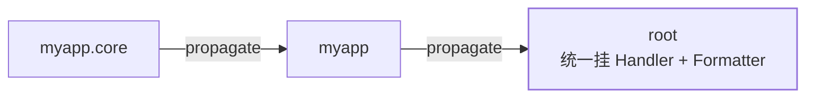

`print` 调试完该退场了。logging 是标准库里的日志框架，设计对标 Java 的
SLF4J/Logback——**Logger 树形层级 + Handler 输出 + Formatter 格式化**，
Java 程序员几乎无缝迁移。

## 分级与 Logger 层级

```python
import logging

logging.basicConfig(level=logging.INFO)
log = logging.getLogger(__name__)    # 惯例：模块路径做名字，形成层级树

log.debug("细节")                    # 10，默认不输出
log.info("常规事件")                  # 20
log.warning("预期外但可恢复")          # 30
log.error("出错")                     # 40
log.exception("出错带堆栈")            # error + 自动附 traceback，except 里用
```

Logger 名字即层级：`myapp` 是 `myapp.core` 的父。**子 Logger 处理完向父
传播**，所以在根上配一个 Handler 就能收到全应用的日志；`log.propagate =
False` 可阻止上浮。



对照 Java：层级 = Logback 的 logger 层级，level = 阈值过滤，Handler =
Appender——概念一一对应，只是配置从 XML 换成了代码或 dict。

## Handler 与 Formatter：双过滤模型

```python
log = logging.getLogger("myapp")
log.setLevel(logging.DEBUG)

fh = logging.FileHandler("app.log", encoding="utf-8")
fh.setLevel(logging.INFO)                      # Handler 还能再过滤一道
fh.setFormatter(logging.Formatter(
    "%(asctime)s %(levelname)s %(name)s %(message)s"))
log.addHandler(fh)
```

**Logger 级别决定要不要产生，Handler 级别决定要不要输出**——debug 进
文件、info 以上同时上控制台，就是两个 Handler 不同 level 的组合。
Formatter 里的 `%(...)s` 不是字符串格式化，是 LogRecord 属性查表。

## 别在库里配日志

一条社区铁律，Java 世界同样适用：

- **库代码**：只 `getLogger(__name__)` + 输出，**不配置**（不加 handler、
  不 setLevel）——配置权归应用；
- **应用入口**：`basicConfig`/dictConfig 统一配一次；
- **框架**（FastAPI/uvicorn）有自己的日志配置，覆盖前先读文档。

库擅自 `basicConfig` 会抢走应用的配置权——日志格式混乱十有八九源于此。
另外日志是泄露重灾区：密钥、身份证号先脱敏再打。

## 与异常处理的配合

```python
try:
    load_config()
except ConfigError:
    log.exception("配置加载失败，使用默认配置")   # 堆栈自动带上
    return DEFAULT
```

`log.exception` 只在 except 块里用。纪律：**吞了才记，要抛就只 log 后
`raise`**，让最外层入口统一记录——同一错误记两遍比漏记更干扰排查。

## 小结

- 五级日志 + exception 自动带堆栈；getLogger(__name__) 成传播树，根上统一配置。
- Logger 管"产生"、Handler 管"输出"、Formatter 管格式，三者正交。
- 库只打日志不配置；吞异常才记日志，要上抛就 raise。
