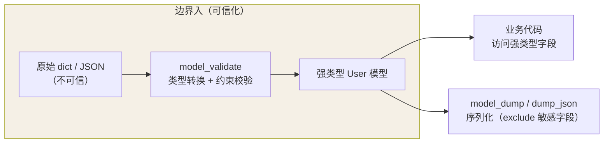
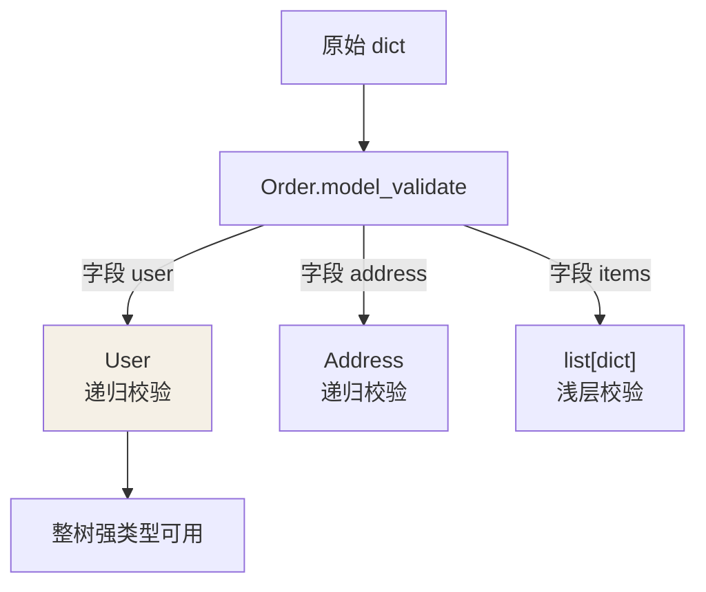

## 为什么需要运行时校验

[typing](/python/intermediate/stdlib/04-typing/) 只在静态检查时存在，
运行时形同虚设。而数据在**边界处**最不可信——HTTP 请求体、配置文件、
第三方 API 响应，都可能在运行时给出任意 JSON。Pydantic 把类型标注从
"给 IDE 看"升级为"运行时强制执行"：

```python
from pydantic import BaseModel, Field

class User(BaseModel):
    id: int
    name: str = Field(min_length=1, max_length=50)
    email: str
    tags: list[str] = []
    is_active: bool = True

User(id="123", name="ada", email="a@x.com")
# ValidationError? 不——"123" 被宽松强制转换为 123（int 类字段接受数字串）

User(id="abc", ...)
# ValidationError：id 无法解析为 int，报错信息带字段路径和原因
```

对比手写校验（`if not isinstance(...)` 的梯田）：**校验规则和字段定义
写在同一行**，错了有精确的字段级错误报告，还是结构化嵌套的。

## 核心管线：校验进、序列化出

Pydantic 的价值全在**边界处的"进/出"两个动作**——它把不可信的原始 dict
在入口转成强类型模型，出口再按需序列化（可排除敏感字段）：



整条链让"外部任意 JSON"在入口**一次性被驯服**，其后代码不再面对裸 dict。

## 嵌套模型：复杂结构层层解析

```python
class Address(BaseModel):
    city: str
    zip_code: str

class Order(BaseModel):
    order_id: int
    user: User                  # 嵌套模型
    address: Address
    items: list[dict]           # 边界内仍可留白

order = Order.model_validate(raw_json_dict)   # 整棵树一次解析
order.user.name                                # 全部有类型保证
```

原始 dict 的 `raw["user"]["naem"]`（拼错）运行时才炸，且报错位置
不知所云；Pydantic 在入口一次解析，**之后代码面对的是强类型世界**。

嵌套模型是一棵"一次递归解析的树"——外层校验到字段时，若它又是
BaseModel，就递归调用其 `model_validate`：



## 序列化往返

```python
class User(BaseModel):
    id: int
    name: str
    password: str = Field(exclude=True)     # 永不出现在输出里

u = User.model_validate({"id": 1, "name": "ada", "password": "s3cret"})
u.model_dump()               # {'id': 1, 'name': 'ada'} —— 排除敏感字段
u.model_dump_json()          # JSON 字符串
```

`model_validate`（进：dict/JSON → 模型）与 `model_dump`（出：模型 →
dict/JSON）构成往返。`exclude=True` 是防泄漏的第一道闸——密码、token
这类字段在序列化时天然消失。

## 性能与生态

Pydantic v2 校验核心用 Rust 重写，比 v1 快 5~50 倍，实测结论：
**校验开销通常不是瓶颈，边界处的收益（提前报错 + 结构化错误）远超成本**。
生态位：FastAPI 的请求/响应模型（见 [FastAPI](/python/intermediate/libs/03-fastapi/)）、
各类 LLM 框架的结构化输出（pydantic-ai、instructor）都拿它当输出解析器。

## 小结

- 边界数据（请求体/配置/外部 API）进 Pydantic，业务代码面对强类型模型。
- 嵌套模型整树解析；`model_validate` 进、`model_dump` 出，
  敏感字段 `exclude=True`。
- v2 Rust 核心性能无忧；校验规则与字段定义同处一行是核心表达力。
