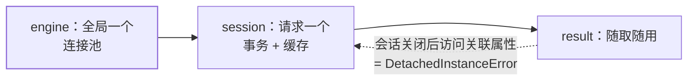

Java 后端的 MyBatis/JPA 对应物。SQLAlchemy 2.0 全面拥抱类型标注——
模型定义风格与 [Pydantic](/python/intermediate/libs/02-pydantic/)、typing
一脉相承，也是学 Python 后端绕不开的一块。

## 两层架构：Core 与 ORM

SQLAlchemy 分两层：**Core**（SQL 表达式层，拼 SQL 的 DSL）和 **ORM**
（对象映射层）。近似 JDBC 与 JPA 的关系：日常用 ORM，ORM 生成的也是
Core 表达式，需要时可以下探。

## 模型定义：声明式 + 类型标注

```python
from sqlalchemy import String, ForeignKey, create_engine
from sqlalchemy.orm import DeclarativeBase, Mapped, mapped_column

class Base(DeclarativeBase): ...

class User(Base):
    __tablename__ = "users"

    id: Mapped[int] = mapped_column(primary_key=True)
    name: Mapped[str] = mapped_column(String(50))
    age: Mapped[int | None] = None          # 可空列：Optional 类型即 NULL

engine = create_engine("sqlite:///app.db")  # 生产用 postgresql+psycopg://...
```

对照 JPA：`Base` 子类 ≈ @Entity、`__tablename__` ≈ @Table、
`Mapped[str]` ≈ @Column 的类型映射。建表在开发期可以
`Base.metadata.create_all(engine)` 一键生成，**生产必须用迁移工具
Alembic**（对应 Flyway/Liquibase）。

`engine` 内置连接池（对应 HikariCP），**全局创建一次**，所有会话共享。

## Session：工作单元模式

Session 对应 JPA 的 EntityManager——一个事务边界 + 身份缓存 + 脏检查：

```python
from sqlalchemy.orm import Session

with Session(engine) as session:
    session.add(User(name="ada", age=36))   # 进入待持久化区
    session.commit()                        # flush + 提交事务

with Session(engine) as session:
    u = session.get(User, 1)                # 主键查（走缓存）
    u.age = 37                              # 改属性即标记脏
    session.commit()                        # 自动生成 UPDATE
```

三个特性：**identity map**（同主键同一会话内只有一个对象实例）、
**脏检查**（改属性不用写 update）、**flush 时机**（commit 前自动把变更
写成 SQL）。生命周期纪律：**Engine 全局一个，Session 请求一个**——
Web 框架里用依赖注入发放，见 [FastAPI](/python/intermediate/libs/03-fastapi/)
的 Depends。

## 查询：select() 表达式

```python
from sqlalchemy import select

stmt = (
    select(User)
    .where(User.name == "ada")
    .order_by(User.id)
    .limit(10)
)
users = session.execute(stmt).scalars().all()
```

`User.name == "ada"` 不是比较运算，是**构造表达式对象**（对比 Java 的
CriteriaBuilder，可读性好一个量级）。参数自动绑定，没有拼接注入问题。
聚合、join、子查询都是同样的表达式风格。

## relationship：关联与 N+1

```python
class Post(Base):
    __tablename__ = "posts"

    id: Mapped[int] = mapped_column(primary_key=True)
    author_id: Mapped[int] = mapped_column(ForeignKey("users.id"))
    author: Mapped["User"] = relationship(back_populates="posts")

# User 侧：posts: Mapped[list["Post"]] = relationship(back_populates="author")
```

`user.posts` 访问时才查库——循环里逐个访问就是 **N+1 查询**，与 JPA 一模
一样。解法也一致：显式预加载
`select(User).options(selectinload(User.posts))`（对应 fetch join/
EntityGraph）。



注意会话关闭后的陷阱：ORM 实例的**关联属性是懒加载的**，Session 关了
再访问 `user.posts` 会抛 DetachedInstanceError——需要的数据在会话内
预加载好，或用 `expire_on_commit=False`。

异步栈对应物是 `create_async_engine` + `AsyncSession`（asyncpg 驱动），
API 形状一致、全部 await 化，配 FastAPI 异步路由。

## 小结

- Engine 全局一个管连接池，Session 请求一个管事务（工作单元）。
- 2.0 模型 = Mapped 标注；开发期 create_all，生产用 Alembic 迁移。
- select() 表达式查询自动绑定参数；relationship 懒加载，N+1 靠显式预加载。
