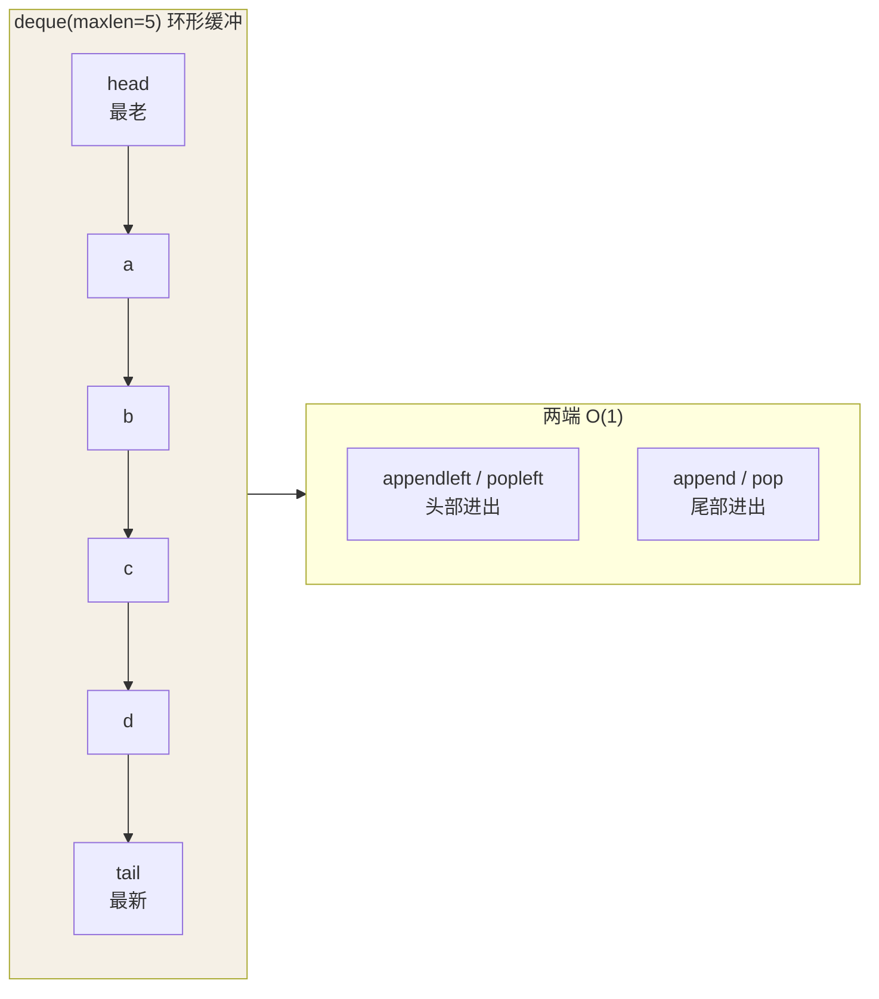

## Counter：计数即一行

```python
from collections import Counter

words = "the quick brown fox the".split()
Counter(words)
# Counter({'the': 2, 'quick': 1, 'brown': 1, 'fox': 1})

Counter(words).most_common(2)      # [('the', 2), ('quick', 1)]
```

手写 `d = {}; for w in words: d[w] = d.get(w, 0) + 1` 的每一行都可以删了。
Counter 还支持集合代数：`a + b`（计数相加）、`a - b`（只保留正计数）。

## defaultdict：兜底工厂

```python
from collections import defaultdict

groups = defaultdict(list)
for user in users:
    groups[user.city].append(user)   # key 不存在时自动建空 list

tree = defaultdict(lambda: defaultdict(int))   # 嵌套工厂
```

与 `d.setdefault(key, [])` 的区别：defaultdict 在**访问缺失 key 时**
触发工厂；setdefault 是显式调用，且每次都白建一次默认值。取值后需要判断
存在性的场景，普通 dict + `.get()` 仍然更直接——defaultdict 的副作用是
"读一下就多出一个空条目"。

## deque：双端队列

list 的 `pop(0)` 是 O(n)，deque 两端都是 O(1)：

```python
from collections import deque

recent = deque(maxlen=5)     # 环形缓冲：满了自动挤掉最老的
for event in stream:
    recent.append(event)      # 滑动窗口、最近 N 条、BFS 队列

q = deque([1, 2, 3])
q.appendleft(0)               # O(1)
q.popleft()                   # O(1)
```

`maxlen` 参数让 deque 变成定容滑动窗口，日志限流、最近记录一行的活。

deque 的双端结构与 `maxlen` 的"满了挤出最老"行为，画成图最直观：



对比 list：**头部进出是 O(n)**（全员平移），deque 才能做到两端 O(1)。

## namedtuple：轻量记录

```python
from collections import namedtuple

Point = namedtuple("Point", ["x", "y"])
p = Point(3, 4)
p.x, p[0]                     # 两种访问都行：字段名 + 索引
x, y = p                      # 可解包
```

tuple 的省内存 + 字段名可读性。新代码更推荐 `typing.NamedTuple`（带类型
标注）或 frozen dataclass，语义相同但更现代：

```python
from typing import NamedTuple

class Point(NamedTuple):
    x: float
    y: float
```

## 选型速查

| 需求 | 用它 |
| ---- | ---- |
| 计数 / TopN | `Counter` |
| 分组 / 嵌套结构 | `defaultdict(list)` |
| 队列 / 滑动窗口 | `deque(maxlen=n)` |
| 固定字段记录 | `NamedTuple` / frozen dataclass |

## 小结

- Counter 一行搞定计数与 TopN；defaultdict 消灭分组时的判空样板。
- 双端操作用 deque，`maxlen` 白送环形缓冲；list 只适合尾部操作。
- namedtuple 向 NamedTuple / dataclass 迁移是现代写法。
