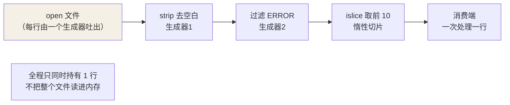

## functools.lru_cache：装饰器级缓存

```python
import functools

@functools.lru_cache(maxsize=None)   # 3.9+ 可用 @functools.cache
def fib(n):
    return n if n < 2 else fib(n - 1) + fib(n - 2)

fib(200)    # 无缓存要算到宇宙热寂
```

两条使用边界：

- **参数必须可哈希**（list 参数直接崩）；`maxsize` 默认 128，
  装饰器可控制内存上限。
- **纯函数才配缓存**：结果依赖外部状态（时间、随机数、数据库）的函数
  缓存了就是错误答案。

配套工具 `cached_property`：实例方法的按字段缓存，第一次访问后变成
实例属性，重复访问零开销。

## partial：冻结参数

```python
from functools import partial

int2 = partial(int, base=2)      # 把 int 的 base 参数"焊死"为 2
int2("1010")                      # 10

def power(base, exp): return base ** exp
square = partial(power, exp=2)    # 通用函数 → 特化函数
```

价值在**把现成函数适配成回调签名**：`map(partial(power, exp=2), range(5))`
不需要再写一层 lambda。

## reduce：折叠

```python
from functools import reduce

reduce(lambda acc, x: acc + x["amount"], orders, 0)   # 求和带初值
```

Python 的态度：sum/all/any/itertools.accumulate 覆盖了九成场景，
剩下的一成先想"是不是该写个显式循环"。reduce 最常见的正当用途是
组合函数：`reduce(lambda f, g: lambda x: f(g(x)), fns)`。

## itertools：惰性组合子

全部返回迭代器，内存 O(1)，与[生成器管道](/python/basic/functions/02-iterators-generators/)无缝拼接：

```python
from itertools import chain, islice, groupby, product, count

chain([1, 2], [3, 4])            # 拼接多个可迭代对象，不建新 list
islice(stream, 100)              # 惰性切片：生成器不能 [0:100]，它能
product("AB", "12")               # 笛卡尔积：A1 A2 B1 B2
count(10)                         # 10 11 12 ... 无限计数器

for key, grp in groupby(sorted(logs, key=lambda l: l.level),
                        key=lambda l: l.level):
    print(key, list(grp))         # groupby 只对"相邻"分组——先排序！
```

最容易踩的坑就是 groupby：**它只合并相邻相同项**，不排序拿到的是碎片。
另外所有 itertools 产物都是一次性迭代器。

## 惰性管道的完整拼图

```python
# 逐行读大文件 → 过滤 → 截断，全程 O(1) 内存
lines = (l.strip() for l in open("app.log"))
errors = (l for l in lines if "ERROR" in l)
top = islice(errors, 10)          # 生成器 + 生成器表达式 + islice
```

为什么这段代码能扛住"无限大"的文件？因为**每个生成器都只是"按需吐一行"的
惰性管道**，数据逐行流过、边取边弃，整条链同时只保留一行在内存：



**一个生成器出口、星链式透传**：下游要一行，上游才吐一行；不要就停在原地，
文件不会整体载入。

## 小结

- `lru_cache` 只缓存纯函数，参数必须可哈希；`cached_property` 缓存重计算。
- partial 冻结参数适配回调；reduce 九成场景被内置函数替代。
- itertools 全家惰性：`chain` 拼接、`islice` 切生成器、`product` 笛卡尔积；
  `groupby` 必须先排序。
