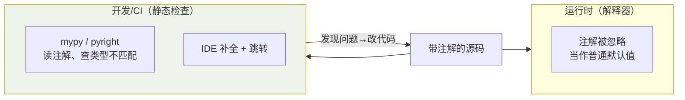

## 渐进式类型：标注不是语法，是文档

Python 类型标注**运行时不强制**——解释器看完就扔，检查交给 mypy/pyright
等静态工具。这叫渐进式类型系统：

```python
def scale(items: list[float], factor: float) -> list[float]:
    return [i * factor for i in items]
```

价值三件事：IDE 补全质变、重构有工具兜底、**签名即文档**——不用翻函数体
猜参数是什么。3.9+ 内置容器直接标注（`list[str]`、`dict[str, int]`），
不再需要 `typing.List`。

"标注运行时不强制、但静态工具检查"是渐进式类型的关键——二者在不同的
时间点介入：



所以类型错误**不会在运行时报**——它要靠 CI/mypy 提前拦下，这也是为什么
"标了类型却没人跑 mypy"等于没标。

## Optional 与 Union

```python
def find_user(uid: int) -> User | None:    # 3.10+ 写法，等价 Optional[User]
    ...

type alias Vector = list[float]            # 3.12+ 直接 type 关键字
type Handler = Callable[[Request], Response]
```

`X | None` 表示"可能没有"——**None 是返回值空间的一部分**，调用方被
迫处理。对比不标注的版本，"这函数可能返回 None"全靠踩坑发现。

## 泛型与 TypeVar

```python
from typing import TypeVar

T = TypeVar("T")

def first(seq: list[T]) -> T:       # 输入输出是同一个类型变量
    return seq[0]

names = first(["a", "b"])           # 推断为 str
```

泛型表达的是**类型间的约束关系**，不是"任意类型"。dataclass 的字段
标注也是它发挥的地方（见 [dataclass](/python/basic/oop/03-dataclass-slots/)）。

## Protocol：结构化接口（鸭子类型的静态版）

```python
from typing import Protocol

class Closeable(Protocol):          # 只声明结构，不要求继承
    def close(self) -> None: ...

def cleanup(res: Closeable) -> None:    # 任何有 close() 方法的对象都算数
    res.close()

class MyConn:                       # 没继承 Closeable，照样通过检查
    def close(self) -> None: ...
```

对比 Java 的接口：**Protocol 按"长得像"判定，不要求显式 implements**。
这让给第三方库类型打补丁成为可能——你不能改人家的类，但可以声明"有
这几个方法就行"。这是 Python 对 Go 的 `io.Writer` 式接口的回应。

## 精确化字面量与字典

```python
from typing import Literal, TypedDict

def set_level(level: Literal["debug", "info", "error"]) -> None: ...
set_level("warn")        # 静态检查直接报错——取值空间被限死

class UserRecord(TypedDict):        # dict 的结构化描述
    name: str
    age: int

def parse(row: UserRecord) -> User: ...   # JSON 边界处的类型护栏
```

TypedDict 的主场是**边界处的 JSON/配置字典**——把裸 dict 约束成
有形状的类型，mypy 就能查出 `row["nam"]` 这种拼写错误。再往上一步
就是 Pydantic 的运行时校验（见 [Pydantic](/python/intermediate/libs/02-pydantic/)）。

## 小结

- 类型标注运行时不强制、静态工具检查；签名即文档，新代码应该全量标注。
- `X | None`、TypeVar 泛型、Literal 限取值、TypedDict 给 JSON 定形。
- Protocol 是鸭子类型的静态版：结构匹配即可，不要求继承。
