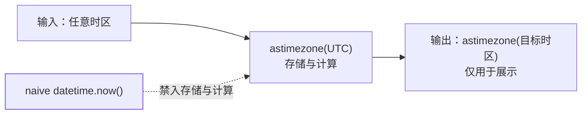

Java 8 之后有 java.time（JSR-310），Python 标准库的 `datetime` 模块定位
相同，但有一个 Java 里不存在的第一大坑：**naive 与 aware 之分**。

## 三个类型：date、time、datetime

```python
from datetime import date, time, datetime

date(2026, 9, 8)                 # 只有日期
time(10, 30, 0)                  # 只有时间
datetime(2026, 9, 8, 10, 30)     # 日期 + 时间
```

对应关系：`date` ≈ LocalDate、`time` ≈ LocalTime、`datetime` ≈
LocalDateTime/ZonedDateTime 的合体——**是否带时区不由类型决定，由
tzinfo 属性决定**，这正是坑的来源。

## naive 与 aware：第一大坑

```python
from datetime import timezone

datetime.now()                    # naive：墙上时间，不知道自己在哪个时区
datetime.now(timezone.utc)        # aware：带时区的时间点
```

| | naive | aware |
| ---- | ---- | ---- |
| 含义 | 墙上时间，无时区信息 | 绝对时间点，带时区 |
| Java 近似 | LocalDateTime | ZonedDateTime |
| 能否比较/相减 | 同类之间可以 | 同类之间可以 |
| 跨时区含义 | **不确定** | 唯一确定 |

naive 和 aware 混合比较直接抛 `TypeError`——Python 用类型错误强制你面对
时区问题。而 `datetime.now()` 返回 naive **本地时间**：同一行代码在两台
机器上结果含义不同。纪律只有一条：

**存储与计算一律用 UTC aware；只在展示边缘转成目标时区。**



## zoneinfo：标准库的时区库

3.9 起标准库自带 IANA 时区（对应 Java 的 ZoneId）：

```python
from datetime import datetime
from zoneinfo import ZoneInfo

sh = datetime(2026, 9, 8, 10, 0, tzinfo=ZoneInfo("Asia/Shanghai"))
utc = sh.astimezone(timezone.utc)     # 换算时间点，同一时刻
```

aware 对象之间比较、相减都是绝对时间意义上的——两个不同时区的 aware
时间可以直接比大小。

## 运算与格式化

```python
from datetime import timedelta

delta = timedelta(days=3, hours=2)
later = utc + delta            # datetime + timedelta → datetime
span = later - utc             # datetime - datetime → timedelta
span.total_seconds()           # 266400.0
```

一个与 Java 不同的细节：aware + timedelta 做的是**墙上时间运算**
（保持 tzinfo 加上去），跨夏令时边界时要先 `astimezone(UTC)` 再算——
类似 Java 里 Period（墙钟）与 Duration（绝对）的区分。

格式化是 C 风格占位符，不是 DateTimeFormatter：

```python
utc.strftime("%Y-%m-%d %H:%M:%S")          # datetime → str
datetime.strptime("2026-09-08 10:00", "%Y-%m-%d %H:%M")   # str → datetime
utc.isoformat()                             # '2026-09-08T02:00:00+00:00'
datetime.fromisoformat(s)                   # 无损往返
```

纪律：**对外传输一律 isoformat（ISO 8601）**，别手搓 `%Y-%m-%d`——
ISO 是无歧义的，自定义格式要靠文档维持。另外时间戳注意单位：
`dt.timestamp()` 是**秒**，Java 的 `Instant` 是毫秒，对接时差三个数量级。

JSON 序列化是 datetime 的经典雷区——`json.dumps` 直接抛 TypeError，
处理方式见 [json 与 csv](/python/intermediate/data/02-json-csv/)。

## 小结

- naive 是墙上时间、aware 是时间点，两者不可比；now() 返回 naive 本地时间。
- 存储计算一律 UTC aware，展示边缘才转时区；zoneinfo 提供标准时区。
- 运算 timedelta、传输 isoformat；timestamp 是秒，Java 是毫秒。
