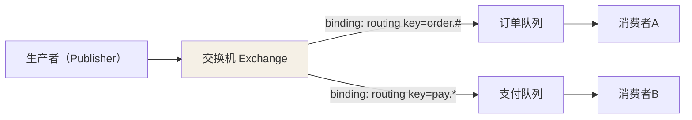
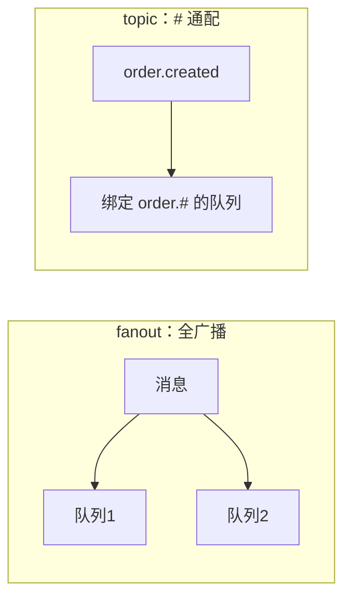
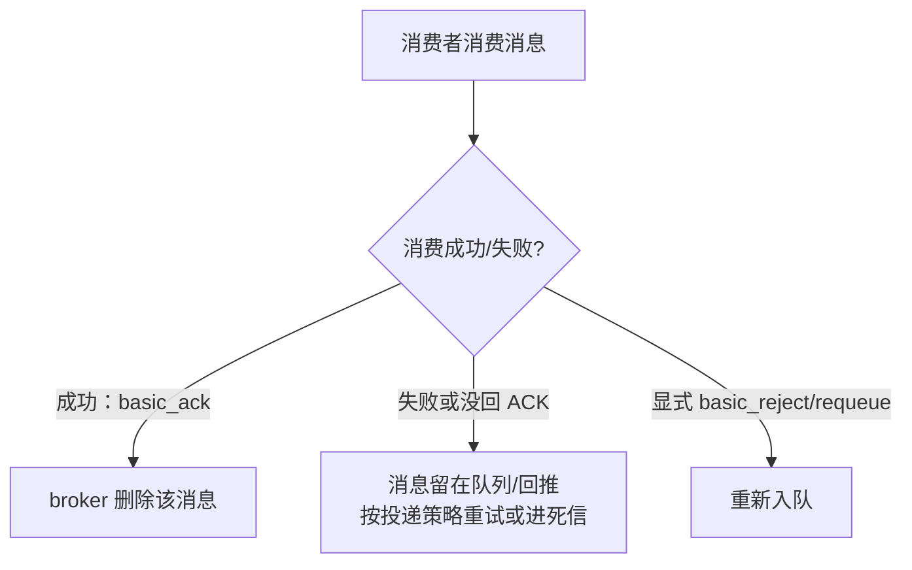

## 一条消息怎么投递

RabbitMQ 遵循 AMQP：**生产者只把消息交给交换机，不直接碰队列**；消息按
路由键（Routing Key）经交换机的规则转进一个或多个队列，消费者再从队列取。

关键认知：**交换机和队列都不保存消息如何分发的逻辑，规则在"绑定"里**。
绑定 =（队列, 路由键模式），它决定消息进不进某队列。

## 四类交换机

| 类型 | 路由规则 | 适用 |
|---|---|---|
| **direct** | 路由键**完全相等**才进队列 | 定点路由（如按消息类型分队列） |
| **topic** | 路由键做 **通配符匹配**（`.` 分段，`*` 单段、`#` 多段） | 灵活分类（如 `order.created`） |
| **fanout** | 广播给**所有绑定队列**，忽略路由键 | 集群广播/事件通知 |
| **headers** | 按消息**头**（键值对）匹配，不是路由键 | 复杂条件路由，用得少 |

## 队列与消息的持久性关系

- **Exchange / Queue 是否 durable**：决定 broker 重启后这些实体还在不在。
- **消息是否持久化（delivery_mode=2）**：决定排队中的消息落盘还是仅内存。
- 三层（交换机 durable + 队列 durable + 消息持久化）**一起**才算可靠投递，
  只记得队列 durable、忘了消息持久化，重启照样丢。

## 消费者模型

消费者默认要 **显式 ACK**（`manual ack`），broker 只有收到 ACK 才删消息——
这是"不丢"的锚点，但它引出的重试/死信正是可靠性篇的主题。

## 小结

- RabbitMQ 模型 = 生产者 → 交换机 → 队列 → 消费者，规则在绑定里。
- 四类交换机：direct(相等) / topic(通配) / fanout(广播) / headers(按头)。
- 可靠投递必须"交换机 + 队列 + 消息"三层都 durable/持久化。