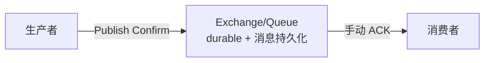

## 不丢的完整链路

一条消息从生产到消费，丢失可能发生在这三段——每段有各自的保障：

| 阶段 | 风险 | 保障手段 |
|---|---|---|
| 生产者 → 交换机 | 网络/进程崩溃 | 生产者 **confirm 模式**（等 broker 确认） |
| broker 存储 | 重启内存清空 | 交换机/队列 durable + 消息持久化 |
| 队列 → 消费者 | 消费者处理失败 | **手动 ACK** + 重试/死信 |



## 生产者端：Confirm 模式

```java
channel.confirmSelect();                       // 开启发布确认
channel.basicPublish("ex", "rk", persistentProps, body);
if (channel.waitForConfirms()) { /* 成功 */ }
```

- 每条消息 broker 落盘/入队后才会回确认——**等不到确认就重发/记失败**。
- 对应"丢了重发"要考虑**幂等**：重发可能让消费者收到两次。

## 消费者端：手动 ACK 与重试

```java
// 关闭自动 ack，自己决定成败
DefaultConsumer consumer = new DefaultConsumer(channel) {
    public void handleDelivery(...) {
        try { process(delivery.getBody()); channel.basicAck(tag, false); }
        catch (Exception e) { channel.basicNack(tag, false, true); } // requeue
    }
};
channel.basicConsume("queue", false, consumer);
```

- **成功** → `basicAck`，broker 删消息。
- **失败** → `basicNack(..., requeue=true)` 重新入队重试；但**反复 requeue 会
  原样死循环**，更稳的是丢进**死信队列**（见可靠与进阶篇）。
- 关闭自动 ack 后「**消息重复**」由你兜底：给消息带唯一 ID，消费端幂等表去重。

## 幂等：不重不漏的最终答案

RabbitMQ 的"至少一次"意味着**可能重复**。彻底解决靠业务幂等：
用消息里的唯一键（订单号/业务 ID）建幂等表或唯一索引，重复消息直接跳过。
可靠队列负责"不丢"，幂等负责"不重"，两者配合才完整。

## 小结

- 三阶段各守一段：生产者 confirm、broker 持久化、消费者手动 ACK。
- 手动 ACK 自主决定成败；反复 requeue 会死循环，要接死信。
- 至少一次 = 可能重复，"不丢"归队列负责，"不重"归业务幂等负责。