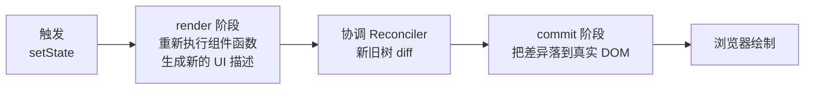

## 一次更新的完整旅程



- **render 阶段**：重跑组件函数得到新虚拟 DOM（UI 描述）。这一段
  必须纯——随时可能被中断重跑
- **协调（diff）阶段**：新旧两棵树对比，算出最小变更集。两个假设
  把 O(n³) 降到 O(n)：**不同类型的元素直接整棵替换**；同层级的
  子节点靠 **key** 匹配身份
- **commit 阶段**：同步地把 diff 结果一次性应用到真实 DOM——
  这就是「重渲染便宜、DOM 操作才贵」的原理

## key：节点的身份证

```jsx
{items.map(item => <Row key={item.id} data={item} />)}
```

列表更新时（插入、删除、排序），框架靠 key 判断「谁是谁」：

- 稳定的业务 id 做 key：插入一条，其余行只做**移动**，组件状态
  （输入框内容、滚动位置）正确保留
- **用数组下标做 key**：插入头部时每行的 key 全体错位——框架认为
  「第 0 行还是那个组件」，只是 props 变了，状态错配、重渲染浪费，
  还可能引发交互 bug
- key 只需在**兄弟之间**唯一，不必全局唯一

## 性能的心智账本

| 动作                       | 成本 | 说明                        |
| ------------------------ | -- | ------------------------- |
| 组件函数重跑（render）           | 低  | 生成虚拟 DOM 描述，纯 JS 计算        |
| diff                     | 低  | O(n) 同层比较                 |
| 真实 DOM 变更（commit）        | 高  | 触发样式计算与布局，尽量批量最小化         |

优化方向因此清晰：**减少不必要的重渲染**（状态下沉、组件拆分、
memo/缓存）胜过在 diff 上抠细节；列表规模大时上虚拟滚动。

## 要点备忘

- 更新三段：render（纯计算）→ diff（同层比较）→ commit（真 DOM）
- diff 的两大假设：类型不同整树替换、key 决定同层身份
- key 用稳定 id，下标 key 在插入删除时制造状态错配
- 性能主战场是「少重渲染」，不是「diff 更快」

## 延伸阅读

- [React 官方文档 · Render and Commit](https://react.dev/learn/render-and-commit)
