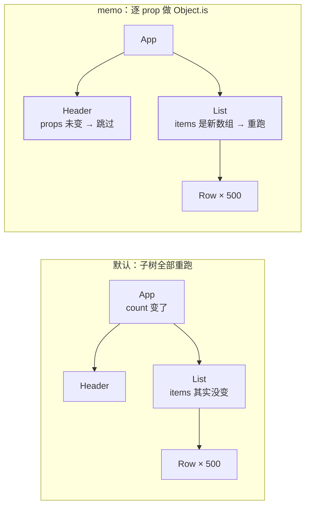
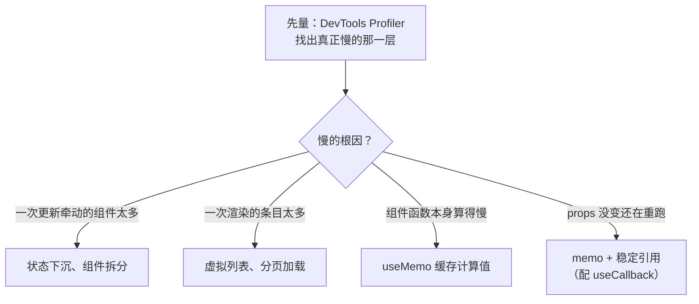

## 默认行为：状态一变，整棵子树跟着重跑

官方口径很直接——**一个组件重渲染时，React 默认递归重渲染它的所有子组件**
（`useCallback` 文档原话：*By default, when a component re-renders, React
re-renders all of its children recursively*）。框架不会自作主张地判断
「这个子组件的 props 好像没变」，因为判断本身要花钱，判错了还会漏更新。

再配上
[渲染流程](/react/basic/core/03-render-flow/)那本账：重跑组件函数很便宜
（只是生成 UI 描述），贵的是 commit 阶段的真实 DOM 变更。所以「子树全
重跑」在大多数页面上无害——**直到某个组件的函数体里真的算了很重的东西，
或者一次要渲染上千行列表**。那一刻才需要显式短路。



> 对照视角：[Vue 的响应式](/vue/basic/core/01-reactivity/)走的是另一条路
> ——依赖收集让「谁读了这个数据」决定谁更新，天然精确。React 把「渲染
> 整棵子树」当成便宜且安全的默认，把优化点留给开发者，这是两种范式
> 的根本差异，不是谁快谁慢。

## memo：短路靠浅比较，比的是引用

```jsx
const Row = memo(function Row({ data, onPick }) {
  return <li onClick={() => onPick(data)}>{data.name}</li>;
});
```

- 默认逐个 prop 用 `Object.is` 比较，**全部相等**才跳过本次渲染；
  也可以传第二个参数 `arePropsEqual` 自定义比较（很少值得）
- 官方措辞留了余地：*usually* not re-rendered，并明写
  **memoization is a performance optimization, not a guarantee**
- 最常见的失效现场：`data` 来自父组件 `list.filter(...)` 的新数组、
  `onPick` 是父组件函数体里 `() => {}` 新建的函数。JS 里每次新建的字面量
  都是不同引用，比较永远不等——于是 `memo` 白付了一次比较成本

## 三件套各自缓存什么

| 构件              | 缓存的东西     | 用来解决                 | 典型误用               |
| --------------- | -------- | -------------------- | ------------------ |
| `memo`          | 一次渲染结果   | 父组件重跑时子树跟着重跑         | 包住所有组件；props 引用不稳 |
| `useMemo`       | 一个计算出的值  | 昂贵计算每次重跑；对象/数组引用不稳  | 当成语义保证；包一切表达式     |
| `useCallback`   | 一个函数引用   | 传给 memo 子组件的回调、依赖数组  | 回调不传给 memo 组件也照包  |

`useCallback(fn, deps)` 与 `useMemo(() => fn, deps)` 等价（官方原文
*is the same as*），它存在的唯一理由是**稳住函数引用**——所以它是给 `memo`
和依赖数组用的，本身不省任何计算。同理，依赖数组也按 `Object.is` 逐项比较：
把组件体内新建的对象写进依赖，等于没缓存。

```jsx
// ✕ memo 形同虚设：onPick 每次渲染都是新函数
function Page({ id, items }) {
  const onPick = (item) => track(id, item);
  const visible = items.filter((i) => i.ok);   // 每次都是新数组
  return <List items={visible} onPick={onPick} />;
}

// ✓ 先稳住引用，memo 才有的谈
function Page({ id, items }) {
  const onPick = useCallback((item) => track(id, item), [id]);
  const visible = useMemo(() => items.filter((i) => i.ok), [items]);
  return <List items={visible} onPick={onPick} />;
}
```

## 「加了 memo 还在重渲染」的四类现场

1. **props 引用不稳**：先按上面的写法稳引用，再谈 `memo`
2. **子树是父组件渲染出来的**：`<Panel><Heavy/></Panel>` 里 `children`
   这个 prop 每次都是新建的元素对象，`memo(Panel)` 短路不了它。有效的用法
   是反过来——从**外层**把稳定元素当 `children` 传进来。React 对引用相同
   （`===`）的已渲染元素会直接跳过整棵子树，这是官方记录在案的既有优化
3. **Context 变了**：consumer 的更新走 context 通道，`memo` 拦不住。
   而 `<Ctx value={{ a, b }}>` 每次渲染都是新对象，等于每次推倒所有
   consumer——所以 Provider 的 `value` 本身要用 `useMemo` 包
4. **状态放得太高**：顶层一个 `useState` 牵动全树。这是结构问题，
   加缓存只是给它擦屁股

## 优化有优先级，三件套排在最后



前两级是**减少触发次数与规模**，收益是数量级的；后两级是**减少单次开销**，
收益是常数级的。顺序反过来的典型结果，是给全树套满 `memo`：比较成本、
依赖数组的维护成本、内存都上去了，而卡顿的原凶（一个渲染一万行的列表、
一个挂在顶层的 state）一点没动。

再往前是编译期方案：官方在 `memo` 文档里明确——开启 React Compiler 之后
`memo` 通常不再必要，编译器会追踪 props 变化并复用已创建的 JSX，把上面
这套记忆化在构建时机械地做完，且「多数情况下比手写的更精确」。官方对
新代码的建议是**依赖编译器**，把 `useMemo`/`useCallback` 留给需要精确
控制的场合（典型是 effect 依赖）。手写三件套因此正从「必备技能」变成
「理解机制 + 无编译器时兜底」，面试里能讲清这层演进会是加分项。

## 面试答法

- **「React 怎么做性能优化」**：先答默认行为（子树整体重跑 + render 便宜
  commit 贵），再给优先级阶梯（结构 > 规模 > 缓存），最后落到三件套与
  React Compiler。能说出「`memo` 是引用的浅比较，所以稳引用优先」就有区分度
- **「`useMemo` 和 `useCallback` 的区别」**：缓存值 vs 缓存函数引用，后者
  是前者的语法糖；两者都只在「这个引用要喂给比较」时才有意义
- **「`memo` 一定更快吗」**：不。比较本身要花钱、缓存要占内存，官方定性它
  是「性能优化，不是保证」；满屏 `memo` 还会让依赖数组变成新的漏更新源头
- **「现在还要手写这些吗」**：开启 React Compiler 后 `memo` 基本不必，
  `useMemo`/`useCallback` 保留作精确控制的逃生门（官方口径，见延伸阅读）

## 要点备忘

- 默认父重跑则子树全重跑：React 不做「props 没变就不渲染」的判断
- `memo` 逐 prop 走 `Object.is`，引用不稳则永远失效；它是优化不是保证
- `useCallback` = `useMemo` 的函数版，服务于 memo 的 props 与依赖数组
- Context 的 `value` 要 `useMemo`，否则每次渲染都推倒全部 consumer
- 顺序：状态下沉 → 少存派生 state → 稳定 key → 虚拟列表 → 最后才 memo
- 没有 Profiler 的数据，上面这些都只是猜测

## 延伸阅读

- [React 官方文档 · memo](https://react.dev/reference/react/memo)
- [React 官方文档 · useCallback](https://react.dev/reference/react/useCallback)
- [React 官方文档 · React Compiler 入门](https://react.dev/learn/react-compiler/introduction)
- [React 官方文档 · Profiler](https://react.dev/reference/react/Profiler)
