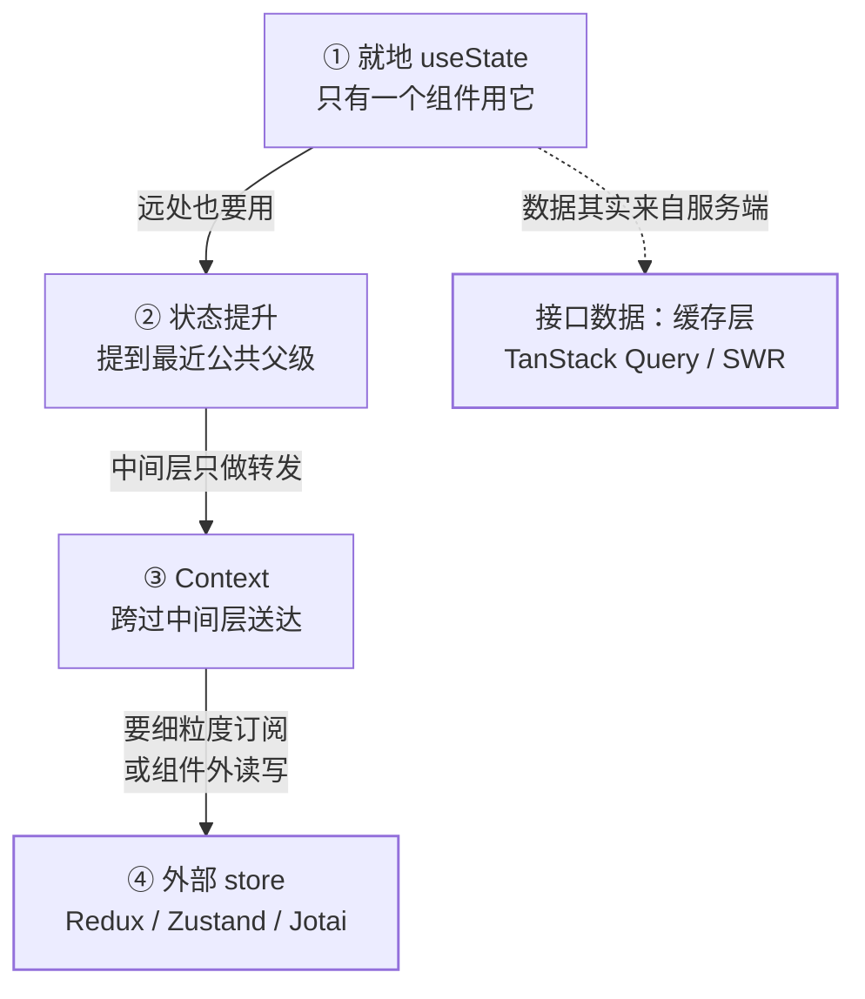
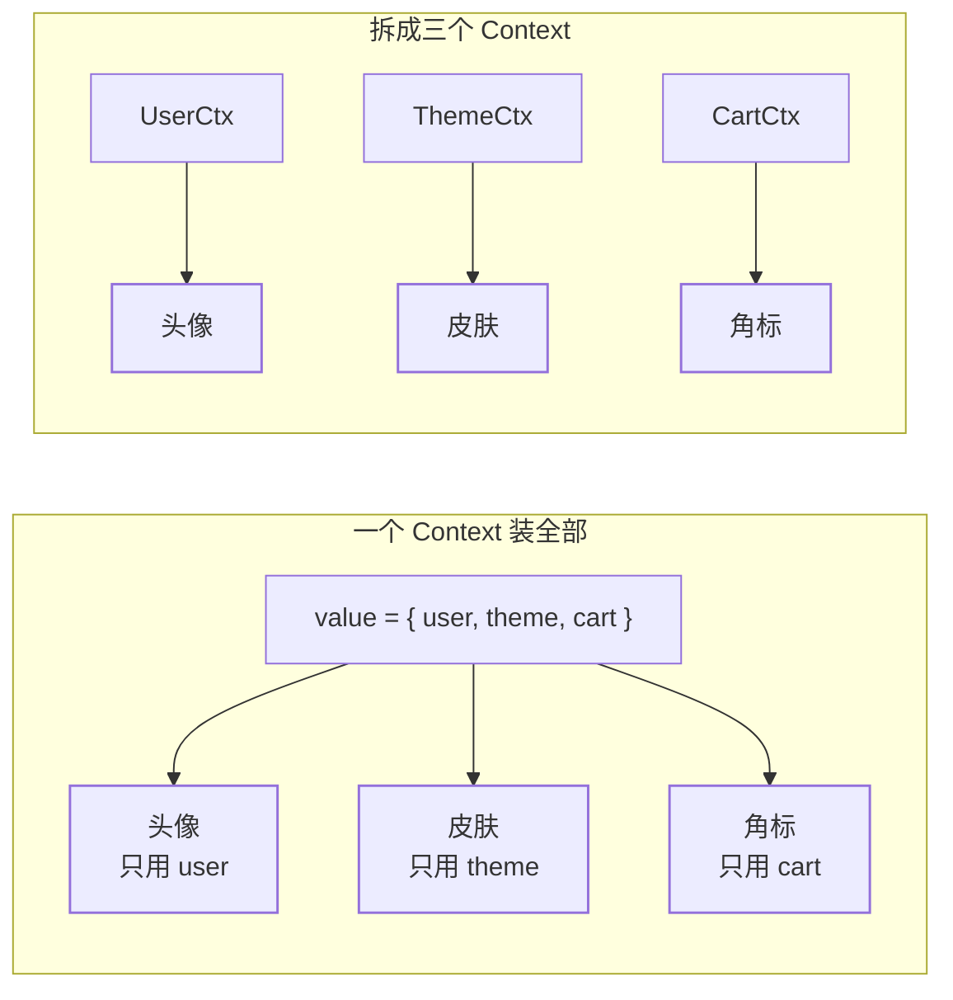

[Hooks 心智模型](/react/basic/core/02-hooks-mental/)讲清了「state 是这一帧渲染
的快照」，[重渲染传播](/react/basic/core/04-rerender-perf/)讲清了「状态一变子树
跟着重跑」。这一篇接着问最工程的那一半：**这份状态该放在哪一层**。放低了远处
拿不到，只能一层层往上抬；抬过头了，输入框每敲一个字全页重渲染。React 给的
答案是四级台阶，每上一个台阶换来一份自由、欠下一份代价——把代价算清再上，
就是这一篇的全部内容。

## 先划界：服务端状态不该进这套台阶

后端读者最容易带进来的直觉，是把接口返回塞进一个全局 store，像维护进程内缓存
那样自己管 `list` / `loading` / `error`。React 生态把这块单独立了个名字
**服务端状态（server state）**，理由是数据归属权根本不同（TanStack Query
官方原文）：

- *Is persisted remotely in a location you may not control or own*
- *Requires asynchronous APIs for fetching and updating*
- *Implies shared ownership and can be changed by other people without your
  knowledge*
- *Can potentially become "out of date" in your applications if you're not
  careful*

问题也随之换了一套：官方列出的正是 *Caching*、*Deduping multiple requests for
the same data into a single request*、*Updating "out of date" data in the
background*、*Knowing when data is "out of date"*——缓存、去重、后台刷新、失效
判断，这些不是 `useState` 能顺手解决的。

**一句判据**：这份数据能否由「请求地址 + 参数」唯一确定？能，它是服务端状态，
交给缓存层（[TanStack Query](https://tanstack.com/query/latest/docs/framework/react/overview)
/ SWR 一类），组件里只读 `data` 与 `isLoading`；不能（用户刚点出来的草稿、抽屉
开没开、向导走到第几步、列表里选中的是哪一条），才是下面四级台阶要处理的客户端状态。

> 混着管的典型代价：全局 store 里存了三份镜像，手写 refetch 与失效时机，最后
> 在解决一个缓存库默认就提供的功能——还常常漏掉竞态（旧请求后到覆盖新结果）。

## 四级台阶：能停在低处就停在低处



| 台阶            | 解决什么                 | 新欠下的账             | 该上台阶的现场信号             |
| ------------- | -------------------- | ----------------- | ---------------------- |
| ① 就地 state    | 组件自己的瞬时状态            | 无                 | ——                     |
| ② 状态提升        | 兄弟共享，保持单一来源          | 中间层被迫接 props      | 无关组件跟着重渲染             |
| ③ Context     | 穿透任意深度的中间层           | 全员 consumer 重渲染  | 三层以上纯转发；主题、登录用户      |
| ④ 外部 store    | 细粒度订阅 + React 之外可读写  | 多一个依赖与一套心智模型     | 高频更新、跨树联动、要持久化或回放    |

## 状态提升：默认答案，也是最容易存错的一级

放哪儿的原则是「**能被尽量少的组件用到的状态就别往上抬**」。官方在讲 state 结构
（[Choosing the State Structure](https://react.dev/learn/choosing-the-state-structure)）
时给了五条：分组相关 state、避免矛盾、避免冗余、避免重复、避免深层嵌套，并把瞬时
UI 状态明确往下推：

> *Sometimes, you can also reduce state nesting by moving some of the nested
> state into the child components. This works well for ephemeral UI state that
> doesn't need to be stored, like whether an item is hovered.*

「存什么」由其中两条决定——能算出来的别存，能存标识的别存整个对象：

> *If you can calculate some information from the component's props or its
> existing state variables during rendering, you should not put that information
> into that component's state.*
> *Keep ID or index in state instead of the object itself.*

```jsx
// ✕ 冗余 state：每改一次都要手动同步两份，漏一处就脏
const [first, setFirst] = useState('');
const [last] = useState('Li');
const [fullName, setFullName] = useState('');
function onChange(e) {
  setFirst(e.target.value);
  setFullName(e.target.value + ' ' + last);   // 每个 handler 都得记得同步一次
}

// ✓ 只存源头，派生值在渲染时算——它不可能忘记同步
const [first, setFirst] = useState('');
const [last] = useState('Li');
const fullName = `${first} ${last}`;
```

抬到顶的代价，[04 篇](/react/basic/core/04-rerender-perf/)第 4 类现场已经点名：
顶层一个 `useState` 牵动全树，那是**结构问题**，加缓存只是给它擦屁股。所以先穷尽
结构（拆组件、把瞬时 state 沉到叶子），确实降不下来再上 Context——下面算它的账。

## Context 是送达通道，不是状态容器

官方定义（[Passing Data Deeply with Context](https://react.dev/learn/passing-data-deeply-with-context)）：

> *Context lets the parent component make some information available to any
> component in the tree below it—no matter how deep—without passing it
> explicitly through props.*

注意主语是 *the parent component*：值仍然由某个上层组件用 `useState` /
`useReducer` 持有，Provider 只是把它**交出来**。所以「用 Context 管状态」在机制上
就不准确——**Context 解决的是送达路径，不是所有权**。官方的「值得上 Context」信号：

> *In general, if some information is needed by distant components in different
> parts of the tree, it's a good indication that context will help you.*

典型是主题、当前登录用户、语言、权限位（官方的 *Theming* / *Current account* 两例），
共同点是**读的人很分散、写的人很少**。三个语义点要先记住：

- 取的是**最近的** Provider：*The component will use the value of the nearest
  `<LevelContext>` in the UI tree above it.*——嵌套 Provider 因此能做局部覆盖
- 不同 Context 互不干扰：*different React contexts don't override each other.
  Each context that you make with `createContext()` is completely separate from
  other ones*——这是后面「拆多个 Context」成立的前提
- 值是活的：*If you pass a different value on the next render, React will
  update all the components reading it below!*

## Context 的性能账：全员重渲染，且 `memo` 拦不住

```jsx
// ✕ value 每次渲染都是新对象：所有 consumer 一起醒
function App() {
  const [user, setUser] = useState(null);
  return (
    <AuthContext.Provider value={{ user, login: (p) => post(p).then(setUser) }}>
      <Shell />
    </AuthContext.Provider>
  );
}

// ✓ 稳住引用：只有 user 真的变了才推倒 consumer
function App() {
  const [user, setUser] = useState(null);
  const login = useCallback((p) => post(p).then(setUser), []);
  const value = useMemo(() => ({ user, login }), [user, login]);
  return (
    <AuthContext.Provider value={value}>
      <Shell />
    </AuthContext.Provider>
  );
}
```

`memo` 救不了这条通道，官方在 `useContext` 参考页写得很直接：

> *Skipping re-renders with `memo` does not prevent the children receiving fresh
> context values.*

这正是 04 篇「四类现场」的第 3 类：`memo` 比的是 props，consumer 的更新走 context
通道，两条路互不干涉。更要紧的是第二条限制——**`useContext` 没有 selector**：
`value` 里塞了多大一个对象，每个 consumer 就拿多大一个对象，做不到「只订阅
`value.user.name`」。这两条叠起来，就是「一上 Context 全树都在重渲染」的完整成因。

官方给的解法恰好是这两条限制的正面：



1. **稳住引用**：`value` 用 `useMemo` 包、里面的函数用 `useCallback` 包（上面的
   ✓ 写法）
2. **拆成多个 Context**：让每个组件只订阅自己真需要的那一份

再往下一档是官方推荐的组合拳——**`useReducer` 配 Context**，并把 state 与 dispatch
拆成两个 Context（原文：*It is common to use a reducer together with context to
manage complex state and pass it down to distant components without too much
hassle.*）。之所以值得单拆 dispatch，是因为它的引用**永久稳定**：

> *The `dispatch` function has a stable identity, so you will often see it
> omitted from Effect dependencies, but including it will not cause the Effect
> to fire.*

```jsx
const StateCtx = createContext(null);
const DispatchCtx = createContext(null);

function TodosProvider({ children }) {
  const [state, dispatch] = useReducer(reducer, initial);
  return (
    <DispatchCtx.Provider value={dispatch}>
      <StateCtx.Provider value={state}>{children}</StateCtx.Provider>
    </DispatchCtx.Provider>
  );
}

// 只提交动作、不读结果：订阅 DispatchCtx，state 变它不重渲染
function AddButton() {
  const dispatch = useContext(DispatchCtx);
  return <button onClick={() => dispatch({ type: 'add' })}>新增</button>;
}
```

> reducer 在这里的额外好处：更新逻辑收敛成一个纯函数，可单测、能在 DevTools 里
> 重放；否则 Provider 里会散落十几个 `setXxx` 回调，每个都是新函数，逼着你不停
> 地 `useCallback`。

## 外部 store 补的是哪两块

Context 撑不住的时候（细粒度订阅、高频更新、跨树联动），要换的是**订阅模型**，
不是把状态换个地方存。外部 store 多给的两样东西：

1. **精确订阅**：组件向 store 注册「我要哪一片」，那片没变就不渲染——补掉的正是
   `useContext` 没有 selector 这一块
2. **状态活在 React 之外**：组件树外面也能读写它（Zustand 直接
   `useDogStore.getState()` / `setState()`），于是持久化、时间旅行、跨入口共享都
   有了落脚点，不再受渲染周期约束

三个主流方案的官方自我定位，选型时够用：

| 方案              | 官方定性（原文）                                                | 心智模型       | 什么时候选它                    |
| --------------- | -------------------------------------------------------- | ---------- | ------------------------- |
| Redux（RTK）      | *Redux Toolkit is our official recommended approach*     | 单 store + action + 纯 reducer 的单向数据流 | 团队要约束、审计与回放，状态规则复杂       |
| Zustand         | *Bear necessities for state management in React*，*no providers are needed* | 一个 hook 就是一个 store，靠 selector 订阅 | 想低成本替代 Redux，还要在组件外读写      |
| Jotai           | *Primitive and flexible state management for React*，*An atom represents a piece of state* | 自底向上的原子 + 派生原子 | 状态之间有大量派生关系，想按最小粒度重渲染     |

Redux 的三条底座原则，官方一句话讲完（也是它「啰嗦」的来源）：

> *The whole global state of your app is stored in an object tree inside a single
> store. The only way to change the state tree is to create an action, an object
> describing what happened, and dispatch it to the store. To specify how state
> gets updated in response to an action, you write pure reducer functions that
> calculate a new state based on the old state and the action.*

> 对照视角：[Vue 的响应式](/vue/basic/core/01-reactivity/)靠依赖收集，「谁读了这个
> 数据」天然决定谁更新，精确订阅是渲染器自带的。React 把这件事留给开发者，于是
> 细粒度订阅被外包给了 store 层——这不是快慢之争，是范式的分工位置不同。

## `useSyncExternalStore`：官方给外部 store 修的那座桥

它是 React 专门为「订阅 React 之外的数据源」提供的 hook：

> *`useSyncExternalStore` is a React Hook that lets you subscribe to an external
> store.*

```ts
const snapshot = useSyncExternalStore(subscribe, getSnapshot)
// 第三个参数 getServerSnapshot 可选，只在 SSR 与水合时用
```

`subscribe` 接一个回调、返回清理函数；`getSnapshot` 返回组件需要的那一片；
`getServerSnapshot` 只在服务端渲染与水合时用。手写一个最小 store：

```js
function createStore(initial) {
  let state = initial;
  const listeners = new Set();
  return {
    get: () => state,
    set(next) {
      state = next;
      listeners.forEach((l) => l());
    },
    subscribe(cb) {
      listeners.add(cb);
      return () => listeners.delete(cb);
    },
  };
}
const store = createStore({ count: 0 });
const useCount = () => useSyncExternalStore(store.subscribe, store.get);
```

为什么不写成 `useState` + `useEffect` 里手动订阅？因为并发渲染下会**撕裂
（tearing）**：一次渲染跨越了 store 的两次变化，同一页面上不同组件读到不同版本的
同一个 store。官方给的处置写得很具体：

> *If the store is mutated during a non-blocking Transition update, React will
> fall back to performing that update as blocking. ... React will call
> `getSnapshot` a second time just before applying changes to the DOM. If it
> returns a different value than when it was called originally, React will
> restart the update from scratch.*

还有一条硬约束，它顺带解释了「为什么 selector 要缓存、要浅比较」：

> *While the store has not changed, repeated calls to `getSnapshot` must return
> the same value.*
> *The store snapshot returned by `getSnapshot` must be immutable.*

`getSnapshot` 每次返回一个新建的对象（哪怕字段一样），React 就会判定 store 变了并
反复重渲染，表现为「`The result of getSnapshot should be cached`」告警加死循环。
自己写订阅 hook 时，这条约束就是「selector 结果要记忆化、比较要用浅比较」的根本
原因：不这么做，每次渲染交给 React 的快照都是新引用，等于一直在告诉它「变了」。

## 面试答法

- **「Context 是状态管理方案吗」**：不是。它是送达通道（依赖注入），状态仍由
  `useState`/`useReducer` 持有；能补上「Context 解决路径不解决所有权」这句就有区分度
- **「为什么用了 Context 全树重渲染」**：`value` 每次渲染都是新对象 + consumer
  整份订阅、没有 selector；`memo` 拦不住 context 更新（官方原话）。解法是稳住引用、
  拆多个 Context、把 dispatch 单独拆一个 Context，再不够换外部 store
- **「什么时候上 Redux / Zustand」**：需要细粒度订阅、组件外读写、复杂更新逻辑收敛
  与回放时；先反问一句「这是不是服务端状态」——是就先上缓存层，别塞全局 store
- **「`useSyncExternalStore` 解决什么」**：让 React 安全订阅外部数据源，防撕裂；
  约束是 `getSnapshot` 在未变化时必须返回同一个值
- **「状态应该放哪」**：最小可用范围 + 最近公共父级；派生值渲染时算不单独存；
  列表选中存 ID 不存对象

## 要点备忘

- 先划界：接口数据是服务端状态，交给缓存层，别进客户端状态四级台阶
- 台阶顺序：就地 state → 状态提升 → Context → 外部 store，能停低处就停低处
- 冗余 state 是 bug 温床：能渲染时算出来的就别存；存 ID 不存整个对象
- Context 只解决送达，不解决所有权；`value` 要用 `useMemo` 稳引用
- `memo` 拦不住 context 更新，`useContext` 也没有 selector——这是它的两条天花板
- 拆 Context 的正解：按变更频率与消费者集合切；`dispatch` 单独一个 Context
- 外部 store 换来精确订阅 + React 之外可读写；Redux 约束最重、Zustand 最轻
- `useSyncExternalStore` 是官方桥梁，防撕裂；`getSnapshot` 必须返回同值否则死循环

## 延伸阅读

- [React 官方文档 · Passing Data Deeply with Context](https://react.dev/learn/passing-data-deeply-with-context)
- [React 官方文档 · useContext](https://react.dev/reference/react/useContext)
- [React 官方文档 · Choosing the State Structure](https://react.dev/learn/choosing-the-state-structure)
- [React 官方文档 · useSyncExternalStore](https://react.dev/reference/react/useSyncExternalStore)
- [Redux · Getting Started](https://redux.js.org/introduction/getting-started)
- [Zustand · README](https://github.com/pmndrs/zustand)
- [Jotai · README](https://github.com/pmndrs/jotai)
- [TanStack Query · Overview](https://tanstack.com/query/latest/docs/framework/react/overview)
