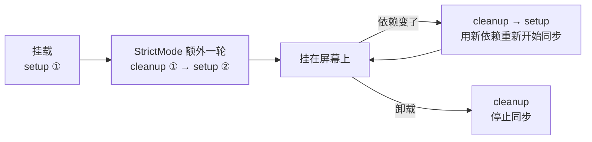
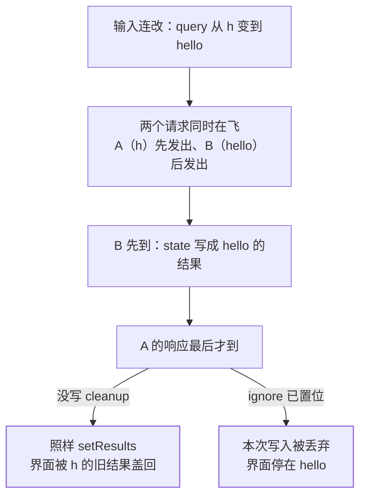

`basic` 层已经把 Effect 的三件事讲清了：它在渲染之后跑、依赖数组是正确性
声明、漏写依赖会读到旧快照（见
[Hooks 心智模型](/react/basic/core/02-hooks-mental/)）。但那三条只够写出
「能跑」的 Effect。面试和线上真正咬人的是另外三条：**清理函数到底在防什么、
StrictMode 为什么把 Effect 跑两遍、以及一个不带清理的 `fetch` 怎么会偶发地把
旧数据写到新界面上**。这三条共用一个前提——**你对 Effect 的心智模型是错的**。

## 换掉生命周期模型：Effect 只有两个动作

绝大多数人第一次写 Effect 用的是「组件生命周期」这套词：挂载时做什么、
卸载时做什么。这套词的危险在于它暗示**只发生一次**，于是清理函数看起来
像可选的收尾工作。官方给的定义把主语换掉了：

> "An Effect can only do two things: to start synchronizing something, and
> later to stop synchronizing it."
> —— Effect 只能做两件事：开始同步某个东西，稍后停止同步它。

配套的还有两句：把 Effect 从组件生命周期里独立出来看（*think about each
Effect independently from your component's lifecycle*），以及这个循环**会
重复多次**——*This cycle can happen multiple times if your Effect depends on
props and state that change over time.*

所以正确的读法是：**Effect 体 = 开始同步，cleanup = 停止同步**，两者配成
一对，随着依赖变化反复开关。你写的不是「初始化」，而是一次订阅；订阅就有
退订，退订不是可选项。同一个理由也解释了为什么依赖变了必须先跑 cleanup
再跑新的 setup：上一次的同步还没停，就叠一份新的上去。



对照着看，两种心智模型的差别就落在一句话上：生命周期模型里 cleanup 挂在
「卸载」一个事件上，订阅模型里 cleanup 挂在**每一次重新同步**前面。后者
才对得上 React 的实际行为。

## StrictMode 多跑的那一轮：照妖镜，不是干扰

理解了这个循环，`StrictMode` 下开发环境 Effect 跑两遍就不再是怪事。官方
描述的行为是：**每一段 Effect 额外多一次 setup + cleanup 循环**（*When
Strict Mode is on, React will also run one extra setup+cleanup cycle in
development for every Effect.*），实现方式是挂载之后再原地重挂一次，且
**state 与 DOM 保留**（*React remounts every component once after mount
(state and DOM are preserved).*）。

它要暴露的正是「没写清理」这一类缺陷。官方在连接示例里说得很直白：忘了
在卸载时关连接，光靠手工测试很容易漏，于是开发期 React 主动重挂一次，
**看到 `"✅ Connecting..."` 打了两遍，就逼你去查为什么没有对应的 close**。
同页另一句给了通用判据：*React starts and stops your Effect one extra time
in development to check you've implemented its cleanup well.*

三条边界要说清，避免把它读成「React 的副作用行为不可靠」：

- **只在开发期**：官方原文 *All of these checks are development-only and do
  not impact the production build.*，生产构建不会重复执行。
- **不是随机重跑**：额外一轮是「setup → cleanup → setup」，中间仍然配了
  cleanup。它测的是你的**对称性**，不是容忍你乱写。
- **别把它当新需求的成因**：如果一段逻辑「跑两遍就出错」，那它在依赖频繁
  变化时同样会跑多遍——StrictMode 只是把本来就会发生的事故提前摆到你面前。

所以「Effect 跑两遍怎么办」这个问法本身就有问题；正确问法是「我的 Effect
能不能被安全地重复启动和停止」。（另两条同源的重复执行——重渲染与
ref 回调多跑一轮——属于渲染纯度与 ref 清理，本篇不展开。）

## 竞态：旧响应晚到一步，就把新数据盖了

同步模型最实用的推论，是它能预判一类很难复现的 bug。官方用的例子是搜索
框：**输入快的时候 `query` 会从 `"h"` 一路变到 `"hello"`，每次都发一个请求，
但响应到达的顺序没有任何保证**（*there is no guarantee about which order
the responses will arrive in*）。两个请求同时在飞，谁先到谁后到取决于网络，
于是形成官方点名的 race condition：*two different requests "raced" against
each other and came in a different order than you expected.*



这就是「偶发」二字的来源：代码没有任何分支依赖时序，但**结果**依赖。修复
办法仍然回到订阅模型——**给 Effect 加 cleanup，把上一次同步的出口关掉**：

```jsx
function SearchResults({ query }) {
  const [results, setResults] = useState([]);

  useEffect(() => {
    let ignore = false;
    fetchResults(query).then(json => {
      if (!ignore) {        // 只有还没被清理过的那次才允许写
        setResults(json);
      }
    });
    return () => {
      ignore = true;        // 停止同步：作废本次的写入权
    };
  }, [query]);
  ...
}
```

`ignore` 是局部变量，每次同步各有一份——Effect 体与它的 cleanup 共享同一次
闭包，所以清理动的一定是「这一次」的开关，不会串到下一轮去。官方对这条
机制的总结是一句很好用的判据：*If the `userId` changes from `'Alice'` to
`'Bob'`, cleanup ensures that the `'Alice'` response is ignored even if it
arrives after `'Bob'`.*——**清理保证的是「旧请求的迟到结果进不了 state」，
无论它先到还是后到**。

`ignore` 只挡住了写入，请求本身照样跑完、带宽照样花掉。若这个请求可以
取消，官方给的是再补一手：*In addition to ignoring the result of an
outdated API call, you can also use AbortController to cancel the requests
that are no longer needed.* 两者不是二选一：`AbortController` 省掉的是流量
与服务端算力，`ignore` 挡的是「已经收下的响应回调里那次 `setState`」。
只 abort 不判 flag，某些封装会在 abort 后仍把 `undefined` 写进 state。

| 副作用类型 | 不写 cleanup 的代价 | 清理动作 |
| --- | --- | --- |
| 订阅 / WebSocket | 每次重同步叠一条，旧连接一直收消息 | 退订、`close()` |
| 定时器 | 旧 interval 继续跑并写 state，回调越堆越多 | `clearInterval` |
| 请求 | 迟到响应盖掉新数据（本节主线） | `ignore` / `abort` |
| 全局事件、直接改 DOM | 监听器泄漏、外部元素没人复原 | `removeEventListener`、还原 |

## 两类不该塞进 Effect 的代码

Effect 的准入判据不是「这段代码有副作用」，而是**它为什么运行**。官方给了
一条可执行的自问：*Use Effects only for code that should run **because** the
component was displayed to the user.* 落到分类上就是那句对照——**由某个交互
引起的逻辑留在事件处理器里，由「用户看到了这个组件」引起的逻辑才放 Effect**。
理由是时机对不上：*By the time an Effect runs, you don't know what the user
did (for example, which button was clicked).* 另外这也解释了两者频次不同：
*Unlike event handlers, which only run once per interaction, Effects run
whenever synchronization is necessary.* 把「提交订单」写进 Effect，它会在每
一次重新同步时再下一单。

第二类是**能算出来的东西**。这与
[状态管理与 Context](/react/intermediate/state/01-context-vs-store/) 里「冗余
state」那条同源，官方的表述更硬：*If something can be calculated from the
existing props or state, don't put it in state. Instead, calculate it during
rendering.* 收益官方列了三条：更快（省掉一次级联更新）、更简单（少一个状态
变量）、更不容易错（避免两个 state 之间对不齐）。用 `useEffect` 把 props 抄
进 state，除了多一次渲染，还额外制造出一个「两帧之间不一致」的窗口。

```jsx
// ✕ 姓或名一变，就同步地把 fullName 重新算一遍写回去
const [fullName, setFullName] = useState('');
useEffect(() => {
  setFullName(firstName + ' ' + lastName);
}, [firstName, lastName]);

// ✓ 渲染期直接算：不需要 state，也就不可能不同步
const fullName = firstName + ' ' + lastName;
```

「重置确认框」这一类更能看出判据怎么用：需求是**用户改了密码就把重复密码
清空**，写成 Effect 会变成「密码一变就清空」——于是任何改密码的路径（包括
表单自动填充、上级受控刷新）都会连带触发它，而它本来只想响应一次点击。

```jsx
// ✕ 用 Effect 代替「改密码」这个动作的下游
useEffect(() => {
  setConfirmPassword('');
}, [password]);

// ✓ 它是交互的下游，就写回交互里
function handlePasswordChange(e) {
  setPassword(e.target.value);
  setConfirmPassword('');
}
```

至于「拉数据到底该写在哪」，本篇给的只是**手写时的自保姿势**。真正的结论
在上一节：接口数据是**服务端状态**，缓存、去重、后台刷新、失效判断这一套
不该由裸 Effect 承担。判据仍然复用那句「为什么运行」——组件被显示出来时
去取数，是同步；用户点了按钮去取数，是事件。

## useEffect 还是 useLayoutEffect

时机差一个「浏览器重绘」，这是两个 hook 唯一实质区别。官方定义：
`useLayoutEffect` **在浏览器重绘屏幕之前**触发，且其中排队的 state 更新同样
在重绘前处理完；而 `useEffect` 是 *React will let the browser paint the screen
before it processes the state update inside `useEffect`.* 代价写在同一页：
`useLayoutEffect` 会**阻塞浏览器重绘**，所以*can hurt performance. Prefer
`useEffect` when possible.*

它的位置因此很窄：**量完布局必须马上用它定位，且不能让用户看见中间态**。
官方例子是 tooltip——用 `useEffect` 定位时慢机器上能观察到闪一下，因为
先按旧位置画了一帧，量完尺寸再改位置又画一帧。反过来，把不依赖测量结果的
副作用（发请求、打日志、订阅埋点）挪进 `useLayoutEffect`，只是把主线程堵在
重绘前，没有任何收益。

## 面试答法

- **「StrictMode 下 Effect 执行两次，怎么解决？」** 先纠正前提：那是开发期
  主动做的额外一轮 setup+cleanup，生产不受影响，它存在的意义就是检查清理
  有没有写全。真要「只跑一次」的逻辑（比如用户交互触发的上报）本来就不该
  放 Effect，放事件处理器。
- **「用 useEffect 拉数据怎么防竞态？」** 加 cleanup 关掉旧同步的写入权
  （局部 `ignore` 标志），能取消的请求再配 `AbortController`。要点是解释
  为什么 `ignore` 不会串轮：Effect 体和它的 cleanup 共享同一次闭包。
- **「清理函数什么时候可以省略？」** 只有当这段 Effect 什么都没建立时。
  没返回 cleanup，React 视为你返回了一个空的（*React will behave as if you
  returned an empty cleanup function*），所以省掉的代价在「以后加了订阅却
  忘了补」的时候才显现。
- **「哪些代码不该进 Effect？」** 两类：由交互引起的（放事件处理器）、能由
  props/state 算出来的（渲染期直接算）。判据是问「这段代码为什么运行」。
- **「useEffect 和 useLayoutEffect 怎么选？」** 默认 `useEffect`；只有在
  「读取布局尺寸并立刻据此定位、且中间态不能露一帧」时才用后者。

## 要点备忘

- Effect 是订阅，不是生命周期：体 = 开始同步，cleanup = 停止同步
- 这个循环会重复多次——依赖每变一次就「停一次、再开一次」
- StrictMode 的额外一轮只发生在开发期，测的是 setup/cleanup 是否对称
- 「跑两遍就出错」不是 React 的问题，是没写清理的 bug 被提前照出来了
- 竞态的根因是响应到达顺序无保证，不是「Effect 多跑了一次」
- `ignore` 挡写入、`AbortController` 省流量，两者互补而非二选一
- 用户交互留在事件处理器，可推导的数据在渲染期算，都别塞进 Effect
- `useLayoutEffect` 阻塞重绘，只在「量完就得定位」这一窄场景里值得用

## 延伸阅读

- [React 官方文档 · Lifecycle of Reactive Effects](https://react.dev/learn/lifecycle-of-reactive-effects)
- [React 官方文档 · Synchronizing with Effects](https://react.dev/learn/synchronizing-with-effects)
- [React 官方文档 · You Might Not Need an Effect](https://react.dev/learn/you-might-not-need-an-effect)
- [React 官方文档 · StrictMode](https://react.dev/reference/react/StrictMode)
- [React 官方文档 · useLayoutEffect](https://react.dev/reference/react/useLayoutEffect)
- [MDN · AbortController](https://developer.mozilla.org/en-US/docs/Web/API/AbortController)
