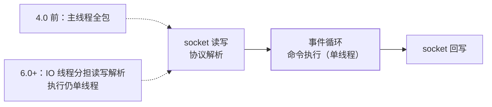

## 先把"单线程"说准

Redis 的"单线程"从来只指一件事：**命令执行由一个线程串行完成**。
网络 IO 在不同版本有不同答案：

- **4.0 前**：连 IO 都是主线程（靠[多路复用](/java/basic/io/01-io-model/)扛海量连接）；
- **4.0**：加入惰性释放线程（`UNLINK`/异步 `FLUSHALL` 后台删大对象）；
- **6.0**：IO 多线程（`io-threads`）分担**读写与协议解析**，命令执行
  仍然单线程——**原子性语义因此一点没变**。

## 为什么快：四个正交原因

| 原因 | 说明 |
|---|---|
| **纯内存** | 读写不碰磁盘（持久化是 fork 子进程/后台线程的事，见[持久化](/redis/basic/core/02-persistence/)） |
| **高效数据结构** | SDS、跳表、listpack、渐进式 rehash（见[数据结构](/redis/basic/core/01-data-structures/)） |
| **IO 多路复用** | epoll 单线程监管海量连接，事件驱动（同 [Netty 的 Reactor](/java/basic/io/01-io-model/)） |
| **单线程无锁** | 没有锁竞争、没有上下文切换、没有并发数据结构的开销——代码简单且每次操作都跑满 |

第四条常被低估：**单线程不是妥协，是选型**——内存操作快到锁开销占比
惊人，串行反而是最优解。同时它免费送了两个东西：**每个命令天然原子**
（[分布式锁的 setnx](/redis/intermediate/usage/03-distributed-lock/)
成立的前提）、**无并发 bug**。

## 6.0 IO 多线程：慢在网络不在计算

瓶颈数据：纯内存执行是微秒级，而**读写 socket 与解析协议是十微秒级**
——高吞吐时 CPU 空转在等内核 syscall。6.0 的 IO 线程只接管这段，
多条线程并行读写/解析，**执行排队回单线程**。所以：

- 开了 io-threads 也不会引入命令并发问题；
- `io-threads-do-reads` 默认关闭（读侧收益小），通常 4 核内不必开。

## 单线程的三个瓶颈（所有优化的出发点）

1. **大 key/慢命令阻塞**：`KEYS *`、`SMEMBERS` 百万元素、`HGETALL`
   大 hash——一条慢命令卡住所有请求（这就是[大 key 治理](/redis/intermediate/usage/06-bigkey-hotkey/)
   存在的根本原因；扫描用 `SCAN` 代替 `KEYS`）。
2. **CPU 吃不满**：执行单线程只能用一个核——吞吐顶不住时**纵向开
   实例**（一机多实例绑核）而不是调参数。
3. **fork 抖动**：RDB/AOF 重写的 fork 在大内存实例上是毫秒~百毫秒级
   停顿（写时复制见[持久化](/redis/basic/core/02-persistence/)）。

## 小结

- "Redis 单线程"= 命令执行串行；6.0 只是 IO 多线程，原子语义未动。
- 快 = 内存 + 数据结构 + epoll + 无锁串行，四条各自独立成立。
- 一切性能优化回到单线程公理：**别让任何一条命令跑太久**——大 key、
  慢命令、fork 都是它的具体形态。
