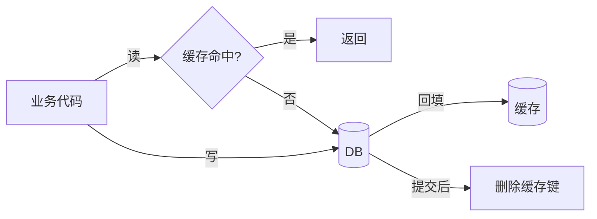
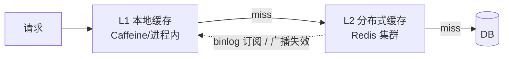

## 缓存在分布式系统中的位置

大型系统里缓存不是"加个 Redis"这么简单，它是一组分层决策：**缓存什么、
读写怎么走、不一致怎么办**。[穿透/击穿/雪崩](/redis/intermediate/usage/02-cache-problems/)是缓存出了问题的
表象，本篇讲的是不出问题的架构底子。

## 四种读写模式

### Cache Aside（旁路缓存）——默认答案

业务代码自己管缓存：**读先查缓存，未命中查 DB 回填；写先更新 DB，再删缓存**。

- 优点：缓存层故障只退化成"全查 DB"，结构简单；
- 坑：先删缓存再更新 DB 是错的（并发下旧值回填）；删缓存失败会留脏数据，
  用重试队列或 binlog 订阅（Canal）补偿。

### Read Through / Write Through——缓存服务代理读写

业务只见缓存层，**缓存组件自己负责与 DB 同步**（miss 时加载、写时同步
落库）。业务代码最干净，但要求缓存组件支持（如某些缓存中间件/封装层），
Java 生态常需要自己包一层。

### Write Behind（Write Back，回写）——写削峰的极限

写只写缓存立即返回，**异步批量刷回 DB**。

| | Cache Aside | Read/Write Through | Write Behind |
|---|---|---|---|
| 一致性 | 最终（删缓存窗口） | 较强（同步落库） | 最弱（刷盘前丢数据风险） |
| 写延迟 | DB 同步延迟 | DB 同步延迟 | **极低** |
| 复杂度 | 低 | 中（组件支持） | 高（合并/刷盘/恢复） |
| 典型场景 | 通用默认 | 缓存组件原生支持 | 计数器、点赞、PV 等可丢失写 |

## 多级缓存架构

单层 Redis 仍是网络一跳；热点流量下在前面再加**本地缓存**：

- L1 挡住大部分读，L2 抗容量与共享，DB 只兜底；
- **代价是一致性链变长**：本地缓存失效要靠广播（如 Redis Pub/Sub 通知各
  节点逐出）或短 TTL 兜底——接受"秒级不一致"是前提；
- 热点 key 打爆单个 Redis 分片时，本地缓存是比无限扩副本更便宜的解。

## 缓存与 DB 一致性策略

| 策略 | 做法 | 一致性窗口 |
|---|---|---|
| 先更新 DB 再删缓存 | Cache Aside 标配 | 毫秒级（删除失败需补偿） |
| 延迟双删 | 删缓存 → 更新 DB → 延迟 N ms 再删一次 | 覆盖并发读回填旧值 |
| binlog 订阅 | Canal 订阅变更→删缓存，与业务解耦 | 秒级，最可靠 |
| 强一致 | 分布式锁串行化读写 | 牺牲吞吐——上缓存就别强求 |

工程默认组合：**先更新 DB 再删缓存 + 删除失败进重试队列**；对一致性敏感
的核心数据再加 binlog 订阅兜底。要强一致的数据，诚实回答是：不适合缓存。

## 热点与大 key

- **热点 key**：单 key QPS 打满单分片。解法：本地缓存、key 打散多副本
  （`key_1..key_n` 随机读一个）、读写分离扩展副本。
- **大 key**：value 过大（集合几十万元素），读写阻塞、过期瞬时空洞。解法：
  拆分（`order:1:items:0..99` 分片）、压缩、异步渐进删除（UNLINK）。

## 小结

- 读写模式四选一：默认 **Cache Aside**，组件支持用 Read/Write Through，
  可丢写的场景才上 Write Behind。
- 多级缓存用本地换网络，代价是一致性链变长——广播失效 + 短 TTL 是标配。
- 一致性三件套：先更新 DB 再删缓存、延迟双删、binlog 订阅兜底。

## 延伸阅读

- [大型分布式系统中的缓存架构（博客园）](https://www.cnblogs.com/panchanggui/p/9503666.html)
