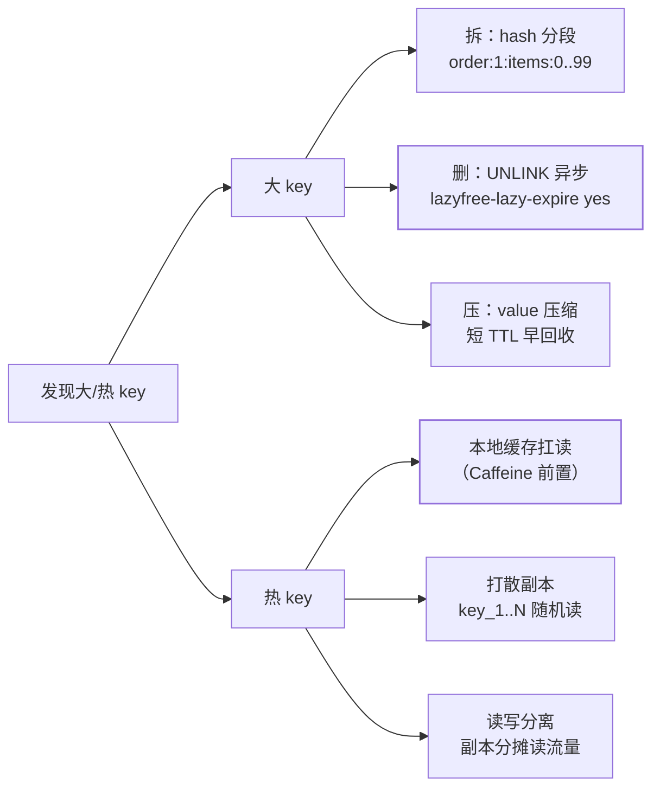

## 为什么值得单开一篇

[缓存模式篇](/redis/intermediate/usage/04-cache-patterns/)给过大 key/
热 key 的速查结论；这篇展开成完整的"发现 → 量化 → 治理 → 预防"
闭环——因为它们的根源都是[单线程模型](/redis/basic/core/03-thread-model/)：
**任何过大的数据或过热的访问都会独占那唯一的执行线程**。

## 大 key：多大算大

经验阈值（按业务可调，阿里规范同量级）：

| 类型 | 关注线 |
|---|---|
| String | value > 10KB（超过 1MB 必治理） |
| 集合（hash/list/set/zset） | 元素数 > 5000 或聚合体积 > 1MB |

**危害四连**：

1. **读写慢**：网络传输 + 序列化都随体积线性涨；
2. **阻塞**：`DEL` 百万元素集合是毫秒~秒级卡顿，单线程下全体陪葬；
3. **过期雪崩**：被动过期瞬间删除同样阻塞（同款问题换触发方式）；
4. **数据倾斜**：Cluster 分片按 key 散列，单个大 key 让某分片内存
   /流量畸高。

## 热 key：单 key 打满单分片

某 key（或某前缀）QPS 远超其他——集群下**全部分片流量压到一个分片**
，CPU 打满、其余分片闲死。典型来源：爆款商品详情、明星微博、
定时任务齐刷同一 key。

## 线上探测

```bash
redis-cli --bigkeys                 # 各类型采样扫描，报 top1 大 key（生产可用，SCAN 式）
redis-cli --hotkeys                 # 热 key（需要 maxmemory-policy 为 LRU 系才有命中统计）
MEMORY USAGE mykey                  # 精确量化单 key 体积
```

- 大规模/精确盘点：**离线分析 RDB**（redis-rdb-tools 生成 CSV 排序），
  零线上风险；
- 客户端/代理层统计访问频次找热 key，比服务端看更准；
- **别用 `MONITOR` 找热 key**：它本身就是单线程阻塞源，生产等于自杀。

## 治理手段



- **拆**是万金油：大 hash 按 field 取模拆小 hash；注意一次 `HGETALL`
  要改成按需取子 key。
- **删务必用 UNLINK**（后台线程释放）而不是 DEL；配置
  `lazyfree-lazy-expire` 让被动过期也异步——专治"过期瞬间卡顿"。
- 热 key 的本地缓存要接受**短时不一致**（毫秒级容忍是前提）。
- 处理不了的（比如监控报警但业务不肯拆）：升配只能买时间，躲不过
  单线程公理。

## 预防红线（写进 code review 清单）

- 禁 `KEYS *`、`FLUSHALL`，扫描用 `SCAN` + 游标；
- 集合类写入前判断规模上限，超限走拆分或换结构（大 value 上传对象
  存储只存引用）；
- 缓存 value 大小入监控（客户端序列化后打点）；
- 新服务上线前过一遍 `--bigkeys` 预检。

## 小结

- 大 key 害在阻塞与倾斜，热 key 害在单分片打满——都是单线程公理的
  事故形态。
- 探测三板斧：`--bigkeys/--hotkeys` 采样、`MEMORY USAGE` 精确、
  RDB 离线分析；`MONITOR` 禁用于生产。
- 治理口诀：**拆、压、异步删（UNLINK）；本地缓存、打散副本扛热**。
- 预防比治理便宜：红线进 review，规模上限进设计。
