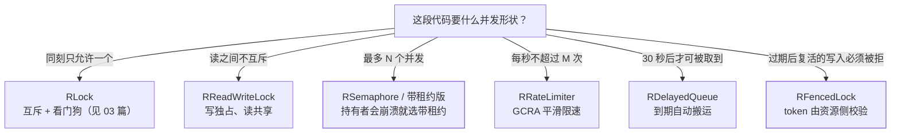

## 问题：只会用 `getLock()`，等于把 Redis 当数据库浪费

[分布式锁的演进](/redis/intermediate/usage/03-distributed-lock/)已经把一把锁讲
到底了：`SET NX EX` → 唯一标识防误删 → 看门狗续期（**只在未指定
`leaseTime` 时启用**）→ RedLock 争议。本篇不重复那条链，只往旁边看：
`RedissonClient` 上那一排**同步器与并发容器**。

它们解决的是"锁只能串行化一段代码，但业务要的是别的形状"：

| 你要的东西 | 对对象 | 换普通锁会怎样 |
|---|---|---|
| 读多写少、读之间不互斥 | `RReadWriteLock` | 用 `RLock` 会把读也串行化 |
| 限并发数而不是互斥 | `RSemaphore` / `RPermitExpirableSemaphore` | 一把锁做不了"最多 N 个" |
| 全局 QPS 上限 | `RRateLimiter` | 计数器 + 过期有竞态 |
| 延迟投递、延时任务 | `RDelayedQueue` | `EXPIRE` + 轮询 key 通知，事件不可靠 |
| 锁过期后旧持有者不能写坏数据 | `RFencedLock` | **普通锁做不到**，见第五节 |



下面按这五个分支展开；一把 `RLock` 的演进不再重复。

## 一、读写锁：读共享，但别指望它免费

```java
RReadWriteLock rw = redisson.getReadWriteLock("cfg:order-service");

RLock r = rw.readLock();     // 多个读者可同时持有
r.lock();
try { return readConfig(); } finally { r.unlock(); }

RLock w = rw.writeLock();    // 独占，挡住所有读者与写者
w.lock(10, TimeUnit.SECONDS);
try { writeConfig(); } finally { w.unlock(); }
```

三个必须心里有数的点：

1. **每次 acquire/release 都是一次 Redis 往返**（内部是 Lua 脚本原子改
   哈希状态，见[管道、事务与 Lua](/redis/intermediate/usage/05-pipeline-transaction-lua/)）。
   本地能省的锁，在 Redis 上每次都是网络成本——**热点读路径上放一把
   分布式读锁，多半比无锁更慢**。它的正确用武之地是"低频但强互斥"
   的写（配置发布、刷新缓存）配"要读到一致视图"的读。
2. **读写锁保证的是"同一时刻不并发写"，不保证你读到新值**。
   读到什么仍取决于你什么时候写进 Redis——这是缓存问题不是锁问题
   （对照[缓存模式](/redis/intermediate/usage/04-cache-patterns/)）。
3. **不要和 `getLock("same-name")` 用同一个 key 名**。可重入锁与读写锁
   的键结构不同，混用同名等于对同一个键写两种语义，行为不在契约里。
   跨"能不能从读锁升到写锁"这类问题也别赌——先释放再取，顺序写清楚。

## 二、信号量：限并发，以及持有者崩溃之后

```java
RSemaphore sem = redisson.getSemaphore("export-slots");
sem.trySetPermits(8);                    // 全集群 8 个并发导出
if (sem.tryAcquire(2, TimeUnit.SECONDS)) {
    try { doExport(); } finally { sem.release(); }
}
```

`RSemaphore` 的硬伤：**许可没有过期时间**。持有者进程被 kill、机器直接
没了，那个许可就**永久泄漏**，8 个坑位慢慢用到只剩 0，表现为
"任务越跑越少，最后全在排队"。

带租约的那一个才是生产该用的：

```java
RPermitExpirableSemaphore s =
    redisson.getPermitExpirableSemaphore("export-slots");
s.trySetPermits(8);

// 等 2 秒拿许可，拿到后租约 60 秒
String permitId = s.acquire(2, 60, TimeUnit.SECONDS);
if (permitId != null) {
    try { doExport(); } finally { s.release(permitId); }   // 必须按 id 释放
}
```

区别在两点：**许可自己会到期回收**，以及 `release` 要传 `acquire`
返回的 id（因为许可归属某个客户端实例，不再是"线程持有"）。
代价是每个许可多一轮交互，且**租约时长必须大于任务最长执行时间**，
否则任务还没跑完许可已被别人拿走——这条和可重入锁的
"业务比 TTL 长"是同一个坑，解法也一样：要么把租约放宽并配看门狗型
续期，要么把任务切短。

## 三、限流器：GCRA 与两个作用域

```java
RRateLimiter lm = redisson.getRateLimiter("vendor:qps");

// 只在还没配过时写入，返回 false 表示已存在（不会覆盖别人）
lm.trySetRate(RateType.OVERALL, 100, 1, RateIntervalUnit.SECONDS);

if (!lm.tryAcquire()) return Result.fail("rate limited");
```

| 维度 | 取值 | 含义 |
|---|---|---|
| 作用域 | `RateType.OVERALL` | 所有实例共享一个总上限（打第三方接口该用这个） |
| | `RateType.PER_CLIENT` | 每个 Redisson 实例各自一份（本机磁盘/线程保护用这个） |
| 写法 | `trySetRate(...)` | **仅当未配置时生效**，返回 `false` 表示已有配置 |
| | `setRate(...)` | 覆盖配置并**重置已消耗的令牌** |

两个容易出事的地方：

- **重启应用别用 `setRate`**：它会重置令牌计数并覆盖掉别的实例已经设好的
  速率；配置限速用 `trySetRate`，只有确实要改策略时才 `setRate`。
- 它是 **GCRA（带虚拟调度的令牌桶变体）** 实现的**平滑限速**，不是
  "窗口内计数"。所以别拿它复刻"每分钟整点放行 100 个"这种突发语义——
  要突发就用固定窗口/漏桶自己配参数，并看清它**不保证公平**。

限流阈值怎么定（容量、单实例分摊、下游能扛多少）是另一件事，
见[容量规划](/distributed/intermediate/performance/03-capacity-planning/)；
跨方案的横向对比（含 Redis vs 网关 vs Sentinel）见
[分布式限流](/distributed/intermediate/traffic/01-distributed-rate-limiting/)。

## 四、延迟队列与"到期搬运"

```java
RBlockingQueue<Task> ready = redisson.getBlockingQueue("task:ready");
RDelayedQueue<Task> delayed = redisson.getDelayedQueue(ready);

delayed.offer(new Task(1), 30, TimeUnit.SECONDS);   // 30 秒后可被取到

while (true) {
    Task t = ready.poll(1, TimeUnit.MINUTES);        // 消费端只看 ready
    if (t != null) handle(t);
}
```

形状是"**投递进延迟层，到期由 Redisson 自动搬进目标队列**"，消费端
完全不知道有延迟这回事。它比"把过期时间设成任务时间、靠 key 过期
通知"可靠得多——**键过期通知不可靠**（惰性删除下过期事件可能不发，
重启还会丢），这条在[延迟消息](/middleware/intermediate/mq/05-delay-message/)里
论证过。

三条边界：延迟任务的载体仍在 Redis 里，**没落盘就等于会丢**（要
持久性就用带持久化的 MQ，Redis 只做削峰那一层）；搬运由持有该
delayed queue 的客户端触发，**消费端全停时到期项不会被搬走**；
这一族 API 在新版本有调整（含优先级延迟队列等形态），
**类名以你依赖的版本为准**，别照抄老帖。

顺带把同一族的三个小件收进来：`RCountDownLatch`（跨实例一次性闸门，
计数归零即放行，**不可复用**）、`RAtomicLong`（跨实例原子计数，
和 `INCR` 同级语义但带 `compareAndSet`）、`RBoundedBlockingQueue`
（有界阻塞队列，生产者满了会真阻塞，用于背压）。

## 五、fencing token：锁续期救不了的那一类

普通锁有个无法消除的窗口：**A 拿到锁 → A 卡顿（GC/网络）→ 锁过期 →
B 拿到锁写入 → A 醒来，以为自己还持有锁，继续写**。看门狗只能降低
概率（它救的是"业务比 TTL 长"），**救不了"进程停顿后复活"**——
A 侧根本不知道自己已经被判出局。

Redisson 对此的答案是 `RFencedLock`：加锁时返回一个**单调递增的
token**，你把 token 一路带到资源侧，资源拒绝比它已见过的最大值更小的写入：

```java
RFencedLock lock = redisson.getFencedLock("storage:leader");

Long token = lock.tryLockAndGetToken(100, 10, TimeUnit.SECONDS);
if (token == null) return Result.busy();   // 未获锁时返回 null
try {
    storage.write(data, token);            // 关键：写入必须带上 token
} finally {
    lock.unlock();
}
```

对应的资源侧只有三行，但**它是整个方案唯一的防线**：

```java
// 存储侧记住见过的最大 token；更小的说明持有者已被判出局
synchronized boolean accept(long token) {
    if (token < maxSeenToken) return false;   // fenced out
    maxSeenToken = token;
    return true;
}
```

所以判断标准很清楚：**只有当被保护的资源能校验 token 时，fencing 才
成立**。资源是一个不认识 token 的第三方 HTTP 接口，这套就退化成普通锁。
`getToken()` 可以只读当前 token 而不加锁；纯进程内协调用不上它，
普通 `RLock` 就够。

官方对多节点红锁的立场也落在这里：`RedLock` 实现**已标记弃用，
由 `RLock` 与 `RFencedLock` 取代**——理由是算法的安全性本身有争议，
而代价是要维护一组彼此独立的主节点。**红锁那段争议的来龙去脉**
（为什么"多数派"仍依赖时钟与延迟假设）在
[分布式锁那篇](/redis/intermediate/usage/03-distributed-lock/)已经讲清，
本篇只补结论：**正确性攸关的互斥，把最后一道防线放在资源侧**
（数据库唯一约束、单调 token、CAS 版本号），而不是放在客户端的锁算法里。

## 小结

- 一把 `RLock` 只会"串行化"。要**读共享**用读写锁、要**限并发数**用
  信号量、要**限速**用 `RRateLimiter`、要**延后执行**用延迟队列、
  要**挡住复活写入**用 `RFencedLock`。
- 读写锁每次 acquire 都是一次 Redis 往返，热点读路径上多半得不偿失；
  它保证不并发写，不保证读到新值。
- `RSemaphore` 的许可**不会过期**，持有者崩溃即永久泄漏——生产用
  `RPermitExpirableSemaphore`，代价是租约必须长于任务时长。
- 限速配置用 `trySetRate`（已存在则不覆盖），`setRate` 会覆盖并**重置
  令牌**；`OVERALL` 是全集群共享上限，`PER_CLIENT` 是每实例一份。
  它是 GCRA 平滑限速，不保证公平。
- 延迟队列的价值在"到期自动搬运"，比 key 过期通知可靠；但要持久性
  请交给 MQ，且消费端全停时不会搬运。
- **fencing token 是锁过期窗口的唯一硬解**：token 要一路带到资源侧
  并被校验。红锁已被官方弃用（由 `RLock`/`RFencedLock` 取代），
  强互斥的最后一道防线不该是客户端算法。

## 延伸阅读

- [Redisson 官方：Locks and synchronizers（读写锁 / 信号量 / RedLock 弃用与 fencing token）](https://redisson.pro/docs/data-and-services/locks-and-synchronizers/)
- [Redisson 官方：Rate Limiter（`trySetRate`/`setRate`、`RateType`、GCRA）](https://redisson.pro/docs/data-and-services/objects/)
- 站内配套：[分布式锁演进与 RedLock 争议](/redis/intermediate/usage/03-distributed-lock/)、[管道、事务与 Lua](/redis/intermediate/usage/05-pipeline-transaction-lua/)
