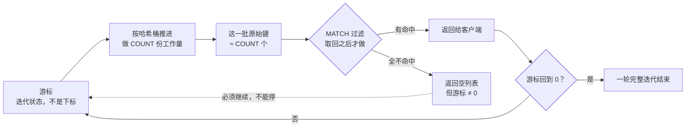

## 先分清：一条命令看不出"快出事"，三层数据源才看得出

Redis 的现场取证难在**它自己就是那个串行执行的地方**——任何一段卡住，
表现出来都是"所有客户端一起慢"，而不同原因的取证入口完全不一样。先把
问题按数据源切开：

| 要回答的问题 | 数据源 | 数据特征 |
|---|---|---|
| 容量还有多少余量、趋势对不对 | `INFO memory` / `stats` / `keyspace` | 绝大多数是**累计计数器** |
| 主线程被哪一段卡住了 | `SLOWLOG` / `LATENCY` | 环形缓冲，容量有限 |
| 谁在这么用、被谁拒了 | `CLIENT LIST` / `ACL LOG` | 快照 + 60 秒合并窗口 |

第一个认知就要写清楚：**`INFO` 的原始快照不能用来告警**。除了
`instantaneous_*` 一类，其余字段都是进程启动以来的累计值，采集侧必须
**两次快照相减**得到速率，才能判断"在变坏"还是"一直这样"。

## INFO：一份快照的六种读法

### 一、命中率：公式简单，坑在语义

官方给的算法：

```
keyspace_hits / (keyspace_hits + keyspace_misses) * 100
```

两个字段的语义要抠准：**命中 = 键被成功找到，未命中 = 请求的键不在缓存
里**。而官方特别注明了一条容易踩的规则——`EXISTS` 判定"不存在"时**也算
一次 keyspace miss**。所以业务里如果大量用 `EXISTS` 做预检，命中率会被
系统性压低，这时"命中率低"根本不是缓存策略问题，是统计口径问题。

### 二、淘汰与过期：evicted_keys 和 expired_keys 要一起看

命中率低于预期时，官方的分诊路径是明确的：

| 现象 | 读什么 | 结论 |
|---|---|---|
| 命中率低 + `evicted_keys` 高 | `INFO stats` | 淘汰策略在踢错键（或 `maxmemory` 太小） |
| 命中率低 + `evicted_keys` 低 + `expired_keys` 高 | `INFO stats` | TTL 太短，或该留的键被设了过期 |
| 写命令报 OOM | `commandstats` 里各命令的**被拒绝次数** | `noeviction`/`volatile-*` 撞上上限 |
| 已经超限多久了 | `current_eviction_exceeded_time` | 上次开始超 `maxmemory` 至今的时间 |

`volatile-*` 系列在**没有任何键带 TTL 时行为等同于 `noeviction`**——这条
经常是"配了淘汰策略却开始报 OOM"的原因。

### 三、内存：碎片率不是阈值指标，是趋势指标

关于内存管理有三条官方事实，它们直接决定 `mem_fragmentation_ratio`
该怎么用：

1. **Redis 删键不归还内存给 OS**（其实是 allocator 的通用行为）：灌进
   5GB 再删掉 2GB，`used_memory` 回到 ~3GB，而 RSS 大概率还停在 ~5GB；
2. 因此内存要按**峰值**规划，不是按均值；
3. 碎片率的定义是 **RSS / 当前实际使用量**（各次分配之和）。

把三条合起来就得到结论：**峰值远大于当前用量时，碎片率必然虚高**。所以
它不适合配"超过 1.5 报警"这种静态阈值，适合和 `used_memory` 放在一起看
趋势。真要处理碎片化，Redis 提供主动碎片整理，它有自己专属的延迟事件
`active-defrag-cycle`——开了之后要回头看这个事件有没有尖刺。

复制和 AOF 还有两个容易漏看的字段：

- `mem_not_counted_for_evict`：等待写给副本/AOF 的缓冲所占内存，**不参与
  和 `maxmemory` 的比较**（官方解释了原因：淘汰本身会生成更新，会把省出
  来的内存立刻吃掉，形成反馈循环触发更多误淘汰）。所以官方建议配
  `maxmemory` 时**从可用内存里先扣掉这块缓冲**；
- `used_memory_dataset`：纯缓存数据的用量，它超过 `maxmemory` 的差额就是
  实际超限的幅度。

### 四、停顿：latest_fork_usec

BGSAVE / BGREWRITEAOF 要 `fork()`，而 fork 在主线程执行，代价主要是拷页
表。官方算例：内存按 4KB 分页，一个 24GB 的实例页表就要 24GB/4KB×8 =
48MB，fork 时得复制它。看这个：

```bash
redis-cli INFO persistence | grep latest_fork_usec   # 最近一次 fork 耗时
```

如果延迟尖刺的时间点和 BGSAVE 对得上，基本就是它。两条配套事实：
`/sys/kernel/mm/transparent_hugepage/enabled` 要设为 `never`（THP 会让
fork 后的写时复制把几乎整个实例内存搬一遍，既拖慢又涨内存）；Linux 上还
可以用 `redis-cli info | grep process_id` 拿到 pid，再去
`/proc/<pid>/smaps` 里 `grep 'Swap:'` 判断有没有被换出。

### 五、连接：三个数就够定位一大类问题

`connected_clients` 贴到 `maxclients` 会开始拒连（看 `rejected_connections`）；
`blocked_clients` 高说明一堆连接卡在 BLPOP/阻塞类命令上；这两个都是瞬时
状态，采样一次就有意义。

### 六、命令耗时：commandstats 是"最贵命令"的第一现场

`INFO commandstats` 每行形如 `cmdstat_hgetall:calls=...,usec=...,usec_per_call=...`。
按 `usec_per_call` 排序找最贵的命令，比盯着总调用次数有用——`GET` 调得多
不叫事，`usec_per_call` 高的才是要治的。这一段与
[大 key 与热 key 治理](/redis/intermediate/usage/06-bigkey-hotkey/)直接衔接。

## 慢日志：它只量"真正执行"那一段

`SLOWLOG` 的定义必须背下来，因为它是大多数误判的源头。官方原文说得很
硬：执行时间**不包含**与客户端通信、把响应发回去等 I/O 操作，**只算命令
真正执行的时间**（作者的理由是——只有这一段会让主线程无法服务别人）。

```bash
CONFIG SET slowlog-log-slower-than 10000   # 单位是微秒：这里是 10ms
SLOWLOG GET 20          # 不带参数默认只给最近 10 条，-1 才是全部
SLOWLOG LEN             # 当前条数
SLOWLOG RESET           # 清空，配合增量拉取用
```

每条记录是 6~7 个值：递增 ID、Unix 时间戳、耗时（微秒）、命令参数数组、
客户端地址、客户端名（较新版本再加一个总参数个数）。三个实用细节：

- **ID 只在进程重启时归零**，官方就是拿它做"避免重复处理同一条慢日志"
  的增量拉取（比如给每条新记录发邮件告警）；
- 参数数组会被 `slowlog-max-argc`（默认 32）截断，末尾变成
  `... (N more arguments)`——看到截断别以为命令就这么长；
- 阈值调得过低会把环形缓冲（`slowlog-max-len`）塞满，真正的尖刺被挤掉。

于是就有了那个最常见的现场：**客户端普遍报慢，但 `SLOWLOG GET` 是空的**。
这不是矛盾——排队、网络往返、响应回写都不计入慢日志。这时候要转两个方向：
LATENCY 事件（下一节）看主线程还有没有别的段落卡住，`CLIENT LIST` 看响应
是不是堆积在输出缓冲里。

## 延迟监控：给主线程的每一段单独计时

慢日志只管命令执行，[延迟监控](https://redis.io/docs/latest/operate/oss_and_stack/management/optimization/latency-monitor/)
把 Redis 内部所有"可能被卡住"的代码路径都插了桩：

```bash
CONFIG SET latency-monitor-threshold 100   # 单位是毫秒；0 表示关闭
LATENCY DOCTOR        # 人话版诊断报告，先看这个
LATENCY LATEST        # 每个事件最近一次采样
LATENCY HISTORY fork  # 某个事件的时间序列
LATENCY GRAPH command # ASCII 折线图
```

阈值默认 0（关闭），官方原话是这套东西开销"near zero"，但没必要让一个
正常实例白占内存。**这里有个反直觉的决定要早做：平时就该开着。** 因为它
的时间序列只有 160 个点，同一秒内同一事件的多次尖刺还会**按最大值合并**，
也就是说最多保留 160 秒左右的历史——出了事再打开，什么也查不到。

事件名就是取证的路标，挑生产上真会遇到的一组：

| 事件 | 在量什么 | 常见成因 |
|---|---|---|
| `command` / `fast-command` | 普通命令 / O(1)、O(log N) 命令的执行 | 大 key、O(N) 命令、Lua |
| `fork` | `fork(2)` 系统调用本身 | 实例太大、THP 没关、虚机 |
| `aof-write-pending-fsync` | 有 fsync 未完成时仍要写 AOF | 磁盘被别的进程拖慢 |
| `aof-fsync-always` | `appendfsync always` 的 fsync | 该换成 everysec |
| `expire-cycle` | 主动过期一轮 | 同一秒海量键到期 |
| `eviction-cycle` / `eviction-del` | 淘汰循环与其删除 | `maxmemory` 卡着上限跑 |
| `active-defrag-cycle` | 主动碎片整理 | 开了整理，看它值不值 |
| `rdb-unlink-temp-file` | 删除 RDB 临时文件 | 大文件 unlink 拖慢主线程 |

**它的边界同样重要**：延迟监控采样的是 **Redis 进程内**的代码路径，网络
和客户端进程完全不在覆盖范围内。所以要先把环境基线量出来。

## 先定基线：可能根本不是 Redis 慢

```bash
redis-cli --intrinsic-latency 100   # 必须在服务端跑，CPU 密集
redis-cli --latency -h <host> -p <port>   # 端到端往返
```

`--intrinsic-latency` 测的是"内核/hypervisor 能让你多久拿不到 CPU"，它
**不连 Redis**。官方给的对照很有冲击力：同一台物理服务器上测到 115 微秒，
而一个跑着 Redis 和 Apache 的 Linode 虚机实例测到 9.7 毫秒，作者说在负载
高的虚拟化环境见过 40 毫秒。**基线 9.7ms 的机器上，Redis 怎么调都下不去
10ms**——这时候调 Redis 是白费。

另一端是网络。官方给的量级：千兆网络单次往返约 200µs，Unix domain socket
约 30µs。Redis 自身执行是亚微秒级，也就是说**多数"Redis 慢"慢在往返次数
上**。官方给的优化优先级也照抄过来：能用 `MGET`/变参命令就不用 pipeline，
能用 pipeline 就不要逐条往返，同机部署就用 UDS——详见
[管道、事务与 Lua](/redis/intermediate/usage/05-pipeline-transaction-lua/)。

还有一类"慢"来自过期风暴，机制值得单独记：主动过期每 100ms 跑一轮，每轮
采样 20 个带 TTL 的键并清掉已过期的；**一旦发现超过 25% 已过期就继续循环**，
直到压回 25% 以下。平时每秒约 200 个键、对延迟无感，但如果用了同一个
Unix 时间戳批量 `EXPIREAT`，主线程就会为了压低比例而卡住。

## MONITOR：它是调试工具，不是可观测性数据源

`MONITOR` 把服务端处理的每一条命令都吐成流，看着像是"最好的可观测性"，
实际是**最容易把故障放大一倍的操作**。官方给的基准（10 并发、10 万请求）：

```
             不开 MONITOR        开一个 MONITOR 客户端
GET          104275 rps      →   45330 rps
SET           95419 rps      →   41823 rps
```

一个监控客户端就能让吞吐掉一半以上，多开几个更糟。所以官方把它归到
`@admin @slow @dangerous`。它还"看不全"：出于安全考虑**管理命令不进
MONITOR 输出**，`AUTH` 的参数被脱敏。

正确用法只有两种：确认某条命令到底有没有发出去、参数是什么，短时开着
落盘（`redis-cli monitor > /tmp/m.log`，立刻 `Ctrl-C`），或者干脆在应用侧
打日志。常态化观测请交给下面这组替代入口：

| 想知道 | 用 |
|---|---|
| 哪些命令慢 | `SLOWLOG` / `INFO commandstats` |
| 主线程卡在哪个阶段 | `LATENCY` |
| 谁在发、发了多少 | `CLIENT LIST` 的 `cmd` / `tot-cmds` / `tot-net-*` |
| 有没有人正挂着 MONITOR | `CLIENT LIST` 里 `flags=O` 的连接 |

## CLIENT LIST：看清"谁在这么用"

```bash
redis-cli CLIENT LIST TYPE NORMAL     # 也可 MASTER / REPLICA / PUBSUB
redis-cli CLIENT LIST ID 42           # 只看某个连接
```

| 字段 | 含义 | 现场判法 |
|---|---|---|
| `age` / `idle` | 连接存活秒数 / 空闲秒数 | 连接数暴涨且 `idle` 普遍很大 = 客户端池没复用或泄漏 |
| `flags` | 连接标记 | `O` 有人挂 MONITOR、`x` 在 MULTI 里、`b` 阻塞中、`S` 副本连接、`P` 订阅者、`t` 客户端缓存 |
| `cmd` | **最后一条**命令 | 不是"正在执行"，别看错 |
| `qbuf` / `qbuf-free` / `argv-mem` | 读缓冲已用/剩余/已抽出的参数 | `qbuf-free=0` 表示输入缓冲满了 |
| `obl` / `oll` / `omem` / `tot-mem` | 输出缓冲长度/排队响应条数/其内存/该连接总内存 | `oll`、`omem` 高 = 响应在排队，消费不过来 |
| `tot-net-in` / `tot-net-out` / `tot-cmds` | 累计流量与命令数 | 排序找大户，MONITOR 的常态化替代 |
| `user` / `resp` / `lib-name` | 认证用户 / RESP 版本 / 客户端库 | 定位"哪套应用"在制造问题 |

字段带版本，而且是官方明说的：**新字段会不断加、个别会被移除**（`ssub`
7.0.3、`watch` 7.4、`multi-mem`/`rbs`/`rbp`/`resp` 7.0、`io-thread` 8.0），
原话建议"优雅处理缺失字段、跳过未知字段"。所以任何解析 `CLIENT LIST` 的
脚本都不能写死字段顺序或做严格断言。

## SCAN：为什么"扫不到"不等于"没有"

`SCAN` 的四个保证与两个不保证，是全部姿势的来源：

- 保证：整个迭代期间**一直存在**的键一定会被返回；全程**一直不存在**的键
  一定不会被返回；
- 不保证：**同一个键可能返回多次**（去重是应用的责任）；迭代期间被增删的
  键返回与否**是未定义的**；
- 允许**单次返回 0 个元素**，只要游标没回到 0，迭代就没结束——这是最高
  频的误用；
- 如果集合一直在长大，官方明确说**不保证迭代能终止**。

```bash
redis-cli --scan --pattern 'cache:*' | head -50   # 扫描用这个，不要用 KEYS
```

`COUNT` 和 `MATCH` 完全不是一回事，这一点必须画开：



要点全在图里那个"过滤发生在取回之后"——官方原话如此，因此**pattern 选择
性高时大多数迭代会返回空**。正确反应是**调大 `COUNT`**（它是"每次调用允
许做多少工作"的提示，默认 10，不是返回条数上限，而且可以在迭代中途改），
而不是以为键不存在。另外两个细节：小集合用紧凑编码时会忽略 `COUNT` 一次
全返回（官方解释是没有可用的游标，只能整体遍历）；游标损坏（负数、越界）
不会崩，但结果不再有任何保证。无服务端状态这点带来两个便利：同一份数据
可以无限多个客户端并行迭代，也可以随时中途放弃而不用通知服务端。

`KEYS` 的位置官方写得很清楚：**只用于调试**。它还同时挂在 `dangerous` 类
目下——一个跑着线上流量的实例里，`KEYS *` 既是性能事故也是权限事故。

## 权限侧的可见性：谁被拒了

Redis 6 引入 ACL，一个向后兼容的关键点值得记：`requirepass` 没有被废弃，
它现在的语义是**给 `default` 用户设密码**，`AUTH <password>` 等价于
`AUTH default <password>`。全新实例的 `ACL LIST` 是
`user default on nopass ~* &* +@all`（`nopass` + default 用户意味着新连接
免认证直接全权限）。

被拒这件事在 Redis 6 之后是有记录的，`ACL LOG` 就是取证入口：

```bash
ACL LOG 20          # 默认只给最近 10 条；RESET 清空
```

- `reason` 只有四种：`auth`（认证失败）、`command`、`key`、`channel`；
- `context` 是 `toplevel` / `multi` / `lua` / `module`——能区分"应用直连发的"
  还是"脚本里触发的"；
- **`count` 字段是 60 秒窗口内合并的计数**，不是一行一次事件。所以"突然
  出现大量拒绝"要看 count 与时间戳，别数行数；
- `entry-id` 从进程启动开始编号，官方就是拿它判断有没有条目被丢弃的。

规则语法里四个会直接坑到生产的点：

1. **key pattern 拦不住整库命令**。官方 NOTE：只作用于"参数里点名 key"的
   命令，`FLUSHALL`/`FLUSHDB`/`SWAPDB` 不受 key pattern 约束——
   `~tenant1:* +@all` 的租户照样能清库，必须显式 `-flushall -flushdb`；
2. `ACL SETUSER` **第二次调用是增量修改**，不会重置用户（只有首次创建时
   是零权限）。要干净状态得显式写 `reset`；
3. 除 `+@all` 之外，**任何类目都不含模块命令**。所以"白名单 + 减法"
   （`+@all -@dangerous`）才是安全写法，纯 `+@read +@connection` 这种加法
   会漏掉模块带来的新命令；
4. 用 `aclfile` 时，**`CONFIG REWRITE` 不会写 ACL 文件**（官方明说两者分开
   处理），持久化改动要 `ACL SAVE`；而且 `redis.conf` 内联 user 与外部
   `aclfile` 互斥，只能选一种。

最后一件与本篇主题直接相关的小事：**这些取证命令自己就是要权限的**。
`MONITOR`、`SLOWLOG GET`、`CLIENT LIST`、`ACL LOG` 的 ACL 类目都是
`@admin @slow @dangerous`，`INFO` 也在 `dangerous` 清单里。也就是说给监控
账号配"最小权限"时，如果不显式放行，采集端拿到的只有 `NOPERM`——**监控
系统本身被 ACL 挡住**是这类改造最常见的首日事故。副本与哨兵同理，官方
给了最小命令集（副本只要 `+psync +replconf +ping`）。

## 五分钟体检清单

```bash
# 1. 环境与基线（必须在服务端跑）
redis-cli --intrinsic-latency 100

# 2. 容量与命中率（累计值，采集侧差分后再比）
redis-cli INFO stats | grep -E \
  'keyspace_hit|keyspace_miss|evicted|expired|rejected_conn|exceeded'

# 3. 内存与停顿
redis-cli INFO memory | grep -E \
  '^used_memory:|^used_memory_rss:|fragmentation|^maxmemory:'
redis-cli INFO persistence | grep latest_fork_usec

# 4. 主线程哪一段在卡（阈值不为 0 才有数据）
redis-cli LATENCY DOCTOR
redis-cli SLOWLOG GET 10

# 5. 谁在制造流量与排队（按累计入流量排序）
redis-cli CLIENT LIST | awk '{
  for (i = 1; i <= NF; i++) { split($i, kv, "="); f[kv[1]] = kv[2] }
  print f["tot-net-in"], f["id"], f["addr"], f["cmd"], f["oll"]; delete f
}' | sort -nr | head

# 6. 谁在被拒
redis-cli ACL LOG 10
```

## 小结

- `INFO` 是累计计数器的快照，**必须差分**才能告警；命中率公式里
  `EXISTS` 判空也算 miss，`evicted_keys` 与 `expired_keys` 要一起看才能
  分诊"策略不对"还是"TTL 太短"。
- 碎片率 = RSS/实际使用，而 Redis 删键不还内存给 OS，所以**峰值远大于
  当前时它必然虚高**——它是趋势指标，不是静态阈值指标。
- `SLOWLOG` 只量命令真正执行那一段，不含排队、网络和回写：**慢日志为空
  不代表 Redis 没问题**，要转 `LATENCY` 与 `CLIENT LIST`。
- `latency-monitor-threshold` 默认关闭，时间序列只有 160 个点且同秒取最
  大值——**事后打开查不到，要平时就开**。
- 先用 `--intrinsic-latency`（在服务端跑）定环境基线，再用 `LATENCY` 归因
  到 Redis 内部；网络量级是 200µs 级，慢常常慢在往返次数。
- `MONITOR` 一个客户端就能让吞吐掉一半以上，且不记录管理命令——它是调试
  工具，常态观测用 SLOWLOG + LATENCY + commandstats + CLIENT LIST。
- `SCAN` 允许返回空、游标不为 0 就没结束；`COUNT` 是工作量提示，`MATCH`
  在取回之后才过滤，所以扫不到要调 COUNT。
- ACL 让"被拒"可见（`ACL LOG`，60 秒合并计数），但 key pattern 拦不住
  `FLUSHALL`、`ACL SETUSER` 是增量、`CONFIG REWRITE` 不写 ACL 文件；而
  取证命令本身都在 `@dangerous` 里，监控账号要显式放行。

## 延伸阅读

- [Redis 官方：诊断延迟问题](https://redis.io/docs/latest/operate/oss_and_stack/management/optimization/latency/)（intrinsic latency、fork/THP、过期风暴、`latest_fork_usec` 的出处）
- [Redis 官方：延迟监控](https://redis.io/docs/latest/operate/oss_and_stack/management/optimization/latency-monitor/)（事件名清单、160 点时间序列、`LATENCY` 子命令）
- [Redis 官方：SLOWLOG GET](https://redis.io/docs/latest/commands/slowlog/)（"不含 I/O"的定义、增量 ID、`slowlog-max-argc` 截断）
- [Redis 官方：MONITOR](https://redis.io/docs/latest/commands/monitor/)（吞吐掉半的基准数字）
- [Redis 官方：SCAN](https://redis.io/docs/latest/commands/scan/)（四条保证、COUNT/MATCH 语义、MATCH 后置过滤）
- [Redis 官方：CLIENT LIST](https://redis.io/docs/latest/commands/client-list/)（字段清单与"会加也会删"的解析建议）
- [Redis 官方：内存优化](https://redis.io/docs/latest/operate/oss_and_stack/management/optimization/memory-optimization/)（不归还 OS、按峰值规划、碎片率失真的三条原始事实）
- [Redis 官方：键淘汰](https://redis.io/docs/latest/develop/reference/eviction/)（命中率公式、`mem_not_counted_for_evict`、分诊路径）
- [Redis 官方：ACL](https://redis.io/docs/latest/operate/oss_and_stack/management/security/acl/)（`requirepass` 与 default 用户、类目与模块命令、`aclfile` 与 `CONFIG REWRITE`）
- [Redis 官方：ACL LOG](https://redis.io/docs/latest/commands/acl-log/)（reason/context/60 秒合并计数）
- 站内配套：[线程模型](/redis/basic/core/03-thread-model/)、[大 key 与热 key 治理](/redis/intermediate/usage/06-bigkey-hotkey/)、[过期删除与内存淘汰](/redis/intermediate/usage/01-expiration-eviction/)、[管道、事务与 Lua](/redis/intermediate/usage/05-pipeline-transaction-lua/)
