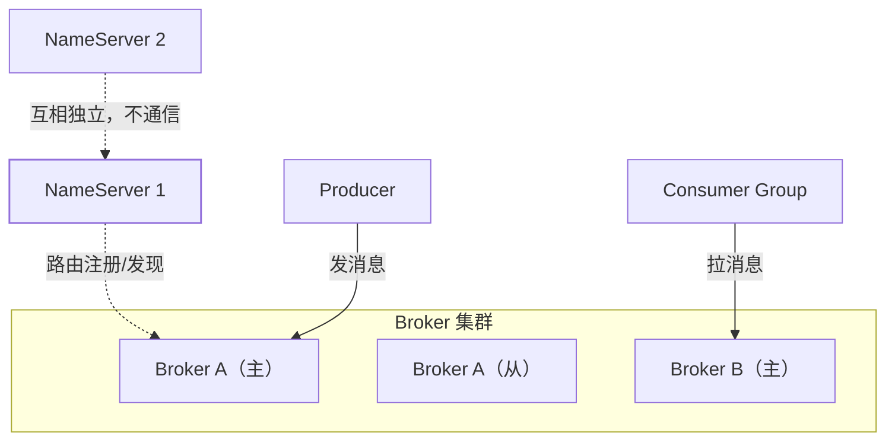

RocketMQ 面试的第一个高频题是**"讲讲 RocketMQ 的架构"**。答案的骨架是四个角色
加一条消息流转链，再加一个与 Kafka 的关键差异（CommitLog 集中存储）。本篇把这个
骨架立起来，事务消息、延迟消息等特性篇（见高级篇）都挂在它上面。

## 四个角色

- **NameServer**：轻量**无状态**路由中心，各节点互相独立、不通信——Broker 向
  每台都注册，客户端向任意一台拉路由。为什么不用 ZooKeeper？因为路由表
  不需要强一致：客户端拿到**稍旧的路由**顶多发错重试，CAP 里取 AP 就够了，
  换来的是部署极简（2 台即可，无选主开销）。
- **Broker**：消息存储与转发主体，主从架构（4.x 默认主从同步/异步复制，
  5.x 有 Dledger 自动选主）。主负责读写，从做热备与读分担。
- **Producer / Consumer**：客户端从 NameServer 拿路由，直连 Broker 收发——
  **NameServer 不参与消息流转**，挂一台不影响收发（客户端有本地路由缓存）。

## 消息模型：Topic → Queue → 消费组

- **Topic**：逻辑分类，与 Kafka 概念一致（见 Kafka 架构篇的三层模型）。
- **Queue（MessageQueue）**：Topic 的物理分片，落在具体 Broker 上——
  角色相当于 Kafka 的 Partition，分区并行、组内互斥的规则相同。
- **消费组**：组内一个 Queue 只给一个消费者；比 Kafka 多出消费模式选择——
  **集群消费**（组内分摊，默认）与**广播消费**（每个消费者全量，如本地缓存刷新）。

## CommitLog：与 Kafka 的最大差异

Kafka 一个 Partition 一个日志文件；RocketMQ 是**所有 Topic 的消息混写进同一个
CommitLog**（按顺序追加），再由后台线程异步分发到各 Topic 的 ConsumeQueue 索引：

| | Kafka | RocketMQ |
| --- | --- | --- |
| 存储 | 每分区独立日志段 | 单一 CommitLog + ConsumeQueue 索引 |
| 写入 | 分区间天然并行 | 全部消息顺序写一个文件 |
| 代价 | Topic/分区多了之后文件句柄、随机 IO 恶化 | 队列文件数与 Topic 数无关，**多 Topic 时更稳** |

一句话记住：**Kafka 少而大的 Topic 快，RocketMQ 多而杂的 Topic 稳**——
这正是业务线选 RocketMQ、大数据管道选 Kafka 的架构根源。

## 高频追问速答

- **NameServer 全挂了怎么办？** 客户端用本地路由缓存继续收发；新路由
  发现失效，存量消息不受影响——所以 NameServer 只要"绝大多数时间在线"。
- **Broker 怎么选主？** 4.x 主从靠人工/配置切换；5.x Dledger 用 Raft 自动选主
  （见分布式共识篇）。
- **Push 消费是推吗？** 不是，客户端长轮询 Broker 伪装成推（高级篇有专门小节）。

## 小结

- 四角色：NameServer（无状态路由，AP 取舍）→ Broker（主从存储）→ 客户端直连收发。
- 模型：Topic → Queue → 消费组（集群/广播两种消费模式）。
- 存储差异是灵魂：CommitLog 集中写换多 Topic 稳定性，ConsumeQueue 索引换消费定位。
