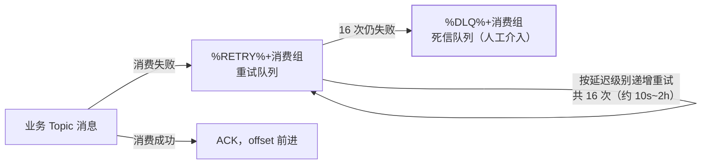

架构篇立了骨架，本篇讲消费端的三件事：**消费模式怎么选、消费进度存哪里、
消费失败怎么办**。最后一件（%RETRY% 重试队列）是 RocketMQ 区别于 Kafka 的
特色设计，也是高频追问。

## 集群消费 vs 广播消费

消费组模型（架构篇）落地为两种模式：

| | 集群消费（默认） | 广播消费 |
| --- | --- | --- |
| 一条消息谁消费 | 组内**一个**实例 | 组内**每个**实例全量 |
| 典型场景 | 业务处理（订单事件） | 本地缓存刷新、配置热更新 |
| 失败重试 | 有（%RETRY% 队列） | 无，失败不重试 |
| 进度存储 | **Broker 端** | **消费者本地文件** |

广播的进度存本地是因为"每个消费者进度各不相同"，Broker 端一份位移没有意义；
代价是本地文件丢失就丢进度、扩容后新实例从最新开始——面试能答到这层就够了。

## 重试：%RETRY% 队列与死信

消费失败（返回 RECONSUME_LATER 或抛异常）时，RocketMQ 不是原地重投，而是
把消息**发进一个特殊 Topic**：

- 重试消息的**延迟级别递增**（10s、30s、1m、2m…最长 2h），给下游留恢复时间
  ——本质是内建的退避重试，Kafka 没有这层，要自己接重试 Topic 或延迟队列。
- 死信队列（%DLQ%）是排障入口：进死信 = 16 次都没救回来，人工处理或告警。
- 面试追问"消费失败会不会阻塞后面消息"：不会——失败消息跳出去重试，
  **新消息继续消费**（这点与 Kafka 单分区内严格顺序形成对比）。

## 重复消费：同一套幂等逻辑

重复的两个来源与 Kafka 同源：①消费成功但 offset 提交前宕机；②**Rebalance
期间分区转手**（RocketMQ 消费组默认 20 秒一次重平衡负载分配，转手瞬间
消息可能被新旧消费者各消费一次）。解法也一样：**业务幂等**（唯一键/去重表/
状态机），架构与可靠性篇的幂等三件套在 RocketMQ 语境完全适用。

## 高频追问速答

- **RocketMQ 有 Rebalance 吗？** 有——消费组内 Queue 的分配定期（默认 20s）
  重新均衡，与 Kafka 的触发式重平衡机制不同但问题相同（见 Kafka Rebalance 篇）。
- **重试 16 次的间隔能改吗？** 可以，`delayLevelWhenStartConsume` 或自定义
  延迟级别；但改之前先问"为什么失败"——重试是兜底不是修复。
- **死信里的消息还能捞吗？** 控制台可导出重发；更好的做法是死信告警 +
  人工修复后走新请求，而不是无限重投。

## 小结

- 模式：集群（默认、有重试、进度在 Broker）vs 广播（全量、无重试、进度在本地）。
- 重试是 RocketMQ 的内建退避：%RETRY% 递增 16 次进 %DLQ%，失败不阻塞新消息。
- 重复消费与 Kafka 同源同解：幂等是业务义务，不是中间件承诺。
