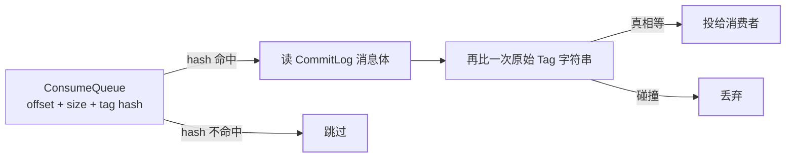

Producer 给消息打 Tag、Consumer 订阅 `Topic + Tag`，是 RocketMQ
相对 Kafka 最常被问的功能差。很多答案停在「Tag 是标签」。本篇讲
它**在存储里长什么样、过滤发生在哪一端、什么时候必须换 SQL92
或拆 Topic**。

## Tag：便宜，是因为写进了 ConsumeQueue

CommitLog 混写全量消息（见[架构篇](/rocketmq/basic/core/01-rocketmq-architecture/)）。
每个 Queue 的 ConsumeQueue 是定长索引，一条 20 字节：

```text
CommitLog offset (8) + size (4) + tag hashcode (8)
```

消费者拉消息时带上订阅的 Tag。Broker 扫 ConsumeQueue：hash 对得上
才去 CommitLog 读体；对不上就跳过这条索引——**过滤在索引层完成，
不碰消息体**。这就是 Tag 能跟高吞吐共存的原因。



hash 会碰撞，所以命中后还要用原始 Tag 字符串复核。订阅语法是
`TagA || TagB`（或 `*` 全收）。**没有「与」**：一条消息只有一个
Tag。想同时按「订单类型 + 机房」过滤，Tag 不够用。

## SQL92：按属性过滤，代价回到消息体附近

消息还可以带用户属性（`Message.putUserProperty`）。SQL92 过滤写
在订阅表达式里：

```text
a > 5 AND b = 'abc'
```

Broker 必须拿到属性才能求值。属性不在 ConsumeQueue 的 20 字节里，
过滤路径变成：读 CommitLog（或至少读消息头/属性）→ 表达式计算 →
丢弃或投递。吞吐明显低于 Tag hash 跳过。

| | Tag | SQL92 |
|---|---|---|
| 过滤依据 | 单个 Tag 字符串 | 用户属性上的 SQL 表达式 |
| Broker 成本 | ConsumeQueue 比 hash，大多不读体 | 几乎每条都要读属性 |
| 表达力 | `=` / `||` / `*` | `AND/OR/>/</IS NULL/...` |
| 消费组约束 | 同一组应对同一 Topic 用**同一套** Tag 订阅 | 同组表达式也应一致 |
| 适用 | 少数离散类别（支付/退款） | 多维度、范围条件 |

还有一种 **Filter Class**（把 Java 过滤类上传到 Broker）：灵活但
运维和隔离都差，生产基本不用 SQL92 + 属性就能覆盖。

## 过滤发生在 Broker，但不是「没写入」

无论 Tag 还是 SQL92，消息**已经在 CommitLog 里**。过滤只决定
「这个消费组要不要拉走」。后果：

1. 写放大按全量消息计，不会因为「没人订这个 Tag」而少写；
2. 积压容量也按全量计——一个冷 Tag 仍然占盘；
3. 消费组订阅改了，旧消息仍在，新过滤规则从当前消费位点往后生效。

所以 Tag 不是「免费分区」。类别会随业务爆炸、或一类消息的保留
策略不同，应**拆 Topic**（不同存储、权限、积压治理），而不是把
Topic 当筐、Tag 当筛。

同一消费组内多个实例必须订阅相同的 Tag/SQL92。组内有人订 `A`、
有人订 `B`，负载均衡仍按 Queue 分配，**不是按 Tag 分配**——订
`B` 的实例可能分到一条 Queue，里面全是 `A`，过滤后空转，真正的
`B` 在别人的 Queue 里。这是线上「过滤突然不生效 / 吞吐腰斩」的
高频原因。

## 和 Kafka Consumer 的对照

Kafka 没有 Broker 侧 Tag：要分类就靠多 Topic，或消费端自己丢。
RocketMQ 把「轻量分类」做成索引字段，换来的是 **Topic 数不必随
类别线性涨**（呼应 CommitLog 混写对多 Topic 友好的设计）。一旦
分类变成查询语言，SQL92 就把这条便宜路径退回「先读再丢」，和
Kafka 消费端过滤接近，还多了 Broker CPU。

## 小结

- Tag 的便宜来自 ConsumeQueue 的 8 字节 hash；碰撞再比原串。一条
  消息一个 Tag，订阅只有或。
- SQL92 按属性过滤，表达力强、几乎必读体，不要拿它当默认。
- 过滤不减少写入；同消费组订阅必须一致；类别生命周期不同就拆
  Topic。

## 延伸阅读

- [RocketMQ 过滤官方说明](https://rocketmq.apache.org/docs/featureBehavior/07filter)
- [架构：CommitLog 与 ConsumeQueue](/rocketmq/basic/core/01-rocketmq-architecture/)
- [NameServer 路由与队列选择](/rocketmq/intermediate/core/02-nameserver-route/)
