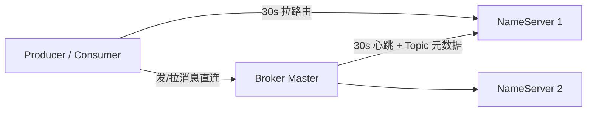

[架构篇](/rocketmq/basic/core/01-rocketmq-architecture/)和
[特性篇](/rocketmq/advanced/core/01-rocketmq-features/)反复强调
NameServer 「无状态、节点互不同步、稍旧路由可重试」。本篇把那句
AP 取舍落到**路由表里有什么、过期怎么发生、客户端拿着表怎么挑
Broker**——面试追问「NameServer 全挂 / 主 Broker 挂了各会怎样」
时，靠这张表回答。

## 路由表：四张图，不是一份 KV

Broker 每 **30s** 向**每一台** NameServer 上报一次（心跳里带着
自己的 Topic/Queue 列表）。NameServer 进程内的 `RouteInfoManager`
大致是：

| 表 | 内容 |
|---|---|
| `topicQueueTable` | Topic → 各 Broker 上的 QueueData（读写队列数、perm） |
| `brokerAddrTable` | BrokerName → `{brokerId: 地址}`（0=Master，非 0=Slave） |
| `clusterAddrTable` | 集群名 → BrokerName 集合 |
| `liveTable`（brokerLiveTable） | Broker 地址 → 上次心跳时间 + 数据版本 |

NameServer 之间**不互相同步**。Broker 必须对所有 NameServer 各报
一遍，各节点才能各自持有全量。漏报一台，那一台上的客户端会看到
「缺一个 Broker」的旧视图——发到其他 Broker 仍成功，这就是「稍旧
可接受」。

## 120 秒不心跳：从路由里消失

NameServer 扫描 `liveTable`，**120s** 没有心跳就把该 Broker 从
路由摘掉（2 个心跳周期的宽限 + 扫描间隔）。摘掉后：

- 新来的 `GET_ROUTEINFO` 不再包含它；
- **已经拉过路由的客户端仍用本地缓存**，直到自己 30s 一轮的更新
  拿到新表，或发失败触发立即刷新。

所以「Broker 杀进程」到「所有生产者不再往它发」之间，有一个
**最长约 30s 的客户端缓存窗**（外加 NameServer 侧最多 120s 的
检测窗，通常心跳一停下一次扫描就会摘）。缓存窗内发送会失败、
客户端重试其它 Queue——这是 AP 的具体代价，不是 bug。

NameServer 自己全挂：存量客户端靠本地路由继续收发，**新 Topic、
新 Broker、新客户端**才发现不了路由。架构篇那句「绝大多数时间
在线即可」指的就是这个窗口。

## 生产者怎么挑队列

拿到 `TopicRouteData` 之后，发送不经过 NameServer：

1. 按 `brokerAddrTable` 把 `brokerId=0` 当成写入口（Master）；
2. 默认 **轮询** 可写 Queue；
3. 顺序消息用 `MessageQueueSelector` 按 key 哈希到固定 Queue
   （见[顺序性篇](/rocketmq/advanced/core/02-order-performance/)）；
4. 发送失败：换下一 Queue / 下一 Broker，并标记故障地址一段时间
   （延迟规避）。

4.x 没有自动把 Slave 提升为 Master 时，Master 宕机 = 这些 Queue
**暂时不可写**。客户端会打到其它 Broker 上该 Topic 的 Queue；若
Topic 的队列全在挂掉的那一台，这个 Topic 写就停，直到运维切主
或 Dledger（5.x）选出新主并重新心跳注册。

读：普通消费者默认从 Master 拉，`slaveReadEnable` / 主忙时可以
切 Slave。路由表里 Slave 地址一直在，只是客户端策略不一定用。

## VIP 通道与 perm 位

Broker 会监听两个端口：普通端口和 **VIP 端口**（通常普通端口
`-2`）。长连接较多的发送路径走 VIP，避免和 HA / 其它 RPC 抢。
客户端 `sendMessageWithVIPChannel` 默认开——连错端口表现为
「偶发超时、路由看起来正常」，排障时要看 Brokers 的双端口是否
都通。

QueueData 上的 `perm` 位控制读写：运维可以把某组队列改成只读
（禁写扩容前的旧 Broker）。客户端必须尊重 perm，硬写下会收到
系统拒绝，而不是「路由里有就一定能写」。

## 和 Kafka 元数据的再对照

| | RocketMQ NameServer | Kafka（KRaft / 旧 ZK） |
|---|---|---|
| 一致性格 | AP，节点各持一份，靠心跳重建 | 元数据日志强一致 |
| 客户端更新 | 主动拉，默认 30s | 更主动的推/更短的刷新 |
| Broker 消失 | 120s 心跳超时剔除 | Controller 感知 + 元数据提交 |
| 故障窗 | 缓存导致短暂发往死人 | 元数据新，但要等 ISR/Leader 选出 |

不是谁更高级：RocketMQ 的路由粒度粗（Broker + 队列数），丢几秒
旧视图可以用重试补；Kafka 分区 Leader 精确到副本，旧元数据会
把生产请求打到「已经不是 Leader 的节点」上被拒，所以必须强一致。

## 小结

- 路由 = Topic 队列布局 + Broker 地址 + 心跳活表；NameServer 互
  不同步，Broker 向每台都报。
- 120s 无心跳从 NameServer 摘除；客户端还有 ~30s 本地缓存，失败
  重试 + 刷新是正路。
- 写只打 Master 队列；Master 单点所在 Topic 会写停，直到切主后
  重新注册。VIP 端口和 perm 位是排障细节，不是装饰。

## 延伸阅读

- [架构骨架：四角色与 AP 取舍](/rocketmq/basic/core/01-rocketmq-architecture/)
- [Tag 过滤发生在 ConsumeQueue](/rocketmq/intermediate/core/01-tag-sql92/)
- [Broker 主从与 5.x Dledger](/rocketmq/advanced/core/01-rocketmq-features/)
