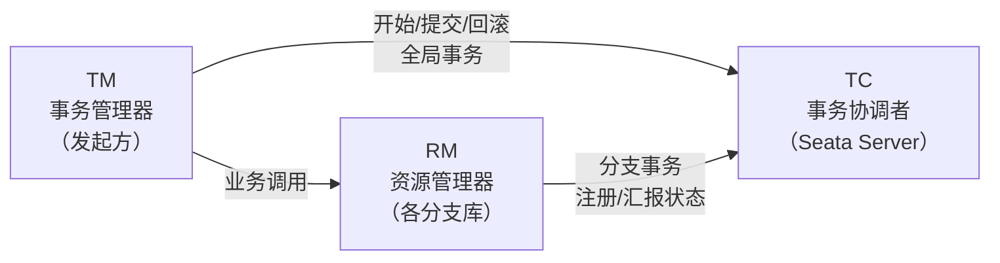
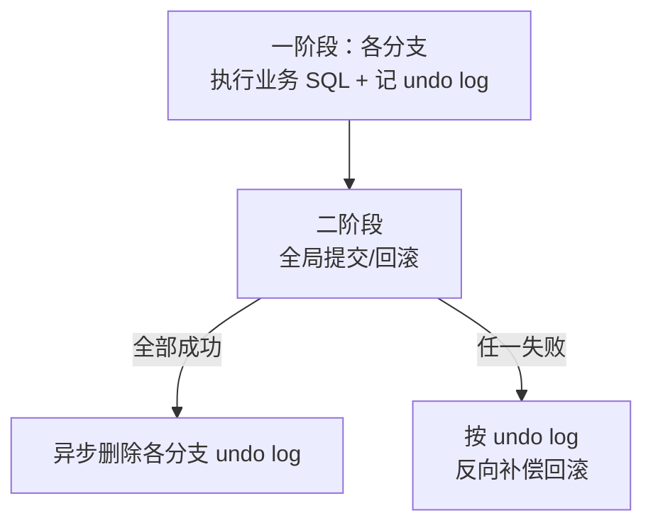

## 分布式事务的难题

一个业务要同时改两个数据库（订单库 + 库存库），怎么保证两者**要么都成
要么都败**？单库事务靠 ACID 就能搞定，跨库后没有现成的"全局事务"，
因为每个库各自提交、互不相知。

Seata 的目标：**让分布式事务对业务几乎透明**，业务还是 `@GlobalTransactional`
注解一加，该写谁写谁，框架负责协调与回滚。

## 三角色模型

| 角色 | 全称 | 职责 | 位置 |
|---|---|---|---|
| TC | Transaction Coordinator | 维护全局事务状态 | Seata Server（独立部署） |
| TM | Transaction Manager | 发起/提交/回滚全局事务 | 业务发起方 |
| RM | Resource Manager | 管理分支事务（本地库） | 各参与服务 |

## AT 模式：两阶段 + 回滚日志

AT 模式是 Seata 最省心的模式，核心是**自动生成回滚日志（undo log）**：

**关键：一阶段就提交本地事务，undo log 兜底回滚。**

- 执行 `UPDATE` 时，Seata 把**修改前镜像（beforeImage）**和**修改后镜像
  （afterImage）**都记进 undo log。
- 全局回滚时，TC 通知各 RM 用 beforeImage 把数据改回去——这就是"自动补偿"。
- 全局提交时，只要异步清理 undo log，几乎零额外开销。

## 一阶段具体做了什么

1. TM 向 TC 开启全局事务，拿到全局事务 ID（XID）。
2. 各 RM 在本地库执行 SQL，并生成 undo log（before/after 镜像），本地事务提交。
3. 各 RM 向 TC 注册分支事务并汇报状态。

## 二阶段：提交或回滚

- **全部成功** → TC 通知各 RM 全局提交，RM 异步删除 undo log。
- **任一失败** → TC 通知各 RM 回滚，RM 用 beforeImage 反向补偿。

## AT 模式的代价

| 优点 | 代价 |
|---|---|
| 业务侵入小（注解即可） | 依赖 undo log，有额外存储 |
| 一阶段即提交，锁短 | 中间状态会被别的事务短暂读到（弱隔离） |
| 使用最广 | 需要代理数据源（对 SQL 有要求） |

正是这些"中间状态可见"的弱隔离特性，催生了 TCC、SAGA 等更强一致但更重的
模式——它们对应「分布式」方向笔记里的五种方案对比。

## 小结

- Seata 用 TC/TM/RM 三角色协调全局事务，业务只需一个注解。
- AT 模式精髓：一阶段本地提交 + undo log 记录前后镜像，二阶段自动补偿。
- 优点是侵入小，代价是弱隔离与 undo log 开销。

## 延伸阅读

- [Seata 官方文档](https://seata.io/zh-cn/)
- [Seata AT 模式详解](https://seata.io/zh-cn/docs/overview/what-is-seata.html)