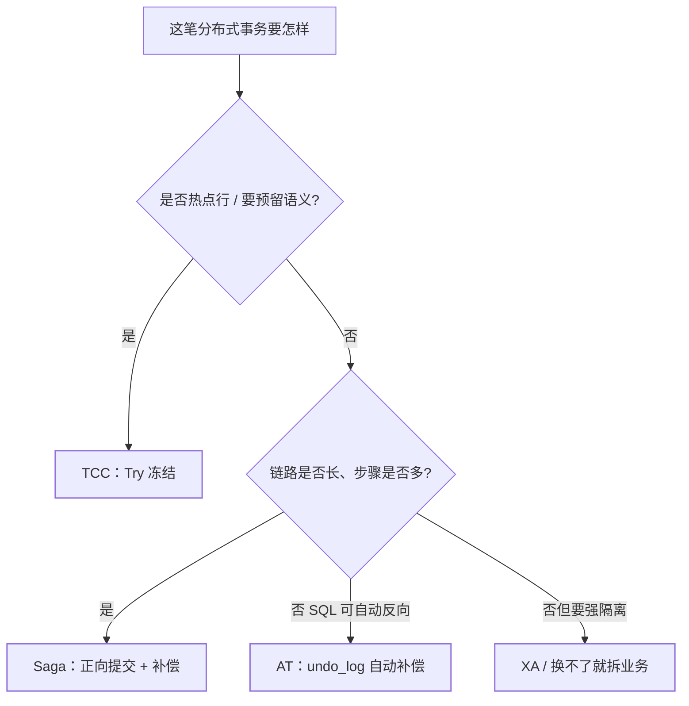

[AT 核心](/seata/basic/core/01-seata-core/)与[全局锁](/seata/basic/core/02-seata-deep-dive/)
把自动补偿讲透了。面试下一问几乎总是：「那为什么还要 TCC / Saga？」
答案不在实现细节，在**失败时你能不能自动把数据改回去、中间态能不能
被别人看见、链路有多长**。

## 一张表先定性

| | AT | TCC | Saga |
|---|---|---|---|
| 侵入 | 注解 + 代理数据源 | 每个服务实现 Try/Confirm/Cancel | 每个服务实现正向 + 补偿 |
| 一阶段 | 本地事务**直接提交** + undo_log | Try：**预留**资源，不落最终态 | 正向业务**直接提交** |
| 二阶段成功 | 异步删 undo_log | Confirm：预留转实扣 | 什么都不做（已经是最终态） |
| 二阶段失败 | 按 beforeImage 自动补偿 | Cancel：释放预留 | 按相反顺序调补偿 |
| 隔离 | 写靠全局锁；读默认未提交 | 由 Try 的预留模型保证，无全局锁 | **无隔离**，只保证最终补偿 |
| 热点行 | 全局锁串行，**不适合** | 预留在应用层，适合库存/余额 | 不适合强互斥资源 |
| 适用链路 | 短、可自动生成反向 SQL | 短、资源能预留 | **长流程**、跨分钟/小时 |
| 典型失败 | 脏写（镜像对不上） | Confirm/Cancel 没做成幂等 | 补偿失败要人工/重试队列 |



[分布式事务五种方案](/distributed/intermediate/transaction/01-distributed-transaction/)
先定一致性档位；本表是档位定完之后 **Seata 里选哪种模式**。多数
互联网下单不是 XA——AT 能覆盖「可逆 SQL + 非热点」；库存冻结、
账户余额才上 TCC；订票/采购这种「已通知下游无法自动 undo」走 Saga。

## AT：自动反向的边界

AT 能自动补偿，前提是：

1. 语句能解析出 **before / after 镜像**（主键明确的 INSERT/UPDATE/
   DELETE）。复杂 SQL、无主键、聚合更新，代理可能生成不了 undo。
2. 回滚时 after 镜像还对得上——这就是全局锁存在的理由，细节见
   [脏写篇](/seata/intermediate/modes/02-undo-local-tx/)。
3. 一阶段已提交，**非全局事务的本地读能看见中间态**。默认隔离是
   读未提交（对全局事务而言更准确的说法：读已提交的本地数据，但
   那笔本地提交对全局还没定论）。

AT 不是 2PC：资源锁（行锁）在本地提交时就放了，只留一把 TC 侧的
全局锁防写冲突。所以它「省心」的代价是隔离弱、热点不行。

## TCC：把隔离做成业务预留

TCC 没有 undo_log，Try 必须把「这笔事务可能成功」编码进数据模型：

```text
库存：available -= n, frozen += n     # Try，可见且可并发
冻结转实扣：frozen -= n               # Confirm
解冻：frozen -= n, available += n     # Cancel
```

两笔全局事务同时 Try 同一 SKU，争的是 **available 字段的条件更新**
（`WHERE available >= n`），不是 TC 全局锁。这就是热点行从 AT 换成
TCC 的原因：冲突在业务行上用乐观条件消化，失败立刻 Cancel，不自旋
等到全局事务结束。

代价全在纪律：

- Confirm / Cancel **必须幂等**（TC 会重试）；
- 空回滚：Cancel 先于 Try 到达（悬挂），Cancel 要记下「已取消」，
  后到的 Try 直接拒绝——否则 Try 预留成功却没有人 Confirm；
- 悬挂与空回滚是 TCC 八股，AT 用户很少碰到，换模式时必答。

## Saga：承认中间态，用补偿收敛

Saga 把长流程拆成一串**已提交**的本地事务：T1, T2, … Tn。失败从
Ti 往回调 C(i-1) … C1。没有 Try 预留，也没有全局锁——**任意时刻
外面都能读到「订了票但没订到酒店」这种半成品**。

Seata 的 Saga 有状态机 JSON 与注解两种编排。选用它的理由只有：

- 步骤跨服务、跨时间（人工审核、等待支付回调），AT/TCC 的二阶段
  不能挂那么久；
- 补偿动作存在且能做成幂等（退款、取消预约），而不是「自动 UPDATE
  回旧值」。

补偿失败怎么办：进重试队列，不行就人工——Saga **不承诺强一致**，
只承诺「失败会朝补偿方向走」。把 Saga 说成「长事务版 AT」是错的。

## 和 MQ 事务消息怎么分工

[RocketMQ 事务消息](/rocketmq/advanced/core/01-rocketmq-features/)
是 **最终一致 + 异步解耦**：半消息 + 本地事务 + 回查。下游消费慢、
甚至暂时不在线都可以。Seata 三种模式都是 **同步编排**（TM 还在调用
栈里，或 Saga 状态机在推进）。

一句话：下游允许晚到、只需最终一致 → 事务消息；需要在一次请求里
知道「几个库都成了或都回了」→ Seata；库存那种既要同步答案又不能
全局锁 → TCC。

## 小结

- AT：可逆 SQL、短链路、非热点；隔离弱，正确性押在 undo + 全局锁。
- TCC：能预留的热点资源；侵入大，Confirm/Cancel 幂等与空回滚是税。
- Saga：长流程、补偿存在即可；无隔离，半成品对外可见。
- 先定「中间态能不能被看见、资源能不能预留、链路有多长」，再选模式，
  不要从「哪个注解好写」倒推。

## 延伸阅读

- [Seata 模式总览](https://seata.apache.org/docs/overview/what-is-seata/)
- [分布式事务五种方案（档位）](/distributed/intermediate/transaction/01-distributed-transaction/)
- [undo_log 与本地事务陷阱](/seata/intermediate/modes/02-undo-local-tx/)
