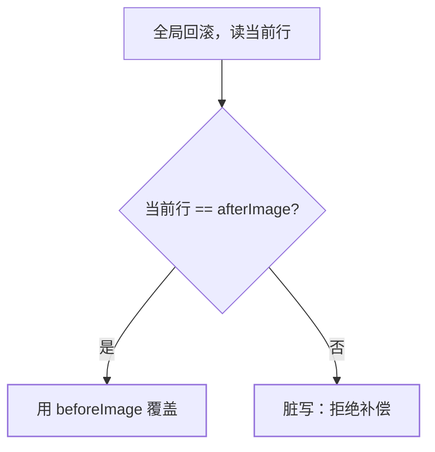

[全局锁篇](/seata/basic/core/02-seata-deep-dive/)给过公式：
**AT 的正确性押在 undo_log 上，undo_log 的正确性押在全局锁上**。
本篇把这条链落到可排查的边界——脏写究竟在哪一步被发现、谁能绕过
全局锁、以及 Spring 本地事务和全局事务嵌套时 undo_log 会不会写丢。

## 回滚时到底校验什么

一阶段本地提交前，代理写入 `undo_log`（与业务 SQL **同一本地事务**）：

```text
xid / branch_id
rollback_info = {
  table, pk,
  beforeImage: 改前各列,
  afterImage:  改后各列
}
```

全局回滚时 RM 不是盲目把 beforeImage 写回去，而是：

1. 按主键再读当前行；
2. **当前行必须等于 afterImage**（没人在全局事务期间改过）；
3. 相等才用 beforeImage 覆盖；不等就抛 **Dirty Write**，这条分支
   补偿中止，数据留给人工。



所以脏写不是「全局锁没防住读」，是 **防不住的写已经提交，镜像失效**。
全局锁的职责是让「第二把写」在一阶段拿锁时自旋失败，根本不提交，
于是 afterImage 始终有效。

## 谁能绕过全局锁

全局锁只对 **向 TC 注册过的分支** 生效。下列写不会去 TC 申请行锁：

| 来源 | 会不会脏写 | 处理 |
|---|---|---|
| 另一个 `@GlobalTransactional` | 会抢同一把全局锁，输的滚本地 | 正常 |
| 普通 `@Transactional` / 裸 JDBC | **不申请全局锁**，直接改行 | 高危 |
| 运维 SQL、定时任务、其他服务直连 | 同上 | 高危 |
| 查询旁路（报表从库） | 只读，不改 afterImage | 最多脏读 |

AT 的写隔离是**协作式**的：不走 RM 代理的写，TC 看不见。生产红线：

- 同一行的写入口必须都在全局事务里，或给非全局写加 `@GlobalLock`
  （查全局锁、冲突就失败，自己不注册分支）；
- 禁止「管理后台直连改库存」这类旁路；
- 读已提交语义要 `@GlobalLock` + `SELECT FOR UPDATE`，否则读的是
  别的全局事务已经本地提交、全局未定的数据——这是脏读，不是脏写。

脏读通常可接受（AT 默认如此）；脏写不可接受，因为它让自动补偿
失效。面试把两者说成一件事会丢追问分。

## 本地事务必须包住 undo_log

DataSourceProxy 的契约：业务 SQL 与 `INSERT undo_log` 在**同一个
本地事务**里提交。这样要么两行都在，要么都回滚——不会出现「业务
改了、undo 没有」或反过来。

和 Spring 嵌套时的典型陷阱：

```java
@GlobalTransactional
public void placeOrder() {          // 全局事务
    orderService.insert();          // @Transactional 默认 REQUIRED
    stockService.deduct();          // 另一个数据源，另一个分支
}
```

- `REQUIRED`（默认）：本地事务挂到 RM 开启的那个连接事务上，
  **正确**——undo_log 与业务同行提交。
- `REQUIRES_NEW`：内层**先独立提交**业务行，外层 RM 事务再写
  undo_log。全局一回滚，undo 对得上 afterImage 的前提被破坏
  （内层已提交且可能已被别人改），或者 undo 还在、业务已提交
  形成「有镜像无归属」。**AT 分支里禁止 REQUIRES_NEW。**
- 内层 `try/catch` 吞掉异常：本地事务标记 rollback-only，但全局
  事务以为成功——和[注解失效](/seata/basic/core/02-seata-deep-dive/)
  同源，表现是 undo_log 有记录、二阶段却走提交。
- 多数据源：每个库一张 `undo_log`，必须在**被代理的库**里。建在
  业务库 A、写却走库 B 的直连池，分支根本没注册。

排查顺序：`undo_log` 有没有行 → `rollback_info` 能否反序列化 →
TC `lock_table` 有没有对应 pk → 本地事务隔离级别是否被改成
READ UNCOMMITTED 之外的奇怪值（少数驱动/连接池会改）。

## 镜像列不够时的脏写变种

默认镜像是行的全部列（可配置 `undo.only.care.update.columns`）。
只镜像变更列能减小 undo，但**未镜像列被旁路更新时校验仍可能通过**，
回滚会覆盖成旧的变更列、留下旁路改过的其它列——这是一种「部分
脏写」。热点表若要缩 undo，先保证没有旁路写，再开这个开关。

回滚 SQL 还依赖主键。无主键表、联合主键漏配 `pk`、用 `LIMIT`
的批量更新，代理可能拒绝或生成不完整镜像。这类语句应改写成
按主键逐行，或把这一支换成 TCC。

## 小结

- 脏写 = 回滚时当前行 ≠ afterImage；全局锁是预防，校验是发现，
  发现后只能人工。
- 非全局事务和直连 SQL 不参与全局锁，是脏写的主入口；`@GlobalLock`
  给旁路一个「查锁但不注册」的补丁。
- undo_log 必须与业务 SQL 同本地事务提交；分支内 `REQUIRES_NEW`
  和未代理数据源会把这条契约拆断。

## 延伸阅读

- [Seata AT 模式与 undo_log](https://seata.apache.org/docs/dev/mode/at-mode/)
- [AT / TCC / Saga 选型](/seata/intermediate/modes/01-at-tcc-saga/)
- [全局锁与注解失效（basic）](/seata/basic/core/02-seata-deep-dive/)
