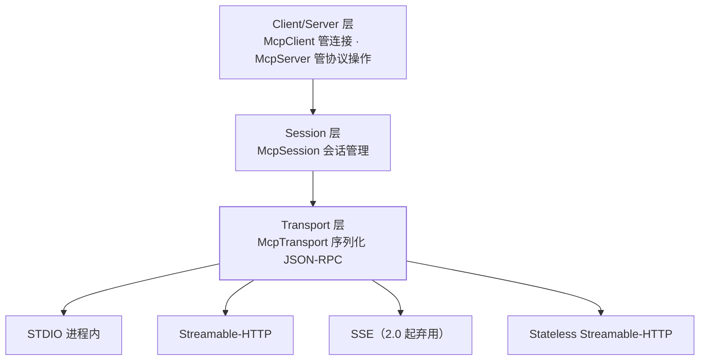

## MCP 解决的是"工具不该只服务一个应用"

Model Context Protocol 把"模型能调什么工具、能读什么资源、能用哪些提示模板"标准化成一个
协议，于是工具提供方与 LLM 应用方解耦。概念与协议本身见站内
[MCP 篇](/ai/intermediate/agent/08-mcp/)，本篇只讲 Spring AI 的接法。

Spring AI 是**双向**支持："building AI applications that consume MCP servers and creating
MCP servers that expose Spring-based services"——既能当客户端去吃别人的工具，也能把自己的
服务开成 MCP server 给别的 agent 用。

## 三层结构：先认清哪一层出问题

官方称实现遵循 "a three-layer architecture"：



排障时按层定位很省时间：**连不上**看 transport（URL、endpoint、进程命令），
**连上但会话异常**看 session，**工具调不到**看 client/server 层的注册与开关。

## 当客户端：两个 starter 与一份连接配置

| starter | 提供什么 |
| --- | --- |
| `spring-ai-starter-mcp-client` | "The standard starter connects simultaneously to one or more MCP servers over `STDIO` (in-process), `SSE`, `Streamable-HTTP` and `Stateless Streamable-HTTP` transports." |
| `spring-ai-starter-mcp-client-webflux` | 同类能力，换 WebFlux 传输实现；官方对生产的建议是 **"For production deployment, we recommend using the WebFlux-based SSE & StreamableHttp connection"** |

常用属性（前缀 `spring.ai.mcp.client.`）：`enabled`（默认 `true`）、`name`、`version`、
`initialized`、`request-timeout`（默认 `20s`）、`type`（`SYNC` 或 `ASYNC`）、
`root-change-notification`。三种传输各有自己的 connections 映射：

```yaml
spring:
  ai:
    mcp:
      client:
        type: SYNC
        request-timeout: 20s
        stdio:
          connections:
            fs:
              command: npx
              args: ["-y", "@modelcontextprotocol/server-filesystem"]
        streamable-http:
          connections:
            crm:
              url: http://localhost:8080
              endpoint: /mcp        # 默认即 /mcp
```

:::caution[SYNC 与 ASYNC 不能混]
官方写死：**"You can choose either `SYNC` or `ASYNC` MCP clients (note: you cannot mix
sync and async clients)."** 一个应用里混挂两种客户端不是"性能差一点"，是不被支持。
:::

### MCP 工具是怎么变成 Spring AI 工具的

这条链路值得单独记，因为它接上了[工具调用](/spring-ai/intermediate/tools/01-tool-calling/)
里那句"自动收集对 MCP provider 例外"：

```text
MCP server 暴露 tools
  → MCP client 注册这些 tools
  → spring.ai.mcp.client.toolcallback.enabled=true（默认）
  → 产出一个 ToolCallbackProvider Bean（SyncMcpToolCallbackProvider）
  → 注入或显式传给 ChatClient
```

官方描述："When tool callbacks are enabled (the default behavior), the registered MCP Tools
with all MCP clients are provided as a `ToolCallbackProvider` instance." 拿到数组的写法是
`toolCallbackProvider.getToolCallbacks()`。**把开关关掉**（`...toolcallback.enabled=false`）
则 "no `ToolCallbackProvider` bean is created from the available MCP tools"——工具还在，
但不再自动进 Spring AI 的工具面。

## 当服务端：三个 starter 与协议选择

| starter | 传输 |
| --- | --- |
| `spring-ai-starter-mcp-server` | STDIO（进程内），配 `spring.ai.mcp.server.stdio=true` |
| `spring-ai-starter-mcp-server-webmvc` | Servlet 栈上的 SSE / Streamable-HTTP / Stateless |
| `spring-ai-starter-mcp-server-webflux` | 响应式栈上的同样三种 |

协议由 `spring.ai.mcp.server.protocol` 选：`SSE` / `STREAMABLE` / `STATELESS`。

:::warning[2.0 起 SSE 服务端已弃用]
文档表格里 SSE 两行直接标着 **"deprecated since 2.0.0, use STREAMABLE instead"**，
Streamable-HTTP 的说明也是 **"It replaces the SSE transport"**。新服务别再写 SSE，
照旧教程配 `protocol=SSE` 等于一上线就背一个弃用项。
:::

`type` 取 `SYNC`（默认，基于 `McpSyncServer`）或 `ASYNC`（`McpAsyncServer`，"optimized
for non-blocking operations … with built-in Project Reactor support"）。其余常用项：
`name`/`version`/`instructions`、能力开关 `capabilities.resource|tool|prompt|completion`
（默认全 `true`）、三类 `*-change-notification`、`request-timeout`（默认 20 秒）、
`tool-callback-converter`（默认 `true`，把 Spring AI 的 `ToolCallback` 转成 MCP tool spec）。

两个容易被忽略的：

- **`expose-mcp-client-tools`（默认 `false`）**：是否把"本应用作为 MCP 客户端拿到的下游工具"
  再包一层暴露出去——做工具网关/聚合层时才需要开。
- **`streamable-http.mcp-endpoint`（默认 `/mcp`）**、`keep-alive-interval`（默认禁用）、
  `disallow-delete`（默认 `false`）。

## 注解面：一个 `@McpTool` 与它的四个提示位

依赖坐标 `spring-ai-mcp-annotations`，模块定位是 "provide annotation-based method handling
for Model Context Protocol (MCP) servers and clients in Java"。服务端侧：

| 注解 | 作用（官方表述） |
| --- | --- |
| `@McpTool` | "marks a method as an MCP tool implementation with automatic JSON schema generation" |
| `@McpToolParam` | 参数级描述与 `required` |
| `@McpResource` | "provides access to resources via URI templates" |
| `@McpPrompt` | "generates prompt messages for AI interactions"，参数用 `@McpArg` |
| `@McpComplete` | 提示与资源 URI 的自动补全，配 `prompt` 或 `uri`，**两者不可同时** |

```java
@McpTool(name = "get-weather", description = "Get weather by city")
public String getWeather(
        @McpToolParam(description = "City name", required = true)
        String city) {
    return weatherService.get(city);
}
```

`@McpTool` 还有 `title`、`annotations`、`generateOutputSchema`（默认 `false`）与
`metaProvider`。其中 `annotations` 一组值得专门看：`readOnlyHint`、**`destructiveHint`
默认 `true`**、`idempotentHint`、`openWorldHint`。

:::note[destructiveHint 默认 true 是个有信息量的默认值]
MCP 把这些提示交给**客户端**去决定"要不要弹确认框"。默认按破坏性处理，意味着
**不显式声明 `readOnlyHint=true` 的只读工具，会被宿主当成危险操作**。这与
[权限与 HITL](/ai/basic/agent/03-permission/)讲的是同一件事，只是换了协议字段。
:::

客户端侧注解处理的是**反向调用与通知**：`@McpLogging`（服务端日志通知）、
`@McpSampling`（服务端反过来请求 LLM 补全）、`@McpElicitation`（向用户追问补充信息）、
`@McpProgress`（长任务进度），以及 `@McpToolListChanged` / `@McpResourceListChanged` /
`@McpPromptListChanged` 三类列表变更通知。特殊参数里 `@McpProgressToken` 官方注明
"should be `String`" 且 **"Excluded from the generated JSON schema"**——它不是模型可见参数。

自动扫描由 `spring.ai.mcp.{client,server}.annotation-scanner.enabled`（默认 `true`）控制；
注解里指定的 `clients` 名称**必须与配置里的 connection 名一致**，否则静默不生效。

## 2.0 断代：包名与传输类都换了地方

```text
org.springaicommunity.mcp.annotation.*
  → org.springframework.ai.mcp.annotation.*
org.springaicommunity.mcp.method.*
  → org.springframework.ai.mcp.annotation.method.*
org.springaicommunity.mcp.provider.*
  → org.springframework.ai.mcp.annotation.provider.*
```

旧依赖 `org.springaicommunity:mcp-annotations` 不再由 Spring AI 传递提供，官方语气很硬：
**"Any code importing from `org.springaicommunity.mcp.*` will fail to compile."**

另一处是传输类：`mcp-spring-webflux` / `mcp-spring-webmvc` 不再由 MCP Java SDK 发布，
"All transport classes have been relocated to `org.springframework.ai` packages"，
group 从 `io.modelcontextprotocol.sdk` 迁到 `org.springframework.ai`。官方定性为
**"a breaking change that requires dependency and import updates"**——但只影响
**直接引用这些传输类**的工程；纯用 starter 自动配置的，《MCP Overview》页明确说
"you do not need to change any Java code"。

:::note[SDK 版本口径两页互斥，本篇不引数字]
《MCP Overview》写 "Spring AI 2.0 requires **MCP Java SDK 1.0.0** (RC1 or later).
The SDK version has been bumped from `0.18.x` to the `1.0.x` release line."；
《Upgrade Notes》一处标题写 "MCP Java SDK Upgraded to **2.0.0**"、正文 "from `1.1.x`
to `2.0.0`"，而**同一页另一处**又重复了 `0.18.x` → `1.0.x`。三处无法同时为真。
处置与[全景篇](/spring-ai/basic/foundation/01-what-is-spring-ai/)一致：**不引用版本号**，
以 `mvn dependency:tree | grep -i mcp` 的解析结果为准。
:::

## 安全这块还别当成熟能力

站内选型时要知道边界：导航项直接标 **"MCP Security (WIP)"**，页面顶部写 "This is still
work in progress. The documentation and APIs may change in future releases."，并且
"This module is part of the spring-ai-community/mcp-security project. This is a
community-driven project and **is not officially endorsed** yet by Spring AI or the MCP
project." 把 MCP server 开到公网前，认证与授权要自己补，别等这个模块。

## 常见误区澄清

- **"MCP 就是 function calling 的另一种写法"**：function calling 是**模型 ↔ 你的应用**之间
  的协议，MCP 是**你的应用 ↔ 工具提供方**之间的协议，两层可以叠加（本篇正是把 MCP tools
  转成 `ToolCallback` 再交给模型）。
- **"接了 MCP 客户端就自动有工具"**：中间隔着 `toolcallback.enabled` 这道开关，
  关掉就没有 provider Bean。
- **"服务端 SYNC 也能挂 `Mono` 返回值的注解方法"**：官方明确 "The SYNC server will register
  **only** synchronous MCP annotated methods. Asynchronous methods will be ignored."
  —— 响应式工具方法配 `type: SYNC` 是静默不注册。
- **"SSE 还能用"**：技术上还能跑，文档上已 "deprecated since 2.0.0"，新项目用 STREAMABLE。

## 小结

- Spring AI 双向支持 MCP：客户端两个 starter（生产推荐 webflux 版），服务端三个 starter
  按 STDIO / WebMVC / WebFlux 分，协议用 `spring.ai.mcp.server.protocol` 选。
- MCP 工具经 `toolcallback.enabled`（默认开）变成 `ToolCallbackProvider`，从而与
  Spring AI 的工具面同源；注解面 `@McpTool` 的 `destructiveHint` 默认 `true`。
- 2.0 的破坏点在**包名与 group**（`org.springaicommunity.*` 编译不过、传输类迁
  `org.springframework.ai`），纯自动配置用户免改码；SDK 版本两页口径互斥，不引数字。
- 安全模块仍是 WIP 且非官方背书，公网暴露要自己补认证。
