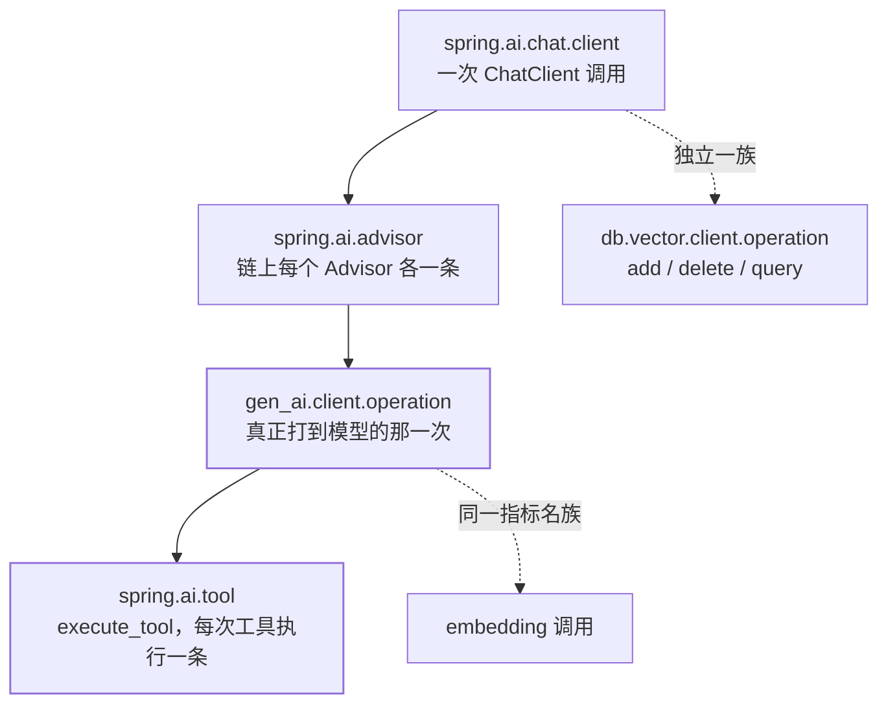

## 为什么这一篇值得单独写

模型调用是**远程、慢、按 token 计费、且输出不确定**的调用。没有观测时，"这个月账单翻倍"
"这轮对话为什么 8 秒"这两类问题只能靠猜。Spring AI 把观测做在**四个不同的层**上，
每层回答的问题不一样——**先把层分对，再谈指标**。



一次"带工具、带记忆、带 RAG"的请求，落地的 span 数量可能是 **1 + N 个 advisor + M 次模型
调用 + K 次工具**。这解释了第一次看 trace 的人最常见的困惑：**"为什么模型被调了好几次"**
——因为工具循环每往返一次就多一次模型调用（见
[工具调用](/spring-ai/intermediate/tools/01-tool-calling/)），不是重试。

## 四类观测各自回答什么问题

| 观测名 | 触发时机（官方表述） | 能回答的问题 |
| --- | --- | --- |
| `spring.ai.chat.client` | "recorded when a ChatClient `call()` or `stream()` operations are invoked" | 这一轮业务请求整体多慢、挂了哪些 advisor、会话是谁 |
| `spring.ai.advisor` | "recorded when an advisor is executed" | 记忆/RAG/工具循环哪个 advisor 吃掉了时间 |
| `gen_ai.client.operation` | "recorded when calling the ChatModel `call` or `stream` methods"（embedding 调用同族） | 打到厂商的那一次：请求模型、响应模型、温度、token 用量 |
| `spring.ai.tool` | "recorded when performing tool calling in the context of a chat model interaction" | 哪个工具、调了多久、参数与结果是什么 |

低基数标签是稳定可聚合的那批：`gen_ai.operation.name`（ChatClient 层 **"Always
`framework`"**、工具层 **"It's always `execute_tool`"**）、`gen_ai.system`（"Always
`spring_ai`"）、`gen_ai.request.model`、`gen_ai.response.model`、`spring.ai.kind`
（`chat_client` / `advisor` / `tool_call` / `vector_store`）、`spring_ai_kind` 等。

:::caution[高基数标签不要拿去当 Prometheus 的 label]
官方把 `spring.ai.chat.client.advisors`、`spring.ai.chat.client.conversation.id`、
`spring.ai.chat.client.tool.names`、`spring.ai.advisor.order`、`gen_ai.request.temperature`
一族、`gen_ai.response.finish_reasons`、`gen_ai.usage.*`、`spring.ai.tool.call.id` 等归为
**高基数**。`conversation.id` 一旦进聚合维度，时间序列数量会随会话数线性膨胀——
这是典型的 cardinality explosion。它们适合出现在 **trace** 里，不适合进 **metric** 标签。
:::

## 指标名：基名用点，导出时会被改写

一个容易读错的规则：**"Base metric names use dots (e.g., `gen_ai.client.operation`),
which Prometheus exports with underscores and standard suffixes"**，展开规则是
"Timers → `<base>_seconds_count`, `<base>_seconds_sum`, `<base>_seconds_max`,
and (when supported) `<base>_active_count`"。

所以在 Grafana 里查面板时，你写的名字和文档里的名字**长得不一样**：

```text
文档基名 → Prometheus 实际序列
gen_ai.client.operation
  → gen_ai_client_operation_seconds_count / _sum / _max
  → gen_ai_client_operation_active_count
gen_ai.chat.client.operation
  → gen_ai_chat_client_operation_seconds_*
db.vector.client.operation
  → db_vector_client_operation_seconds_*
```

token 计量是独立的一条：**"The `gen_ai.client.token.usage` metrics measures number of
input and output tokens used by a single model call."**，导出为
`gen_ai_client_token_usage_total`，按 `gen_ai_token_type` 分
`input`（发给模型的 prompt token）/ `output`（模型返回的 completion token）/ `total`。
Embedding 的 token 也走同一个指标名（"Use the metric name `gen_ai.client.token.usage`
that is provided by the `EmbeddingModel`"）。

**做成本核算要盯 `input` 与 `output` 的比**，而不是 total：prompt 侧被 RAG 拼接和长历史
撑大时，`total` 涨但 `output` 不动，只看总量会误判成"模型变慢了"。

向量库那条带 `db_operation_name`（官方列明取值 **"One of `add`, `delete`, or `query`"**）
与 `db_system`，所以"入库慢"和"检索慢"天然可分。

## 内容导出：六个开关，默认全是 false

这是本篇最需要在上线前确认的一段。**prompt 与 completion 的正文默认不进观测数据**，
官方给的理由是尺寸与隐私："The `ChatClient` prompt and completion data is typically big
and possibly containing sensitive information. For those reasons, **it is not exported by
default.**"

| 属性 | 默认 | 控制什么 |
| --- | --- | --- |
| `spring.ai.chat.client.observations.log-prompt` | `false` | ChatClient 层的 prompt 正文 |
| `spring.ai.chat.client.observations.log-completion` | `false` | ChatClient 层的 completion 正文 |
| `spring.ai.chat.observations.log-prompt` | `false` | ChatModel 层的 prompt 正文 |
| `spring.ai.chat.observations.log-completion` | `false` | ChatModel 层的 completion 正文 |
| `spring.ai.chat.observations.include-error-logging` | `false` | 错误日志 |
| `spring.ai.tools.observations.include-content` | `false` | 工具入参与返回值 |
| `spring.ai.image.observations.log-prompt` | `false` | 图像生成的 prompt |
| `spring.ai.vectorstore.observations.log-query-response` | `false` | 向量检索的 query 与命中文档 |

工具那条的理由同样直白："The input arguments and result from the tool call are not
exported by default, **as they can be potentially sensitive.**"

:::danger[开了就是把它交给采集链路，官方原话是警告]
文档在每类内容后重复同一句：**"If you enable logging of the chat client prompt and
completion data, there's a risk of exposing sensitive or private information.
Please, be careful!"** 决策要点不是"要不要看正文"，而是**你的 trace 后端谁能读**：
采样到哪、保留多久、有没有跨租户可见。生产上更稳的做法是默认关，需要复现问题时
按环境/按时间窗临时开，并把正文落到有访问控制的地方。
:::

两个命名坑值得单独记：一是这套开关叫 **`log-*`**（工具是 `include-content`），
不是 `include-prompt` 那类直觉拼法；二是 **ChatClient 层与 ChatModel 层各有一套**，
只开 `spring.ai.chat.observations.*` 而期望 ChatClient span 上出现正文，是不会生效的。

## 排障配方：按层往下走

```text
问题：某接口 P99 从 900ms 涨到 4s
1. 看 spring.ai.chat.client 的 duration
   —— 是整轮变慢还是个别请求
2. 拆 spring.ai.advisor
   —— 记忆 / RAG / ToolCallingAdvisor 哪一段吃时间
3. 数 gen_ai.client.operation 的条数
   —— 是不是工具循环往返变多（不是模型变慢）
4. 看 gen_ai_client_token_usage_total{gen_ai_token_type="input"}
   —— prompt 是否被撑大
5. 若第 2 步落在 RAG advisor，再看 db.vector.client.operation
   与 db_operation_name="query"、similarity_threshold、top_k
   （后两者是高基数标签，走 trace 不走聚合）
```

第 3 步是这套分层最实用的收益：**"变慢"在单指标视角下只有一句话，在分层视角下有三个
完全不同的原因**——模型慢、往返多、检索慢，三者的修法互不相同。

:::note[这一页没写"整体关掉观测"的开关]
官方《Observability》页只给了内容导出的 `log-*` / `include-*` 开关，
**没有**列出关闭整类 observation 的属性，也没提 `management.*` 系列。要按 Spring Boot
的方式裁剪导出后端（Actuator / Micrometer 侧），依据是本页指向的
Spring Boot Metrics 与 Tracing 文档——**别把"关掉正文导出"误当成"关掉了观测"**。
:::

## 常见误区澄清

- **"有 ChatModel 指标就够了"**：ChatClient 层才有 `conversation.id` 与 advisor 列表，
  模型层看不到"这轮挂了什么"。两层是不同观测名，不是同一份数据的两个视图。
- **"token 指标能直接算钱"**：它给的是 token 数；单价、缓存命中（
  `gen_ai.usage.cache_read.input_tokens` 这类标签）与厂商计费口径要自己接。
- **"trace 里没正文说明埋点坏了"**：那是默认行为，见上表。
- **"指标名照文档抄就能查"**：Prometheus 侧名字被改写过（点→下划线 + 后缀），
  照基名查会查不到序列。

## 小结

- 观测分四层：`spring.ai.chat.client` → `spring.ai.advisor` → `gen_ai.client.operation`
  → `spring.ai.tool`；向量库另有 `db.vector.client.operation` 一族。
- 基名用点，Prometheus 导出时下划线化并加 `_seconds_count/_sum/_max`；token 走
  `gen_ai.client.token.usage`，按 `input`/`output`/`total` 分型。
- **正文默认全不导出**（八个 `log-*` / `include-*` 开关默认 `false`），理由是大尺寸与
  敏感信息；ChatClient 与 ChatModel 两套开关互不替代。
- 高基数标签（会话 ID、advisor 列表、工具名、温度等）适合 trace，不适合当 metric 标签。
