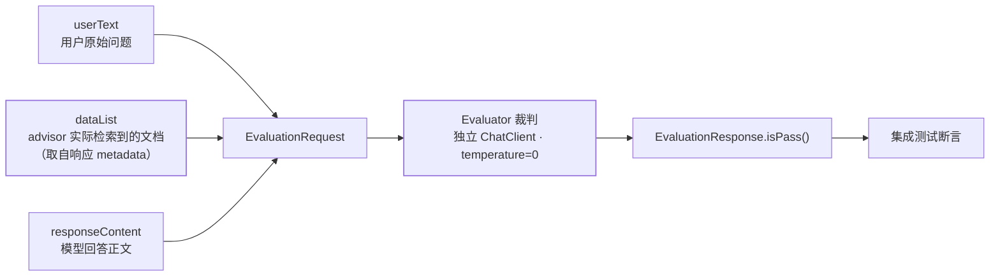

## 为什么需要它

官方给动机一句话就够："Testing AI applications requires evaluating the generated content
to ensure the AI model has not produced a hallucinated response." 传统单测断言的是
"返回了 200、字段非空"，而 AI 应用真正的失败是**答得流畅但内容是编的**。

传统指标为什么不够，官方在 LLM-as-a-Judge 指南里说得很直接："Traditional metrics like
ROUGE and BLEU fall short when assessing the nuanced, contextual responses that modern
LLMs produce."，而"Human evaluation, while accurate, is expensive, slow, and doesn't scale."
于是走第三条路——**用模型评模型**："One method to evaluate the response is to use the AI
model itself for evaluation. **Select the best AI model for the evaluation, which may not
be the same model used to generate the response.**"

顺带一个常被当成卖点的数字，官方也给了对照："Research shows that sophisticated judge
models can align with human judgment up to 85%, which is actually higher than human-to-human
agreement (81%)." ——裁判模型的可信度**不低于人评的一致性**，但它仍然是模型，见下文边界。

## 接口只有一个方法，输入固定三槽

```java
@FunctionalInterface
public interface Evaluator {
    EvaluationResponse evaluate(EvaluationRequest evaluationRequest);
}
```

输入侧的构造签名决定了**你能评什么**：

```java
public EvaluationRequest(String userText,
        List<Content> dataList, String responseContent)
```

三槽的官方语义：`userText` 是用户原始输入；`dataList` 是 "Contextual data, such as from
Retrieval Augmented Generation, appended to the raw input"；`responseContent` 是模型回答。

:::important[没有"标准答案"这一槽]
`EvaluationRequest` 里**没有** expected / ground-truth 参数——这套 API 评的是
**"回答与给定上下文是否自洽"**，不是"回答是否等于正确答案"。所以它是
**RAG 场景的忠实度检查**，不是精确匹配测试。要判"事实对不对"得自己带参照资料进
`dataList`（`FactCheckingEvaluator` 正是这个用法）。
:::

三槽的数据来源不同，这是这套 API 最容易被用错的地方：



中间那三条边的要点是**别自己拼 `dataList`**：它必须是这次调用真正检索到的那些文档，
否则测的是拼接逻辑而不是检索质量（下文 CI 一节给取法）。

## 内置只有两个裁判，各自管一件事

判定结果用 `isPass()` 消费，官方示例直接把它接进断言：
`assertThat(evaluationResponse.isPass()).isTrue();`

:::caution[两个同名不同物的 EvaluationResponse]
框架侧 `Evaluator.evaluate(...)` 返回的 `EvaluationResponse` 带 `isPass()`；而官方
LLM-as-a-Judge 指南里用结构化输出自定义了一个
`record EvaluationResponse(int rating, String evaluation, String feedback)`（1–4 分 + 理由 +
改进建议）。**读代码时先确认是哪一个**——前者是布尔门禁，后者是打分管线。
:::

## 内置只有两个裁判，各自管一件事

### `RelevancyEvaluator`：回答是否切题且有据

官方定位："an implementation of the `Evaluator` interface, designed to assess the relevance
of AI-generated responses **against provided context**"，机制是 "uses a prompt template to
ask the AI model if the response is relevant to the user input and context"。默认模板是
**二值判定**（只有 YES / NO），且要求模型不要解释、不要改措辞。

想换成打分制或加约束，用 `.promptTemplate()` 自定义，但**三个占位符是硬契约**：
"the template must contain the following placeholders: a `query` placeholder …
a `response` placeholder … a `context` placeholder"。渲染器默认是
"`StPromptTemplate` based on the StringTemplate engine"，也可换别的 `TemplateRenderer`。

### `FactCheckingEvaluator`：断言是否被资料支撑

官方描述："helps detect and reduce hallucinations in AI outputs by verifying if a given
statement (claim) is logically supported by the provided context (document)"，构造只要一个
`ChatClient.Builder`，模板是 `Document: {document} Claim: {claim}`。

两者的分工其实回答了两个不同的问题：**Relevancy 问"这段回答配得上这些资料吗"，
FactChecking 问"这句话在资料里找得到依据吗"**。前者面向整段回答，后者面向单条断言——
所以 FactChecking 天然是"把长答案拆成 claim 逐条验"的循环，成本随断言数线性增长。

:::note[这套 API 的覆盖面比想象中小]
2.0.1 文档里**只有这两个实现**。常见的相似度评测器、`Assertion.*` 断言工具、
期望答案参数，在 Model Evaluation 页均**查无此名**——别按别的框架的经验脑补 API。
:::

## 偏差控制：三条官方要求

用模型评模型，裁判本身会带偏差。官方指南给的三条是可执行动作：

- **换模型**："Mitigate bias through separate generation/evaluation models"；
- **锁确定性**："Ensure deterministic results (temperature = 0)"；
- **分开客户端**：代码注释原文 "Use separate ChatClient for evaluation to avoid
  narcissistic bias" —— 同一个模型自评会偏向自己的输出。

这三条与参数层是连着的：`temperature = 0` 要在评测用的那套 options 上显式设，
而不是改业务 Bean 的默认值（覆盖规则见
[ChatModel 与参数覆盖](/spring-ai/intermediate/model/01-chatmodel-and-options/)）。
成本侧官方也给了出路："Smaller and more efficient AI models dedicated to this purpose
are available, such as Bespoke's Minicheck, which helps reduce the cost of performing
these checks compared to flagship models like GPT-4."

## 在 CI 里的落点：拿真实上下文，别自己拼

官方给的集成测试范式最有价值的是**上下文从哪来**——直接取 RAG advisor 写进响应的
文档集：

```java
ChatResponse chatResponse = chatClient.prompt()
    .advisors(new RetrievalAugmentationAdvisor(...))
    .user(question)
    .call()
    .chatResponse();

var context = chatResponse.getMetadata()
    .get(RetrievalAugmentationAdvisor.DOCUMENT_CONTEXT);

var request = new EvaluationRequest(question, context,
        chatResponse.getResult().getOutput().getText());
assertThat(new RelevancyEvaluator(chatClientBuilder)
    .evaluate(request).isPass()).isTrue();
```

要点：**`dataList` 用 advisor 实际检索到的文档**，而不是"你以为检索到了的那些"。否则测的
是拼接逻辑，不是检索质量。官方也指明项目内有多处这样的集成测试
（"integration tests in the Spring AI project that use the `RelevancyEvaluator` to test
the functionality of the `QuestionAnswerAdvisor` … and `RetrievalAugmentationAdvisor`"）。

配套的测试基建只有一件成文的 artifact：
`org.springframework.ai:spring-ai-spring-boot-testcontainers`——"Spring AI provides Spring
Boot auto-configuration for establishing a connection to a model service or vector store
running via Testcontainers"，提供 `OllamaConnectionDetails`、`ChromaConnectionDetails`、
`MilvusServiceClientConnectionDetails`、`QdrantConnectionDetails`、
`WeaviateConnectionDetails` 等连接工厂。

也就是说 2.0.1 的官方测试路径是**起真容器跑真调用**，而不是 mock 响应回放——文档里
没有 mock/replay 框架。这与[评测通用方法](/ai/intermediate/agent/10-agent-evaluation/)
里"先量化检索再谈生成"的结论一致。

## 一处 URL 陷阱，找文档时先知道

侧边栏标题叫 **Model Evaluation**，文件却是 **`api/testing.html`**，正文 H1 又是
**Evaluation Testing**；直觉地址 `api/evaluation.html` **返回 404**。深入指南在
`guides/llm-as-judge.html`。

## 常见误区澄清

- **"评测 API 能判答案对错"**：它判的是"与上下文是否自洽/是否被资料支撑"，没有标准答案槽。
  要真值比对，得自建数据集与断言，属于[应用层评测](/ai/intermediate/agent/10-agent-evaluation/)
  的活。
- **"裁判模型越强越好"**：官方推荐的是"最合适的裁判"而非"同一个旗舰模型"，并明确给了
  小模型省成本的出路；且**同模型自评有 narcissistic bias**。
- **"自定义模板随便写"**：`query` / `response` / `context` 三个占位符缺一个就跑不通。
- **"评测是上线前的动作"**：官方给的用法就是**集成测试**——它属于 CI，不属于一次性验收。

## 小结

- `Evaluator` 是单方法函数式接口，输入固定三槽（userText / 上下文 / 回答），
  **没有期望答案位**；结果用 `isPass()` 断言。
- 内置只有 `RelevancyEvaluator`（回答配不配上下文）与 `FactCheckingEvaluator`
  （断言有没有依据）；自定义模板必须保留 query/response/context 三个占位符。
- 裁判要**换模型、锁 temperature=0、用独立 ChatClient**；成本可用专用小模型。
- 官方测试路径是 Testcontainers 起真模型/真向量库 + advisor 实际检索到的文档做上下文，
  把评测当 CI 资产而非一次性验收。
