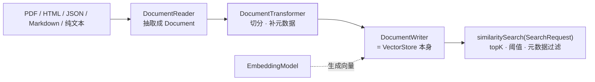

## 一句话分工

**Embedding 模型负责把文本变成向量，VectorStore 只负责存与相似检索**——官方说得很直白：
向量库 "does not generate the embeddings itself. For creating vector embeddings, the
`EmbeddingModel` should be utilized." 所以接一个向量库实际要接**两个** starter：
一个 embedding 模型、一个向量库实现，且 **"you need to pick an embedding model that
matches the higher-level AI model being used"**——维度不匹配是入库成功、检索全废的头号原因。



## VectorStore：一个接口同时是写端和读端

2.0 的接口定义把 ETL 的 Writer 与检索端合在了一身上——`VectorStore extends DocumentWriter,
VectorStoreRetriever`，方法面是：

```java
public interface VectorStore extends DocumentWriter, VectorStoreRetriever {
    default String getName() { … }
    void add(List<Document> documents);
    void delete(List<String> idList);
    void delete(Filter.Expression filterExpression);
    default <T> Optional<T> getNativeClient() { … }
    // 继承而来：List<Document> similaritySearch(SearchRequest request);
}
```

`delete(Filter.Expression)` 值得单独看一眼：**能按元数据条件批量删**，做"某个租户/某篇文档
重新入库"时不必先查出 ID 列表。`getNativeClient()` 则是可移植抽象的逃生口——需要厂商特有能力
（混合检索、稀疏向量）时拿原生客户端，代价是这一步之后不再可移植。

### Document：文本或媒体，二选一

`Document` 是入库的唯一载体："A Document holds either text content or media content,
**but not both**"，判断用 **`isText()`**。取值方法是 **`getText()`**（还有 `getId()`、
`getMetadata()`、检索后带回来的 `getScore()`）。

:::caution[官方示例里有个已不存在的方法名]
《Vector Databases》页的示例代码写着 `Document::getContent`，但 2.0.x 源码的 `Document`
类**只有 `getText()`，没有 `getContent()`**（该类全文 0 次出现 `getContent()`）。
照文档抄会编译不过——**方法名以你 IDE 解析到的实际依赖为准，别以示例为准**。
:::

构造有三种写法，元数据是随手可挂的 `Map<String, Object>`：

```java
var doc = new Document("正文内容", Map.of("group", "faq"));
var withId = new Document("id-1", "正文内容", Map.of("group", "faq"));
var built = Document.builder()
    .text("正文内容")
    .metadata("group", "faq")
    .build();
```

`mutate()` 用于在已有 Document 上改（切分与增强阶段的常见手法）。

## SearchRequest：三个旋钮决定召回质量

```java
var request = SearchRequest.builder()
    .query(question)
    .topK(5)                    // 返回前 5 条
    .similarityThreshold(0.7)   // 相似度 >= 0.7 才要
    .build();
```

`threshold` 的语义官方写明是 **0 到 1，越接近 1 越相似**。要"只按过滤条件、不设阈值"就用
`similarityThresholdAll()`。这三个旋钮是 RAG 召回质量的第一层调参面，与[检索进阶
](/ai/intermediate/agent/11-rag-advanced/)讲的是同一件事。

## 元数据过滤：一套 ANTLR4 外部 DSL

官方对它的定位是 **"an external DSL based on ANTLR4 that accepts filter expressions as
strings"**，并强调它 **"functions similarly to a 'where' clause in SQL, but it applies
exclusively to the metadata key-value pairs of a `Document`"**——只管元数据，不管正文语义。

字符串侧（外部 DSL）支持的操作符：`==`、`!=`、`>`、`>=`、`<`、`<=`、`and|or|not`（也接受
`&&`/`||`/`!`）、`in`、`nin`、`IS NULL`/`IS NOT NULL`。Java 侧用 `FilterExpressionBuilder`：

```java
FilterExpressionBuilder b = new FilterExpressionBuilder();
Filter.Expression exp = b.and(
        b.eq("country", "BG"),
        b.gte("year", 2024))
    .build();
```

:::warning[IS NULL 系列不是所有库都实现了]
官方明确留了一句 **"IS NULL and IS NOT NULL have not been implemented in all vector
stores yet."** 跨库可移植性在这里有个真实的洞——用到这两个操作符时，换库要单独回归。
:::

## ETL 三段式：三个函数式接口

官方称 ETL 是 "the backbone of data processing within the Retrieval Augmented Generation
(RAG) use case"。三段各自继承 JDK 的函数式接口，因此可以随意串：

```java
public interface DocumentReader extends Supplier<List<Document>> {
    default List<Document> read() { return get(); }
}
public interface DocumentTransformer
        extends Function<List<Document>, List<Document>> {
    default List<Document> transform(List<Document> t) { return apply(t); }
}
public interface DocumentWriter extends Consumer<List<Document>> {
    default void write(List<Document> documents) { accept(documents); }
}
```

`VectorStore` 就是 `DocumentWriter`——**入库的终点天然是向量库**，不需要额外的 Writer。

### 现成的 Reader

| Reader | 官方描述 |
| --- | --- |
| `TextReader` | "processes plain text documents, converting them into a list of Document objects" |
| `JsonReader` | 处理 JSON，构造时可指定要抽取的字段名 |
| `JsoupDocumentReader` | 用 JSoup 处理 HTML |
| `MarkdownDocumentReader` | 处理 Markdown |
| `PagePdfDocumentReader` | 用 Apache PdfBox **按页**切 PDF |
| `ParagraphPdfDocumentReader` | 用 PDF 目录（TOC）信息**按段落**切，一个段落一个 Document |
| `TikaDocumentReader` | 用 Apache Tika 抽 PDF/DOC/DOCX/PPT/HTML 等格式 |

按页还是按段落切 PDF 是**两种不同的检索粒度**：按页保结构但块大，按段落召回更准但丢版式。

### Transformer：切分与元数据增强

`TokenTextSplitter` 是 "an implementation of `TextSplitter` that splits text into chunks
**based on token count**"——按 token 而不是按字符，这点直接决定成本与召回。另有
`KeywordMetadataEnricher`（"uses a generative AI model to extract keywords … and add them
as metadata"）与 `SummaryMetadataEnricher`（为文档生成摘要写入元数据）。

:::caution[2.0 改了短文本的分块行为]
官方写明：**"As of version 2.0, small texts (with token count at or below the chunk size)
are no longer split at punctuation marks, preventing unnecessary fragmentation."**
1.x 里"本来够短却被标点切碎"的块，在 2.0 会保持完整——**同一份语料重新入库，块数和
命中结果都会变**，升级时要做检索回归，不能只看接口编译通过。
:::

增强后的元数据是有固定键名的，检索过滤和重排都靠它们：`charset`、`source`、
`excerpt_keywords`（关键词）、`section_summary`/`prev_section_summary`/`next_section_summary`
（摘要）、`page_number`/`end_page_number`。

写文件用 `FileDocumentWriter`（"writes the content of a list of Document objects into a
file"），调试切分效果时很实用。

## 选型：18 个实现 + 一个只能测试用的

文档所列 `VectorStore` 实现约 18 个：PgVector、Pinecone、Milvus、Chroma、Qdrant、Redis、
Weaviate、Elasticsearch、OpenSearch、MongoDB Atlas、Azure Vector Search、Cassandra、
GemFire、MariaDB、Neo4j、Oracle、Typesense、S3 Vector Store。

站内已有对应方向的（[Redis](/redis/intermediate/usage/)、[MongoDB](/mongodb/intermediate/usage/)、
[PostgreSQL](/postgresql/)、[Elasticsearch](/elasticsearch/)）可以复用其部署、权限与索引
运维知识——但**向量检索那一维是各库在 Spring AI 侧的独立配置**，不能靠已有的全文/聚合知识
直接推。

两条边界：

- **`SimpleVectorStore` 不能上生产**：官方原话 "not designed for production use and should
  only be used for testing or demonstration purposes." 它是本地跑通 RAG 链路的最快路径，
  但别让它出现在架构图上。
- **Azure Cosmos DB 在 2.0.1 已外置**：`spring-ai-azure-cosmos-db-store` 与对应 chat memory
  模块从核心移除、改由外部维护——列在文档里但坐标不同，选型时先确认维护方。

## 常见误区澄清

- **"向量库自己会算向量"**：不会，它只存与比；embedding 模型和向量库必须**同维度同模型**，
  换 embedding 模型等于全量重灌。
- **"过滤表达式能过滤正文"**：只能过滤元数据。要"只检索某类文档"，得先把类别写进 metadata。
- **"切分越细召回越好"**：块越小越丢上下文（`lost-in-the-middle` 与噪声问题正是
  `DocumentPostProcessor` 要解决的，见[两篇 RAG Advisor 篇](/spring-ai/advanced/rag/02-rag-advisors/)）。
- **"入库是一次性动作"**：`delete(Filter.Expression)` + 重灌是常态运维，元数据里没留
  `source` 之类的可回滚键，后面清理会很痛。

## 小结

- 接向量库要接**两个**东西：`EmbeddingModel`（造向量）+ `VectorStore`（存与检索），
  两者维度必须匹配。
- `VectorStore` 同时是 `DocumentWriter`，检索端只有 `similaritySearch(SearchRequest)` 一个
  入口，旋钮是 `topK` / `similarityThreshold` / 元数据过滤 DSL。
- ETL 三段是 JDK 函数式接口（`Supplier` / `Function` / `Consumer`），可自由串接；
  **2.0 短文本不再按标点切碎**，升级要重灌并回归检索效果。
- `Document` 取值是 `getText()`——官方示例里的 `getContent()` 在 2.0.x 源码里不存在。
