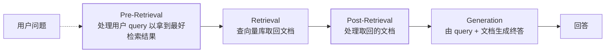

## 先摆结论：同一件事的两档复杂度

| | `QuestionAnswerAdvisor` | `RetrievalAugmentationAdvisor` |
| --- | --- | --- |
| 定位 | "implementing the **Naive RAG** (Retrieval-Augmented Generation) pattern" | "providing an out-of-the-box implementation for the most common RAG flows, based on a **modular architecture**" |
| 依赖坐标 | `spring-ai-vector-store-advisor` | `spring-ai-rag` |
| 可组合度 | 配 `SearchRequest` + prompt 模板 | 按阶段插组件（查询改写 / 检索 / 后处理 / 增强） |
| 什么时候用 | 语料单一、检索策略不需要调 | 要做查询改写、多源合并、重排、空上下文策略 |

**别一上来就选后者。** 官方对 Naive RAG 的机制描述已经足够清楚："A vector database stores
data that the AI model is unaware of. When a user question is sent to the AI model, a
`QuestionAnswerAdvisor` queries the vector database for documents related to the user
question. The response from the vector database is **appended to the user text** to provide
context for the AI model to generate a response." 先把这条跑通并量化召回，再决定要不要上
模块化——顺序与[「先量化检索再谈生成」](/ai/intermediate/agent/06-rag/)是同一件事。

## Naive RAG：一行挂上

```java
var advisor = QuestionAnswerAdvisor.builder(vectorStore)
    .searchRequest(SearchRequest.builder()
        .similarityThreshold(0.8d)
        .topK(6)
        .build())
    .build();

String answer = chatClient.prompt()
    .user("我的问题 XYZ")
    .advisors(advisor)
    .call()
    .content();
```

要按元数据收窄检索范围时，过滤条件走**运行期参数**而不是 advisor 构造期：

```java
.advisors(a -> a.param(
        QuestionAnswerAdvisor.FILTER_EXPRESSION, "type == 'Spring'"))
```

自定义拼接方式用 `promptTemplate(...)`。官方已把旧入口标弃用：**"The
`QuestionAnswerAdvisor.Builder.userTextAdvise()` method is deprecated in favor of using
`'.promptTemplate()'` for more flexible customization."** 老教程里的 `userTextAdvise` 直接换。

:::note[同一模块里还有记忆 Advisor]
`spring-ai-vector-store-advisor` 同时供 `QuestionAnswerAdvisor` 与
`VectorStoreChatMemoryAdvisor`（把历史写进 system 文本那一档，见
[会话记忆](/spring-ai/intermediate/advisor/02-chat-memory/)）。加错依赖的报错通常长得
像"类找不到"，先确认坐标。
:::

## Modular RAG：四个阶段、每个阶段可换件

官方架构说明是："Spring AI implements a **Modular RAG** architecture inspired by the concept
of modularity detailed in the paper '[Modular RAG: Transforming RAG Systems into LEGO-like
Reconfigurable Frameworks]'." 四个阶段的定义分别是：



各阶段官方点名的组件（名字以文档为准）：

| 阶段 | 组件 | 官方职责表述 |
| --- | --- | --- |
| Pre-Retrieval | `QueryTransformer` | 让 query 更适合检索，"addressing challenges such as poorly formed queries, ambiguous terms, complex vocabulary, or unsupported languages" |
| Pre-Retrieval | `CompressionQueryTransformer` | "compress a conversation history and a follow-up query into a standalone query" |
| Pre-Retrieval | `RewriteQueryTransformer` | 重写 query 以在目标系统（向量库或搜索引擎）拿到更好结果 |
| Pre-Retrieval | `TranslationQueryTransformer` | 把不支持的语言转成可检索语言 |
| Pre-Retrieval | `MultiQueryExpander` | "expand a query into multiple semantically diverse variations" |
| Retrieval | `VectorStoreDocumentRetriever` | 从向量库取语义相近文档，"supports filtering based on metadata, similarity threshold, and top-k results" |
| Retrieval | `ConcatenationDocumentJoiner` | 把多 query / 多数据源的结果拼接合并 |
| Post-Retrieval | `DocumentPostProcessor` | 处理 "lost-in-the-middle, context length restrictions … the need to reduce noise and redundancy" |
| Generation | `ContextualQueryAugmenter` | "augments the user query with contextual data from the content of the provided documents" |

装配写法（官方示例里出现的是这三个 builder 方法）：

```java
var advisor = RetrievalAugmentationAdvisor.builder()
    .queryTransformers(CompressionQueryTransformer.builder()
        .chatClientBuilder(chatClientBuilder).build())
    .documentRetriever(VectorStoreDocumentRetriever.builder()
        .similarityThreshold(0.50)
        .vectorStore(vectorStore)
        .build())
    .queryAugmenter(ContextualQueryAugmenter.builder()
        .allowEmptyContext(true)
        .build())
    .build();
```

:::warning[别凭直觉写没出现过的装配方法]
`queryExpander(...)`、`documentJoiner(...)`、`documentPostProcessors(...)` 这类**单数/复数
混猜**的名字，在文档示例里没有出现过——模块化组件是存在的，但**注入点名称要以你依赖版本的
`RetrievalAugmentationAdvisor.Builder` 为准**。写之前用 IDE 补全确认，别照概念名硬编。
:::

## 一个容易记反的细节

"Naive RAG" 这个词在官方文档里**不是 `QuestionAnswerAdvisor` 的专属标签**：《Retrieval
Augmented Generation》页的 "Naive RAG" 小节挂在 `RetrievalAugmentationAdvisor` 的
**Sequential RAG Flows** 之下，示例代码用的也是 `RetrievalAugmentationAdvisor`。

也就是说：**naive 指的是一条流程（检索→拼接→生成），不是某个类**。`QuestionAnswerAdvisor`
是"这条流程的一键封装"，`RetrievalAugmentationAdvisor` 是"同一流程的可拆版"。面试里说
"naive RAG 就是那个 advisor 类"会被追问一句就露。

## `allowEmptyContext` 是行为决策，不是容错开关

`ContextualQueryAugmenter.builder().allowEmptyContext(true)` 决定的是**检索为空时怎么办**：
放开则让模型凭自身知识回答，收紧则不给上下文、按模板走"没有依据"的路径。

这是[幻觉](/ai/intermediate/llm/12-hallucination/)治理在产品里的落点：一个"根据公司制度
回答"的问答机器人，检索为空时放开上下文，等于允许模型编制度。**默认值不是你想要的场景很多**，
这一项要显式定，别留给默认。

## 常见误区澄清

- **"挂了 RAG Advisor 就不用管阈值"**：`similarityThreshold` 与 `topK` 是召回质量的两个
  主旋钮，且**分属不同层**——前者在 retriever/searchRequest 上，后者影响拼接长度与成本。
- **"RAG 是模型能力问题"**：拼接发生在 prompt 层，模型只是被喂得更准。检索侧的问题
  （分块、元数据、阈值）在[上一节](/spring-ai/advanced/rag/01-vector-store-etl/)，
  生成侧才是模型。
- **"模块化一定更好"**：多一个组件就多一处失败点和一次额外调用（`CompressionQueryTransformer`
  本身就要调模型，见[推理参数与成本](/ai/intermediate/llm/04-inference-params/)）。
- **"Advisor 顺序无所谓"**：RAG Advisor 与记忆 Advisor 的先后直接决定"历史进不进检索 query"，
  位次语义见 [Advisor 责任链](/spring-ai/intermediate/advisor/01-advisor-chain/)。

## 小结

- 两档复杂度：`QuestionAnswerAdvisor`（naive，坐标 `spring-ai-vector-store-advisor`）
  一行接入；`RetrievalAugmentationAdvisor`（modular，坐标 `spring-ai-rag`）按四阶段换件。
- naive 是**流程名**不是类名；`userTextAdvise()` 已弃用，改 `promptTemplate()`。
- 过滤走运行期 `FILTER_EXPRESSION` 参数；`allowEmptyContext` 是产品决策，要显式定。
