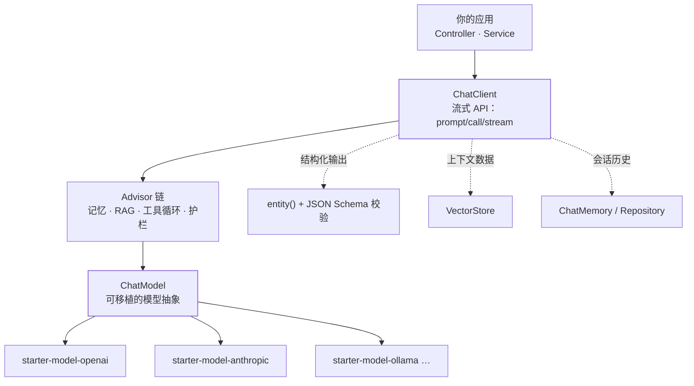

## 一句话定位

Spring AI 是 Spring 官方用来**把大模型接进企业应用**的框架。官方对自己的表述有两句话值得
先记住：

> "Spring AI aims to streamline the development of applications that incorporate artificial
> intelligence functionality without unnecessary complexity."
>
> "Spring AI addresses the fundamental challenge of AI integration: **Connecting your
> enterprise Data and APIs with AI Models**."

注意它把 **Data 和 APIs 放在 Models 前面**——这个框架的卖点不是"能调模型"（谁家 SDK 都能调），
而是**用你已有的 Spring 那套东西去调**：依赖注入、自动配置、`@Transactional` 旁边放 `@Tool`、
Actuator 的观测里顺手带上 token 指标。

## 它站在哪个位置：与站内另两个方向的分工

| 方向 | 讲什么 | 什么时候看它 |
| --- | --- | --- |
| [AI](/ai/basic/agent/01-agent-loop/) | 概念与工程原理：Agent Loop、[RAG](/ai/intermediate/agent/06-rag/)、[工具设计](/ai/intermediate/agent/16-tool-design/)、[记忆](/ai/intermediate/agent/04-memory/) | 想知道"这些东西本来要手写什么" |
| [LangChain](/langchain/basic/core/01-langchain-overview/) | Python/JS 生态的框架落地：ChatModel、LCEL、LangGraph 状态图 | 已经用 Python 写 AI 应用 |
| **Spring AI**（本方向） | Java / Spring Boot 生态的落地：`ChatClient`、Advisor 链、starter 自动配置 | 应用本来就是 Spring Boot，模型是其中一个能力 |

一句话对照：**Spring AI 之于 LangChain，约等于 Spring Boot 之于"自己写装配"**——它的差异化
不在抽象多少，而在和 Boot 的自动配置体系是一体的。

## 版本兼容：先看列车，再写代码

这是全篇最需要先确认的一件事，因为**Spring AI 2.0 换的是 Boot 的大版本列车**：

| Spring AI | 要求的 Spring Boot | 状态（采集于 2026-09） |
| --- | --- | --- |
| **2.0.x** | **4.0.x 与 4.1.x** | 当前稳定版 2.0.1 |
| 1.1.x | 3.x 时代 | 维护版 1.1.8 |
| 1.0.x | 3.x 时代 | 维护版 1.0.9 |

官方《Getting Started》的原文口径是：**"Spring AI 2.0.x supports Spring Boot 4.0.x and
4.1.x."** 而 Boot 这一侧，4.0.0 于 2025-11-20 发布、构建在 Spring Framework 7.0 之上；
Boot 当前的系统要求（4.1.1）写的是 **"requires at least Java 17 ... and is compatible with
versions up to and including Java 26"**，并要求 Spring Framework 7.0.9+、Servlet 6.1。

> 三条推论：① 存量 Boot 3.x 项目**升不到 Spring AI 2.0**，得连 Boot 一起升；
> ② Java 基线仍是 17，"Boot 4"不等于"必须 Java 21/25"；③ 网上 2024—2025 上半年的
> Spring AI 教程，API 名与属性名**大量已经失效**，见下文断代清单。

## 依赖形态：BOM + starter

版本由 BOM 统一管，坐标固定是 `org.springframework.ai:spring-ai-bom`：

```xml
<dependencyManagement>
    <dependencies>
        <dependency>
            <groupId>org.springframework.ai</groupId>
            <artifactId>spring-ai-bom</artifactId>
            <version>2.0.1</version>
            <type>pom</type>
            <scope>import</scope>
        </dependency>
    </dependencies>
</dependencyManagement>
```

命名规则两条（官方《Getting Started》）：

- 模块：`spring-ai-{provider}`，如 `spring-ai-openai`；
- **starter：`spring-ai-starter-model-{provider}`**，如 `spring-ai-starter-model-openai`。

```gradle
implementation platform("org.springframework.ai:spring-ai-bom:2.0.1")
implementation 'org.springframework.ai:spring-ai-starter-model-openai'
```

只有用里程碑/快照版本（如 `2.1.0-M1`）才需要额外仓库 `https://repo.spring.io/milestone`
与 `.../snapshot`；**GA 版本走 Maven Central**，别再照旧教程手工加仓库。

:::caution[文档示例里的版本号会滞后]
本篇采集时，官方页面顶部稳定版已是 **2.0.1**，但示例 XML 仍写 `<version>2.0.0</version>`。
抄代码时以**版本选择器当前的 Stable** 为准，不要照抄示例数字。
:::

## 抽象分层：谁调谁



读图要点：**`ChatClient` 是你天天写的门面，`ChatModel` 是它下面那层可移植抽象**。
换厂商时改的是 starter 依赖和配置属性，`ChatClient` 的代码不动——这是 Spring AI 全部
设计取向的来源。

## 厂商覆盖：不止 OpenAI

官方参考文档按模型能力分组列出的支持面（会随版本增加，以文档为准）：

| 能力 | 覆盖的厂商（文档所列） |
| --- | --- |
| Chat | Bedrock Converse、Anthropic、Azure OpenAI、DeepSeek、Docker Model Runner、Google GenAI、Groq、Mistral、MiniMax、NVIDIA、Ollama、OCI、OpenAI、VertexAI |
| Embedding | Bedrock（Cohere/Titan）、Azure OpenAI、Google GenAI、Mistral、OCI、Ollama、ONNX Transformers、OpenAI、PostgresML、VertexAI |
| Image | Azure OpenAI、OpenAI、Stability、Google GenAI |
| Audio | 转写与 TTS：Azure OpenAI、OpenAI、ElevenLabs |
| Moderation | OpenAI、Mistral |

本地开发相关的两条也值得留意：官方把 **Docker Compose 开发期服务**与 **Testcontainers**
支持写进了参考文档——`Ollama` + Testcontainers 是不花钱跑通全链路的常见组合。

## 2.0 断代清单：旧教程哪些名字已经废了

这是本方向后面几篇的**共同前提**，也是面试里最容易露馅的地方（以下按官方
《Upgrade Notes》"upgrading from Spring AI 1.1.x to 2.0.0" 条目整理）：

| 1.x 写法 | 2.0 现状 | 影响 |
| --- | --- | --- |
| `FunctionCallback` | **彻底移除** | 改用 `ToolCallback` |
| `ChatClient.functions(...)` | 改 `tools(...)` | 编译不过 |
| `ChatModel` 内置工具执行循环 | **移除**，"tool calls are not executed automatically" | 工具循环改由 `ToolCallingAdvisor` 驱动，只走 `ChatClient` 才有 |
| `ToolCallAdvisor` | 改名 `ToolCallingAdvisor` | 按名引用的代码要改 |
| `PromptChatMemoryAdvisor` | **移除** | 迁 `MessageChatMemoryAdvisor` |
| `ChatMemory.DEFAULT_CONVERSATION_ID`（值 `"default"`） | **移除** | 会话 ID 变必填，缺失抛 `IllegalArgumentException` |
| `*Options` 可变、`*Properties` 提供默认值 | Options **严格不可变**，默认值下沉到构造器 | 依赖旧属性默认值的地方要显式配 |
| `spring.ai.openai.embedding.options.model` | 扁平化为 `spring.ai.openai.embedding.model` | 旧键 deprecated 兼容 |
| `spring-ai-azure-openai` / `-openai-sdk` / `-oci-genai` / `-hanadb-store` 模块 | **移除**（Azure/OpenAI 改走官方 `openai-java` SDK） | 依赖坐标要换 |
| `spring-ai-advisors-vector-store` | 改名 `spring-ai-vector-store-advisor` | RAG advisor 依赖坐标要换 |
| MCP 注解包 `org.springaicommunity.mcp.annotation.*` | 迁到 `org.springframework.ai.mcp.annotation.*` | import 全改 |
| MCP 传输类 group `io.modelcontextprotocol.sdk` | 迁到 `org.springframework.ai` | 依赖与 import 都要改 |

两条"好消息"：属性名官方同时提供了 **OpenRewrite 迁移配方**（`migrate-to-2-0-0-M3.yaml`），
大版本升级可以先跑配方；MCP 侧则声明**"如果完全依赖 starter 自动配置，不需要改 Java 代码"**。

:::note[一处官方口径自相矛盾，正文不引数字]
关于 Spring AI 2.0 依赖的 **MCP Java SDK 版本**，《Upgrade Notes》写"从 `1.1.x` 升到
`2.0.0`"，而《MCP Overview》写"requires MCP Java SDK **1.0.0**（RC1 or later），
从 `0.18.x` 升到 `1.0.x`"。两处**直接冲突**，本方向不采信任何一个数字——
以你工程里 `mvn dependency:tree | grep -i mcp` 的解析结果为准。
:::

## 常见误区澄清

- **"Spring AI 只是给 OpenAI 套了层壳"**：壳是可移植的 `ChatModel` 抽象，厂商差异
  收敛在 starter 与 `ChatOptions` 里；能力集不对齐时它会退化到"该厂商支持的子集"，
  而不是强行抹平。
- **"用了 Spring AI 就不用懂模型"**：`temperature`、上下文窗口、[幻觉](/ai/intermediate/llm/12-hallucination/)、
  token 计费这些仍是自己的事，框架只负责**把调用组织得干净**。
- **"ChatClient 就是 ChatModel"**：`ChatModel` 才是模型抽象；`ChatClient` 是**门面**，
  多了流式 API、Advisor 链和结构化输出。绕过它直接调 `ChatModel`，2.0 起
  连工具循环都不再自动执行（见上表）。
- **"Spring AI = LangChain 的 Java 版"**：抽象数量级相似，但设计取向不同——Spring AI
  的第一公民是 **Boot 自动配置与 Bean 生命周期**（见[自动配置原理](/java/intermediate/spring-boot/01-autoconfig/)），
  没有它这套注解和 starter 就不成立。

## 小结

- Spring AI 的定位是"**用 Spring 的方式接模型**"：差异化在自动配置、starter 与容器集成，
  不在抽象本身。
- **2.0.x 要求 Spring Boot 4.0.x/4.1.x**，Boot 侧 Java 基线仍是 17；存量 Boot 3.x
  项目接不进 2.0。
- 依赖坐标是 `spring-ai-bom` + `spring-ai-starter-model-{provider}`；GA 走 Central。
- 读旧教程先对断代清单：`FunctionCallback`、`functions()`、`ChatModel` 内置工具循环、
  `PromptChatMemoryAdvisor`、默认会话 ID 在 2.0 都已消失。
