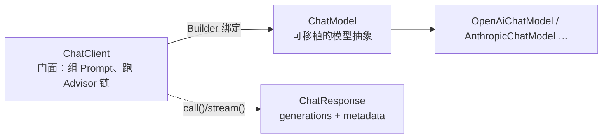

## 三层关系先分清



- **`ChatModel`** 是模型抽象，换厂商换它（准确说是换它背后的 starter）。
- **`ChatClient`** 是你实际写的门面：官方表述为 "The ChatClient offers a **fluent API** for
  communicating with an AI Model, supporting both synchronous (`call()`) and streaming
  (`stream()`) programming models."
- **`ChatClient.Builder`** 把门面绑到某个 `ChatModel` 上。自动配置**默认只提供一个
  `ChatClient.Builder` Bean**，而且是原型的——官方原文：**"You can use the auto-configured
  `ChatClient.Builder` as it is prototype-scoped, meaning a new instance is created for each
  injection point."** 原型作用域正是"一个用例一个 ChatClient"能成立的原因。

## 最小可用与两种配置位置

```java
@RestController
class MyController {
    private final ChatClient chatClient;

    // 注入原型的 Builder，build 出本用例专用的 ChatClient
    public MyController(ChatClient.Builder builder) {
        this.chatClient = builder.build();
    }

    @GetMapping("/ai")
    String generation(String userInput) {
        return this.chatClient.prompt()
            .user(userInput)
            .call()
            .content();
    }
}
```

配置能落在两个层级，语义完全不同——**构建级设默认，请求级追加**：

| 构建级（`ChatClient.Builder`） | 作用 | 请求级（fluent 链上） |
| --- | --- | --- |
| `defaultSystem(String/Resource/Consumer)` | 默认 system 文本 | `system(...)` |
| `defaultOptions(ChatOptions)` | 默认模型参数 | `options(...)` |
| `defaultTools(Object... tools)` | 每次请求都可用的工具 | `tools(...)` |
| `defaultAdvisors(Advisor...)` | 每次请求都过的拦截器 | `advisors(...)` |

`defaultTools` 官方签名说明它是**异构**的："Accepts a heterogeneous mix of `ToolCallback`,
`ToolCallbackProvider`, or POJOs with `@Tool` annotated methods."

:::caution[别绕开自动配置的 Builder]
官方点名了一个反模式："doing so bypasses the auto-configured `ChatClient.Builder`,
**which means observability and `ChatClientBuilderCustomizer` beans are ignored**" ——
即用 `ChatClient.create(chatModel)` 或 `ChatClient.builder(chatModel)` 手工建门面，
观测埋点和自定义 Builder 的定制都会静默失效。多模型场景要谨慎，优先复用自动配置的
Builder。
:::

## 终结方法：一张表记住

链式调用只是**攒参数**，真正发出请求要等终结方法。`call()` 之后有五个，`stream()`
之后有三个（返回类型取自官方文档原文）：

| 终结方法 | 位置 | 返回 | 什么时候用 |
| --- | --- | --- | --- |
| `content()` | call / stream | `String` / `Flux<String>` | 只要文本，最常见 |
| `chatResponse()` | call / stream | `ChatResponse` / `Flux<ChatResponse>` | 要 **token 用量等 metadata**："contains multiple generations and also metadata about the response, for example how many token were used" |
| `chatClientResponse()` | call / stream | `ChatClientResponse` / `Flux<ChatClientResponse>` | 要 **Advisor 执行上下文**（例如 RAG 流程里检索到的文档） |
| `entity()` | 仅 call | 你的 Java 类型 | 结构化输出 |
| `responseEntity()` | 仅 call | `ChatResponse` + Java 类型 | 既要结构化结果又要 metadata |

`chatClientResponse()` 与 `chatResponse()` 的区别是面试易错点：前者**包着**后者，
外加 "the ChatClient execution context, giving you access to additional data used during
the execution of advisors"。Advisor 往上下文里塞的东西（检索文档、置信度）只能从它取。

## Prompt 模板变量

`user()`/`system()` 支持运行时模板，占位符用 `{name}`，值由 `param()` 给：

```java
String answer = chatClient.prompt()
    .user(u -> u.text("Tell me 5 movies by composer {composer}")
                .param("composer", "John Williams"))
    .call()
    .content();
```

模板本身可由 [PromptTemplate](/ai/intermediate/llm/02-prompt-engineering/) 承载
（内部是 StringTemplate），system/user 两侧都能 `param`。

## 流式：只在 stream() 上取文本

```java
Flux<String> output = chatClient.prompt()
    .user("Tell me a joke")
    .stream()
    .content();
```

`Flux` 意味着背压与非阻塞——和 [Spring MVC 的响应式栈](/java/intermediate/spring-mvc/01-springmvc-flow/)
是两套线程模型，WebFlux 端点直接返回它即可流式下发。

## 结构化输出：`.entity()` 一条链做完三件事

让模型返回可直接反序列化的结果，2.0 的官方入口是 **`.entity(...)`**："Spring AI exposes
structured output directly on the `ChatClient` fluent API through `.entity(…)`. You define
a Java type for the shape you want back."

```java
record ActorsFilms(String actor, List<String> movies) {}

ActorsFilms films = chatClient.prompt()
    .user("Generate the filmography of 5 movies for Tom Hanks")
    .call()
    .entity(ActorsFilms.class);
```

它内部发生的三件事，官方表述为 "a JSON schema is **generated from your type**, the model
is **instructed to honor it**, and the response is **deserialized into your type**"——
即"生成 Schema → 写进 prompt 的 system 上下文 → 反向校验解析"。

两个必须知道的边界：

1. **不能和流式同时用**："`.entity(…)` is `.call()`-only. Typed parsing requires the
   complete response, so it is not available on the streaming path." 要边流边结构化，
   只能自己攒完整段再解析。
2. **失败可以重试，但要显式开**：`validateSchema()` "turns on a **self-correcting retry
   loop**: Spring AI validates the response against the entity's schema, and if validation
   fails, the specific error is appended to the prompt and the call is re-issued —
   **up to 3 attempts by default**"，实现 "powered by `StructuredOutputValidationAdvisor`
   (auto-registered recursive advisor)"，校验用 JSON Schema **DRAFT_2020_12**。

配套的两个概念成对记：`.useProviderStructuredOutput()` 是**请求侧约束**（让厂商原生
结构化输出能力去保证），`validateSchema()` 是**响应侧兜底**（拿到结果再校验、错就把错误
塞回 prompt 重试）。

## 转换器层：`.entity()` 底下是什么

想手工控制格式说明，用转换器族。接口定义："public interface
`StructuredOutputConverter<T> extends Converter<String, T>, FormatProvider`"，
带 `default String getJsonSchema()`，`FormatProvider` 只声明 `String getFormat()`。

| 转换器 | 目标格式 | 构造 |
| --- | --- | --- |
| `BeanOutputConverter<T>` | 由 Java 类推导的 JSON Schema（DRAFT_2020_12） | `new BeanOutputConverter<>(ActorsFilms.class)` |
| `MapOutputConverter` | RFC8259 兼容的 JSON | `new MapOutputConverter()` |
| `ListOutputConverter` | 逗号分隔列表 | `new ListOutputConverter(new DefaultConversionService())` |

格式说明惯常拼在用户输入尾部：`"format", this.outputConverter.getFormat()`。泛型集合要
走 `ParameterizedTypeReference`，否则类型擦除后推不出 Schema：

```java
var converter = new BeanOutputConverter<>(
    new ParameterizedTypeReference<List<ActorsFilms>>() {});
```

概念层面的取舍（为什么"要求返回 JSON"经常失败、Schema 校验与自纠错的通用原理）
见 [结构化输出](/ai/intermediate/agent/12-structured-output/)，本篇只讲 Spring AI 的落点。

## 模型参数：可移植 vs 厂商专属

`options(...)`/`defaultOptions(...)` 的官方说明是："Pass in either portable options defined
in the `ChatOptions` class **or model-specific options** such as those in
`OpenAiChatOptions`." 两者差异要心里有数——可移植项换厂商仍在，厂商专属项换厂商即失效。

2.0 有两条相关断代（见[全景篇](/spring-ai/basic/foundation/01-what-is-spring-ai/)的清单）：
Options 类 **"now strictly immutable"**（不能再 setter 改），默认值从 `*Properties` 下沉到
options 构造器；配置属性扁平化，`spring.ai.openai.embedding.options.model` 变成
`spring.ai.openai.embedding.model`——旧键 deprecated 兼容，但新写代码用新键。

## 常见误区澄清

- **"注入 `ChatClient` 就行"**：自动配置给的是 **`ChatClient.Builder`**（原型），
  通常注入 Builder 再 `build()`；直接注入 `ChatClient` 不是默认形态。
- **"`prompt()` 一调请求就发出去了"**：不是，"Execution is deferred until a terminal method
  is invoked"——没有终结方法，什么都不会发生，也是排查"没反应"的第一站。
- **"`entity()` 能保证模型一定返回合法 JSON"**：默认只是"要求 + 解析"。要真正的
  schema 校验重试，得显式 `validateSchema()`，且默认上限 3 次。
- **"换厂商要改代码"**：改的是 starter 依赖与配置属性；但用了 `OpenAiChatOptions` 这类
  厂商专属 options，可移植性就在这一点上打了折。

## 小结

- `ChatClient` 是门面、`ChatModel` 是抽象，Builder 原型作用域使"一用例一客户端"成立；
  手工 `ChatClient.create()` 会绕开自动配置从而丢观测。
- 五个终结方法按"要不要 metadata / 要不要执行上下文 / 要不要 Java 类型"选，
  `entity()` 只在 `call()` 路径上可用。
- 结构化输出 = Schema 生成 + 请求侧约束 + 响应侧校验重试（默认 3 次），
  三者别当成一件事。
