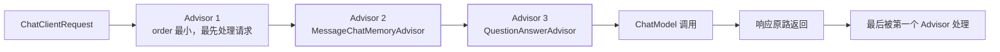
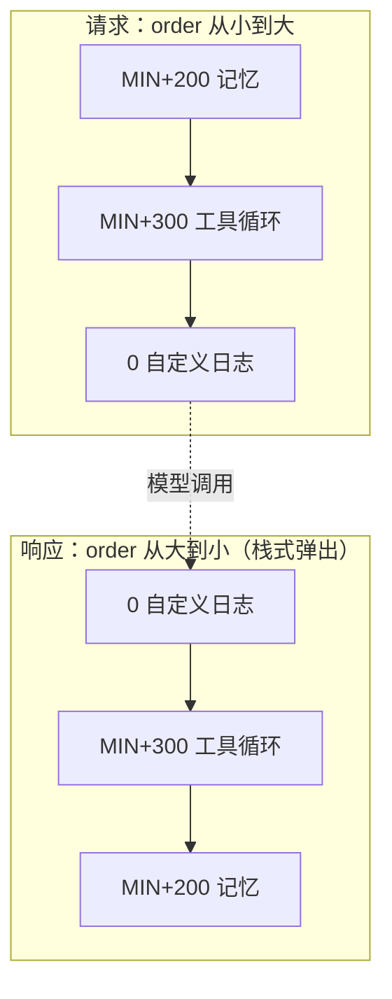
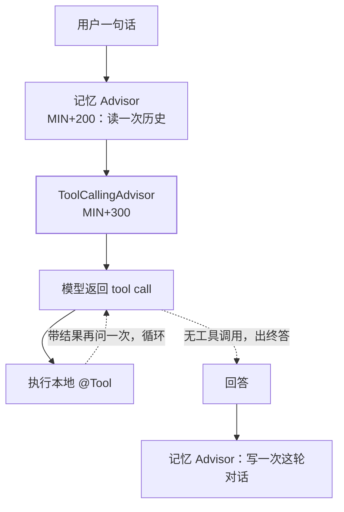

## Advisor 是什么，类比谁

官方定义："The Advisors API provides a flexible and powerful way to **intercept, modify,
and enhance** AI-driven interactions in your Spring applications." 典型用途是**往 prompt
里补上下文**——你的私有文档（RAG）、历史对话（记忆）、护栏过滤，都在这一层做。

如果你写过 Spring，它就是**AI 调用版的 Filter / HandlerInterceptor**；如果看过
[责任链模式](/java/intermediate/design-pattern/12-chain-of-responsibility/)，它是同一个
模式的又一次落地——区别只在于被拦截的不是 HTTP 请求，而是一次模型调用。



## 接口签名：三个方法就说完

```java
public interface Advisor extends Ordered {
    String getName();
}

public interface CallAdvisor extends Advisor {
    ChatClientResponse adviseCall(
        ChatClientRequest chatClientRequest,
        CallAdvisorChain callAdvisorChain);
}

public interface StreamAdvisor extends Advisor {
    Flux<ChatClientResponse> adviseStream(
        ChatClientRequest chatClientRequest,
        StreamAdvisorChain streamAdvisorChain);
}
```

链条本身也只是一个接口——`CallAdvisorChain extends AdvisorChain`，方法是
`nextCall(ChatClientRequest)` 与 `getCallAdvisors()`。**"下一个"由你显式调用**，
所以 Advisor 天然能：改请求再放行、放行后改响应、或者根本不放行（护栏直接拒）。

一个最小实现（官方拿它做示例，明确 "not a built-in framework advisor"）：

```java
@Slf4j
public final class SimpleLoggerAdvisor
        implements CallAdvisor, StreamAdvisor {

    @Override
    public String getName() {
        return this.getClass().getSimpleName();
    }

    @Override
    public int getOrder() {
        return 0;
    }

    @Override
    public ChatClientResponse adviseCall(
            ChatClientRequest req, CallAdvisorChain chain) {
        log.debug(req.toString());
        ChatClientResponse resp = chain.nextCall(req);
        log.debug(resp.toString());
        return resp;
    }
    // adviseStream(...) 同理：包 nextStream(...) 的 Flux
}
```

## order 语义：两条规则 + 一个栈

面试里 `getOrder()` 的行为和 Spring 别处一致，但要答准三句话（均为官方原文口径）：

1. **"Advisors with lower order values are executed first."** 值小的先执行。
2. **"Higher values are interpreted as lower priority."** 值大 = 优先级低。
3. **"The advisor chain operates as a stack: The first advisor in the chain is the first
   to process the request. It is also the last to process the response."**
   —— 先处理请求的那个，**最后**处理响应。

常量来自 `Ordered`：`HIGHEST_PRECEDENCE = Integer.MIN_VALUE`、
`LOWEST_PRECEDENCE = Integer.MAX_VALUE`。把第 3 条画开就是：



这个"进正出反"决定了**记忆的写入时机**——下一节的重点。

## 内置 Advisor 清单：各自解决什么

| 内置 Advisor | 官方职责表述 | 归类 |
| --- | --- | --- |
| `MessageChatMemoryAdvisor` | "Retrieves memory and adds it as **a collection of messages** to the prompt" | 记忆 |
| `VectorStoreChatMemoryAdvisor` | "adds it into the prompt's **system text**" | 记忆 |
| `QuestionAnswerAdvisor` | "implementing the **Naive RAG** pattern" | RAG |
| `RetrievalAugmentationAdvisor` | "using the building blocks defined in the `org.springframework.ai.rag` package and following the **Modular RAG** Architecture" | RAG |
| `ReReadingAdvisor` | "Implements a re-reading strategy for LLM reasoning, dubbed **RE2**" | 推理增强 |
| `ToolCallingAdvisor` | "Handles the **tool calling loop** as part of the advisor chain … always auto-registered by `ChatClient`" | 工具 |
| `SafeGuardAdvisor` | "prevent the model from generating harmful or inappropriate content" | 护栏 |

`QuestionAnswerAdvisor` 与 `RetrievalAugmentationAdvisor` 的差别是 **Naive RAG vs
Modular RAG**：前者一步检索拼 prompt，后者用 `org.springframework.ai.rag` 的构件自己
组装检索链路。选型与原理见 [RAG](/ai/intermediate/agent/06-rag/) 与
[RAG 进阶](/ai/intermediate/agent/11-rag-advanced/)。

## 注册：推荐构建期，追加在请求期

```java
var chatClient = ChatClient.builder(chatModel)
    .defaultAdvisors(
        MessageChatMemoryAdvisor.builder(chatMemory).build(),
        QuestionAnswerAdvisor.builder(vectorStore).build())
    .build();
```

官方口径是**推荐构建期注册**："It is recommended to register the advisors at build time
using builder's `defaultAdvisors()` method." 请求期通过 `AdvisorSpec` 追加，运行参数
（会话 ID、阈值）走 `param`：

```java
chatClient.prompt()
    .user(userText)
    .advisors(a -> a
        .advisors(MessageChatMemoryAdvisor.builder(chatMemory).build())
        .param(ChatMemory.CONVERSATION_ID, conversationId))
    .call()
    .content();
```

`AdvisorSpec` 只有四个方法：`param(String, Object)`、`params(Map)`、
`advisors(Advisor...)`、`advisors(List<Advisor>)`。

## 关键机制：工具循环为什么是"一个 Advisor"

这是 2.0 最重要的一处结构变化。断代清单里那条 "tool calls are not executed automatically"
的含义是：**`ChatModel` 自己不再跑工具循环**，循环改由 `DefaultChatClient` 自动注册的
`ToolCallingAdvisor` 承担——官方原文 "`DefaultChatClient` auto-registers a ToolCallingAdvisor
that drives the loop"，并且 "always auto-registered by `ChatClient`"。

于是位次关系变成了硬约束：

- `ToolCallingAdvisor` 默认 order = **`HIGHEST_PRECEDENCE + 300`**；
- `MessageChatMemoryAdvisor` 默认 order = **`HIGHEST_PRECEDENCE + 200`**，
  官方直接点明后果——"lower than ToolCallingAdvisor, **which places it outside the loop**"。



按栈式语义读这张图：记忆在**环外**，所以**一整轮工具调用只读一次历史、只写一次记忆**——
中间那些"模型要工具 → 工具返回"的往返不会污染历史。反过来要把记忆放进环内，官方给的
办法也是调顺序：`place the memory advisor inside the loop by giving it an order greater
than ToolCallingAdvisor.DEFAULT_ORDER`。

两个必须知道的边界：

1. **重复注册会被拒**："Attempting to register a second one fails with an explicit error."
   手工再 `.advisors(new ToolCallingAdvisor(...))` 直接报错。
2. **要关掉只有两条路**：请求级 `AdvisorParams.toolCallingAdvisorAutoRegister(false)`，
   或全局属性 `spring.ai.chat.client.tool-calling.enabled=false`（默认 `true`，2.0 新增）。
   关掉后要自己驱动循环，别指望它还在。

## 命名沿革：旧教程为什么编译不过

Advisor 的类名在 1.0 换过一轮，2.0 又删了旧记忆 Advisor，看到旧名请按此表对照：

| 旧名（早期教程常见） | 现名 | 时点 |
| --- | --- | --- |
| `CallAroundAdvisor` / `StreamAroundAdvisor` | `CallAdvisor` / `StreamAdvisor` | 1.x 早期 |
| `AdvisedRequest` / `AdvisedResponse` | `ChatClientRequest` / `ChatClientResponse` | 1.0.0 |
| `FunctionCallback` | `ToolCallback` | **2.0 移除前者** |
| `ToolCallAdvisor` | `ToolCallingAdvisor` | 2.0 |
| `PromptChatMemoryAdvisor` | `MessageChatMemoryAdvisor` | 1.1.3 弃用，**2.0 移除** |

## 常见误区澄清

- **"Advisor 就是 AOP"**：不是同一层。[AOP](/java/intermediate/spring/02-aop/) 靠代理在
  **Bean 方法**边界织入；Advisor 是框架**显式设计的扩展点**，拿到的是请求/响应对象与
  `AdvisorChain`，能改内容也能短路，且不依赖代理（同类内部调用也不会失效）。
- **"order 小的先执行，所以也先看到响应"**：前半句对，后半句反了——链是栈，
  先进后出，order 最小的**最后**处理响应。
- **"记忆 Advisor 放哪都一样"**：2.0 之后放前放后直接决定工具循环的中间消息会不会进历史，
  这是位次而非风格问题（见上节）。
- **"RAG 只能自己写"**：`QuestionAnswerAdvisor` 一行挂上就能用，`RetrievalAugmentationAdvisor`
  提供模块化装配；两者是**同一件事的两档复杂度**。

## 小结

- Advisor = 模型调用版责任链，`Advisor extends Ordered` + `adviseCall/adviseStream`
  两个签名，`nextCall(...)` 由你显式放行。
- order 三条语义（小者先、大者低优先级、栈式进出）合起来决定**记忆写入时机**。
- 2.0 的工具循环是**一个自动注册的 Advisor**（MIN+300），记忆默认在环外（MIN+200）；
  关掉它只有 `AdvisorParams` 与 `spring.ai.chat.client.tool-calling.enabled` 两条路。
