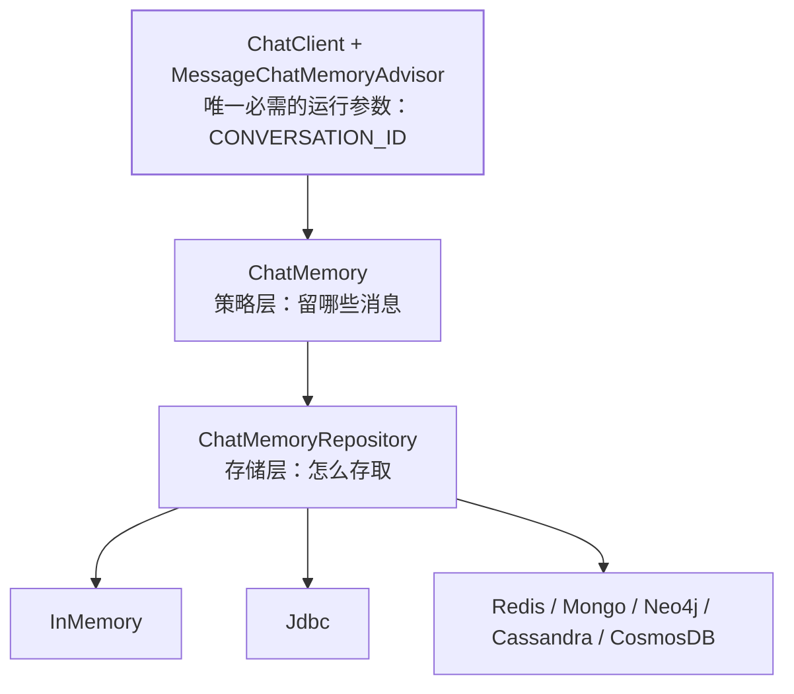

## 为什么需要这一层

模型本身**无状态**：每次调用都是一次独立的 HTTP 请求，"记得上文"必须由调用方把历史
重新拼进去。站内 [Agent 记忆](/ai/intermediate/agent/04-memory/) 讲的是这件事的通用原理，
本篇讲 Spring AI 怎么把它做成**可替换的两层抽象 + 一个 Advisor**。



分层的官方表述是：**"The `ChatMemory` abstraction allows you to implement various types of
memory to support different use cases. The underlying storage of the messages is handled by
the `ChatMemoryRepository`"**，并直接点名后者 **"whose sole responsibility is to store and
retrieve messages"**。

为什么要拆两层——因为**"记住什么"和"记在哪"变化频率不同**：窗口/裁剪/摘要属于策略，
换 MySQL 还是 Redis 属于存储。拆开就能只换一头。

## 策略层：MessageWindowChatMemory

默认自动配置的就是它。规则很朴素：**滑动窗口 + 永不过滤 SystemMessage**——
"maintains a sliding window of messages up to a specified maximum size. When the number of
messages exceeds the maximum, **older messages are evicted while always preserving
`SystemMessage` instances**. **The default window size is 20 messages**."

```java
ChatMemory memory = MessageWindowChatMemory.builder()
    .maxMessages(10)
    .build();
```

注意 `maxMessages` 数的是**消息条数**，不是 token。所以"窗口 20 条"在长对话里
仍可能撑爆上下文：条数与 token 是两个预算维度，按 token 裁剪得自己在窗口策略之外
另做（官方文档给的内置实现就是这个滑窗）。

:::caution[窗口淘汰会静默丢事实]
条数上限意味着**最早的用户诉求可能被挤出去**，表现为"聊着聊着它忘了我最初要什么"。
这不是模型退化，是窗口策略。生产上要么放大窗口，要么在窗口外做摘要/检索式长期记忆。
:::

## 接线：一个 Advisor + 一个必填参数

```java
var chatClient = ChatClient.builder(chatModel)
    .defaultAdvisors(
        MessageChatMemoryAdvisor.builder(memory).build())
    .build();

String answer = chatClient.prompt()
    .user(userText)
    .advisors(a -> a.param(ChatMemory.CONVERSATION_ID, conversationId))
    .call()
    .content();
```

`MessageChatMemoryAdvisor` 的行为是**以消息集合形式注入**："On each interaction, it
retrieves the conversation history from the memory and includes it in the prompt
**as a collection of messages**"。另有一个 `VectorStoreChatMemoryAdvisor` 走的是
"adds it into the prompt's **system text**"——同一段历史，进 messages 还是进 system 文本，
是不同的模型行为取向，后者更像"背景描述"。

### 2.0 最疼的一处变更：会话 ID 没有默认值了

官方写法是加粗的：**"The `ChatMemory.CONVERSATION_ID` parameter is required for all memory
advisors. Calls that omit this parameter will throw an `IllegalArgumentException` at runtime.
There is no default conversation ID."**

对应在 2.0 断代清单里的是**常量本身被删**："The constant `ChatMemory.DEFAULT_CONVERSATION_ID`
(value `"default"`) has been removed."

```text
1.x：忘传 CONVERSATION_ID → 落到 "default" 会话
     → 所有用户共用一份历史（多租户下是数据串线事故）
2.0：忘传 → 当场 IllegalArgumentException
     → 忘了就崩，不会串线
```

**这不是坏消息**：1.x 那个默认值把一次严重的数据越权，变成了线上才会发现的隐性问题。
2.0 把它前移成启动即报错。

## 存储层：七种内置仓储

2.0.1 文档列出的 `ChatMemoryRepository` 实现：

`InMemoryChatMemoryRepository`、`JdbcChatMemoryRepository`、`CassandraChatMemoryRepository`、
`Neo4jChatMemoryRepository`、`CosmosDBChatMemoryRepository`、`MongoChatMemoryRepository`、
`RedisChatMemoryRepository`。

对比 1.0.9 的清单只到 `Neo4j`——**Cosmos/Mongo/Redis 是后续补的**。选型判断不在条数，
而在下面这个坑。

手工接线用 builder 的 `chatMemoryRepository(...)`：

```java
ChatMemory memory = MessageWindowChatMemory.builder()
    .chatMemoryRepository(chatMemoryRepository)
    .maxMessages(10)
    .build();
```

:::caution[不是所有仓储都存得下工具消息]
两处口径要一起读。第一处是能力缺口："Currently, the intermediate messages exchanged with a
large-language model when performing **tool calls are not stored in the memory**."
第二处是仓储侧限制："**Not every** `ChatMemoryRepository` can persist tool messages …
As of 2.0, the built-in repositories that support the full message set are:
`InMemoryChatMemoryRepository`, `RedisChatMemoryRepository`, `Neo4jChatMemoryRepository`."

合起来的实际含义：**你要把工具调用轨迹也留在历史里，可选仓储只有 InMemory / Redis /
Neo4j 三个**；用 Jdbc 或 Mongo 时，工具消息这一维是缺失的。跨会话审计、复盘模型为什么
这么答，会直接受影响——选型阶段就要定，别等上线后补。
:::

Redis 那一档还带一处属性改名：`spring.ai.chat.memory.redis.*` →
`spring.ai.chat.memory.repository.redis.*`（2.0 断代，旧键不再生效）。

## 记忆与工具循环的位次：一个真实的行为差异

[Advisor 责任链](/spring-ai/intermediate/advisor/01-advisor-chain/)篇讲过，
`MessageChatMemoryAdvisor` 默认 order = `HIGHEST_PRECEDENCE + 200`，比驱动工具循环的
`ToolCallingAdvisor`（`+ 300`）更小，因此**在环外**。把两种放法对照清楚：

| 记忆 Advisor 位置 | 读历史的次数 | 写历史的粒度 | 后果 |
| --- | --- | --- | --- |
| 默认（`+200`，环外） | 一整轮 1 次 | 一整轮 1 次 | 历史只有"用户问 / 最终答"，干净、省 token |
| order 大于 `ToolCallingAdvisor.DEFAULT_ORDER`（环内） | 每次工具往返 1 次 | 每次工具往返 1 次 | 中间消息全进历史，可审计但历史膨胀 |

官方对"环内"给的正是顺序手段："place the memory advisor inside the loop by giving it an
**order greater than** `ToolCallingAdvisor.DEFAULT_ORDER`"。注意这与"仓储存不存得下工具
消息"是**两道独立的闸门**——Advisor 位置决定写不写，仓储类型决定能不能写。

## 常见误区澄清

- **"`ChatMemory` 就是缓存"**：它存的是**对话消息序列**，语义是给模型重放的上下文，
  不是 KV 缓存。真要做语义级长期记忆，方向是向量检索（`VectorStoreChatMemoryAdvisor`
  那一档）。
- **"自动配置了 memory 就会记住"**：还得挂上 Advisor 并传 `CONVERSATION_ID`。
  自动配置只给了 `ChatMemory` Bean 本身（默认 `MessageWindowChatMemory`）。
- **"换存储要改业务代码"**：只换 `ChatMemoryRepository` 实现与 starter，
  `ChatMemory` 用法不变——这正是两层抽象存在的理由。
- **"记忆越长越好"**：窗口只是第一道闸；长历史会带来 token 成本与"中间信息淹没"
  两类问题，参见[上下文工程](/ai/intermediate/agent/03-context-engineering/)。

## 小结

- 两层分工：`ChatMemory` 管**留什么**（默认 `MessageWindowChatMemory`，窗口 20 条、
  保留 SystemMessage），`ChatMemoryRepository` 管**存哪**（内置 7 种）。
- 2.0 起 `ChatMemory.CONVERSATION_ID` **必填且无默认值**，忘传直接抛异常——
  把 1.x 的多会话串线事故换成了启动即失败。
- 工具消息能否留档由**两道闸门**共同决定：Advisor 在不在工具循环内，以及仓储是否支持
  全消息集（2.0 只有 InMemory / Redis / Neo4j）。
