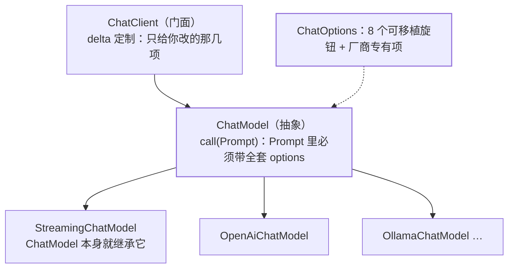

## 这一层解决什么

[ChatClient 那篇](/spring-ai/basic/foundation/02-chatclient-api/)讲的是你天天写的门面，
本篇讲门面**底下**那层：`ChatModel`。分层的意义在一个具体问题上体现得最清楚——
**"我在模型 Bean 上配了 `temperature=0.2`，这次请求只想改 `topK`，其他参数保持，
该怎么写？"** 答错这个的人，会在生产上拿到一批"温度悄悄变回默认值"的样本。



## 接口本身：一个 ChatModel 同时也是流式模型

```java
public interface ChatModel extends Model<Prompt, ChatResponse>,
                                   StreamingChatModel {
    default String call(String message) { … }
    @Override
    ChatResponse call(Prompt prompt);
}

public interface StreamingChatModel
        extends StreamingModel<Prompt, ChatResponse> {
    default Flux<String> stream(String message) { … }
    @Override
    Flux<ChatResponse> stream(Prompt prompt);
}
```

值得注意的不是方法名，而是**继承关系**：`ChatModel extends StreamingChatModel`，
所以任何厂商实现都同时具备流式能力，`stream()` 不是"某些模型才有的附加接口"。
2.0 在音频侧做了同构的事——《Upgrade Notes》写 "`TranscriptionModel` now extends
`StreamingTranscriptionModel`, making streaming transcription a first-class capability of
every transcription model"，并给接口一个默认实现
"returns `Flux.error(new UnsupportedOperationException(…))`, so existing custom
implementations … continue to compile without changes"。**"接口先扩、厂商后补"的兼容手法**
在这两处是同一个：默认实现抛 `UnsupportedOperationException`，而不是让编译断掉。

## 可移植的旋钮只有八个

`ChatOptions` 的完整可移植面就是这些 getter（外加一个 `mutate()`）：

```java
public interface ChatOptions extends ModelOptions {
    String getModel();
    Double getFrequencyPenalty();
    Integer getMaxTokens();
    Double getPresencePenalty();
    List<String> getStopSequences();
    Double getTemperature();
    Integer getTopK();
    Double getTopP();
    ChatOptions.Builder<?> mutate();
}
```

**厂商专有项在这之外**，官方口径："every model specific ChatModel/StreamingChatModel
implementation can have its own options that are not portable across different AI Models"，
并举例 OpenAI 有 `logitBias`、`seed`、`user`。前面[工具调用篇](/spring-ai/intermediate/tools/01-tool-calling/)
里那个 `strict` 也是同一类——它属于 `OpenAiChatOptions`，不属于 `ChatOptions`。

:::caution[可移植 ≠ 有效]
八个旋钮是"**能被翻译成各家协议的交集**"，不是"每家都真按这个值行为"。
`topK` 在某些厂商被映射成别的语义、`stopSequences` 的支持度不一——**换厂商后这八个值
要重新回归，不能靠"接口一样"就认为结果一样**。
:::

## 关键规则：走 ChatModel 是全量取代，走 ChatClient 才是增量

这是本篇最该记住的一条，官方两句原话对照着看：

- **`ChatModel` 路径**："When using `ChatModel.call() / ChatModel.stream()`, the passed
  prompt needs to contain **a full set of options** that will **completely take precedence**
  over options set in the model (or use `null` options in the `Prompt` to use the model's
  defaults)."
- **`ChatClient` 路径**："The ChatClient abstraction allows for an **incremental approach**
  where users can provide a \"delta\" customizer that overrides the default options on a
  per-request basis."

翻译成行为差异：

```text
Bean 上配 temperature=0.2, maxTokens=200

ChatClient.prompt().options(o -> o.topK(5))...
  → 温度仍是 0.2，只加 topK（这是 delta）

ChatModel.call(new Prompt(text,
    OpenAiChatOptions.builder().topK(5).build()))
  → 这被当成「一整套」options：未显式设的项不再继承 Bean 的值
```

所以开头那个问题的正解是：**要"只改一项、其余保持"，就别绕开 `ChatClient`**。
真要下到底层，只有两条路——带上一套完整的 options，或者干脆 `null` 让它用模型默认。
"传一个只填了一项的 options 下去"是最糟的第三种：看着像增量，实际是全量。

## Options 在 2.0 是不可变的

《Upgrade Notes》的断代条目："Options classes … are **now strictly immutable**"，并且默认值
从配置属性类下沉到 options 构造器、`*Properties` 的默认配置属性被删除。合起来的写法变化：

```java
// 改一份 options：走 mutate() 拿新实例，不要指望 setter
var tuned = options.mutate().temperature(0.7).build();
```

不可变性和上一节是**同一件事的两面**：既然 `ChatModel` 路径把 options 当"整套快照"传，
可变对象就会在并发请求间互相污染。`mutate()` 返回新实例，正是为了让"基于默认值改一项"
这件事在 `ChatModel` 层也能显式做对——**先复制全套，再改那一项**。

## 响应侧：ChatResponse 里有什么

```java
public class ChatResponse implements ModelResponse<Generation> {
    private final ChatResponseMetadata chatResponseMetadata;
    private final List<Generation> generations;
    public ChatResponseMetadata getMetadata() { … }
    public List<Generation> getResults() { … }
}

public class Generation implements ModelResult<AssistantMessage> {
    private final AssistantMessage assistantMessage;
    private ChatGenerationMetadata chatGenerationMetadata;
    public AssistantMessage getOutput() { … }
    public ChatGenerationMetadata getMetadata() { … }
}
```

`ChatResponse` 装的是**一个列表**（`List<Generation>`），因为一次请求可以有多个候选补全。
只取 `getResults().get(0)` 是常见便利写法，但要清楚"多候选"这件事在协议层是被允许的。
门面层的对应关系见 [ChatClient 终结方法表](/spring-ai/basic/foundation/02-chatclient-api/)：
`chatResponse()` 拿这个对象，`content()` 是它的便捷投影。

## 多模态的边界：只有用户消息能带媒体

`UserMessage` 的 `content` 放文本，`media` 放图/音/视频，`MimeType` 指明模态；数据形态
依厂商而定——"the `Media` data field can be either the raw media content as a `Resource`
object or a `URI` to the content"。

```java
var image = new ClassPathResource("/multimodal.test.png");
var userMessage = UserMessage.builder()
    .text("Explain what do you see in this picture?")
    .media(new Media(MimeTypeUtils.IMAGE_PNG, image))
    .build();
ChatResponse response = chatModel.call(new Prompt(userMessage));
```

两条硬边界，官方写得很明确：

- **媒体只在输入侧有效**："The media field is currently applicable only for user input
  messages (e.g., `UserMessage`). It does **not** hold significance for system messages.
  The `AssistantMessage` … provides text content only."
- **产出非文本要换模型**："To generate non-text media outputs, you should utilize one of
  the dedicated, single-modality models."（图像生成走 Image Model，语音走 Audio Model，
  见[全景篇](/spring-ai/basic/foundation/01-what-is-spring-ai/)的能力分组表。）

也就是说：**"让模型返回一张图"不该用 `ChatModel` 期待它带媒体输出**，那是另一条 API。

## 常见误区澄清

- **"options 会智能合并"**：`ChatModel` 路径是全量取代，只有 `ChatClient` 是 delta。
  见上文那组对照，这是本篇最容易在生产上踩到的一条。
- **"流式是另一个接口，要单独接"**：`ChatModel` 本身继承 `StreamingChatModel`。
- **"可移植接口 = 行为一致"**：八个旋钮是协议交集，效果要按厂商回归。
- **"Options 对象可以边用边改"**：2.0 起严格不可变，改配置用 `mutate()`。
- **"system prompt 里也能塞图"**：`media` 只对 `UserMessage` 有意义。

## 小结

- `ChatModel` 是模型抽象、`ChatClient` 是门面；`ChatModel` 同时就是流式模型。
- 可移植旋钮只有 8 个（model / temperature / topK / topP / maxTokens /
  frequencyPenalty / presencePenalty / stopSequences），其余皆厂商专有。
- **参数覆盖规则分两层：`ChatModel` 收全量快照、`ChatClient` 收 delta**；
  想"只改一项"就走门面，或先 `mutate()` 复制再改。
- 多模态只在用户输入侧，非文本产出要用专门的单模态 API。
