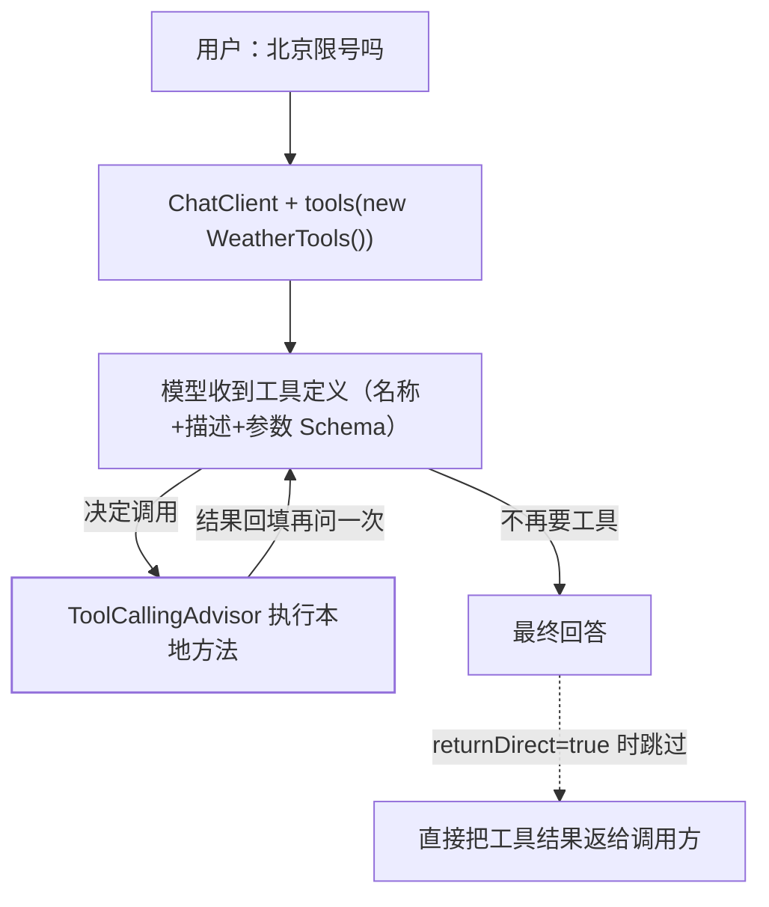

## 先纠正一个直觉

工具不是 Spring AI 替你调的。**模型只会输出文本**，它能做的只是"说出我想调用
`getWeather(city)` 并带上这些参数"，真正执行的是你的 JVM。通用原理见
[工具使用](/ai/basic/agent/02-tool-use/) 与[工具设计](/ai/intermediate/agent/16-tool-design/)，
本篇只讲 Spring AI 把这套协议做成了什么。



中间那个"再问一次"的环就是所谓的 **tool calling loop**。它在 2.0 换了主人，是本篇最重要
的一件事。

## 三种声明方式，按侵入度排

### 一、`@Tool` 注解在方法上（日常首选）

```java
class WeatherTools {

    @Tool(description = "Get the weather in location")
    String weatherByCity(@ToolParam(description = "City name") String city) {
        return weatherService.get(city);
    }
}
```

`@Tool` 可配的属性：**`name`**（默认取方法名，且在一次请求的工具集内**必须唯一**）、
**`description`**、**`returnDirect`**、**`resultConverter`**。参数级用 `@ToolParam` 描述，
`@ToolParam(required = false)` 或 `@Nullable` 让参数变可选。

:::caution[description 是给模型看的，不是给人看的]
模型只能看到名称、描述和参数 Schema——**描述写不清楚，模型就选错工具或干脆不调**。
这是[工具设计](/ai/intermediate/agent/16-tool-design/)那篇的核心结论在 Spring AI 里的
落点，也是 `@Tool` 与 `@Bean` 最本质的区别。
:::

### 二、`FunctionToolCallback`（函数式/动态注册）

```java
var currentWeather = FunctionToolCallback
    .builder("currentWeather", weatherService::getWeather)
    .description("Get the weather in location")
    .inputType(WeatherRequest.class)
    .build();
```

官方说明 builder 设的是描述与 **input type**，后者用于**生成参数 JSON Schema**。
适合工具实现来自配置、注册表或运行期才知道的场景。

### 三、`MethodToolCallback`（反射到指定方法）

```java
MethodToolCallback.builder()
    .toolMethod(method)
    .toolObject(new WeatherTools())
    .build();
```

`toolObject` 对实例方法必需、静态方法可省。三者最终都是同一个接口的实现——
`ToolCallback`：

```java
public interface ToolCallback {
    ToolDefinition getToolDefinition();
    ToolMetadata getToolMetadata();
    String call(String toolInput);
    String call(String toolInput, ToolContext toolContext);
}
```

入参是**字符串**（模型给的 JSON），出参也是字符串。这个设计让"工具"这一层与
模型协议彻底解耦：任何厂商的 tool call 报文，落到这里都是 `String → String`。

## 注册位置：默认工具与单次工具

```java
var chatClient = ChatClient.builder(chatModel)
    .defaultTools(new WeatherTools())   // 每次请求都带
    .build();

chatClient.prompt().user(question)
    .tools(currentWeather)              // 本次追加
    .call()
    .content();
```

两条语义要分清：`.tools(...)` 与 `defaultTools(...)` 都是**异构**入口——"they accept
`@Tool`-annotated POJO instances, `ToolCallback` instances, `ToolCallbackProvider`
instances, and arrays or collections of any of these"；而**单次 `.tools(...)` 是往默认
列表上追加，不是替换**："Per-call `.tools(…)` appends to the client's defaults —
**it does not replace them**."

还有一条省代码的路：容器里的 `ToolCallback` Bean 以及 `ToolCallbackProvider` Bean 产出的
工具会被自动收进解析器（`StaticToolCallbackResolver`），**但 MCP 提供的 provider 是例外**，
不在这条自动收集之列。

## 2.0 断代：执行归属从 ChatModel 搬到了 Advisor

这是升级时最容易踩空的一处。官方口径：**"The per-ChatModel internal tool execution loop
of Spring AI 1.x has been removed. Calling `ChatModel` with tools sends the tool definitions
to the model and returns the model's response — tool calls in that response are not executed
automatically."**

```text
1.x：ChatModel.call(prompt) 带工具 → 框架内部循环 → 拿到最终答案
2.0：ChatModel.call(prompt) 带工具 → 只把模型的 tool call 原样返回给你
     循环改由 ChatClient 自动注册的 ToolCallingAdvisor 驱动
```

后果很实际：**绕过 `ChatClient` 直接裸调 `ChatModel` 的代码，在 2.0 会"看起来能跑但工具
没执行"**——模型要工具的意图就在响应里，只是没人去执行它。要么走 `ChatClient`，要么自己
写循环。位次与开关见 [Advisor 责任链](/spring-ai/intermediate/advisor/01-advisor-chain/)。

同批断代还有三条：

| 1.x | 2.0 |
| --- | --- |
| `FunctionCallback` | **彻底移除**，统一 `ToolCallback` |
| `ChatClient.functions(...)` | 改 `tools(...)` |
| `toolCallbacks(...)` / `defaultToolCallbacks(...)` | 源码里已标 `@Deprecated(since = "2.0.0", forRemoval = true)`，统一走异构的 `tools(...)` / `defaultTools(...)` |
| `SpringBeanToolCallbackResolver` + `toolNames(...)`（按 Bean 名找工具） | **移除**，只能显式传对象或靠 `ToolCallback` Bean 自动收集 |

另有一处 2.0.1 的行为收紧值得知道：**只有随请求附带的工具才可能被执行**（"the tools
attached to a request … are the only tools that can be executed"），要恢复旧的"回退到全局
工具池"行为得显式开 `spring.ai.tools.resolution.fallback.enabled=true`。这对多租户、
按请求收窄工具集的场景是安全收益，但会让"注册了 Bean 就自动能用"的旧习惯失效。

## `returnDirect` 与 `ToolContext`：两个常被忽略的出口

- **`returnDirect`**：**"return the result directly to the caller instead of feeding it back
  to the model"**。适合结果本身就是终答的场景（查余额、下单回执），省一次模型往返，
  也避免模型转述时改写数字。
- **`ToolContext`**：**"lets you pass non-model data (tenant IDs, user IDs, request scope)
  to tool methods. The data is not sent to the model."** 这是权限类参数的正解——
  `userId`/`tenantId` 绝不能让模型填，否则等于把越权写进 prompt。

```java
chatClient.prompt().user(q)
    .tools(new OrderTools())
    .toolContext(Map.of("tenantId", currentTenant()))
    .call()
    .content();
```

## 常见误区澄清

- **"工具越多越聪明"**：每个工具都占 prompt 里的定义空间，且模型要在候选里做选择；
  收窄到"该请求真正需要的"才是正解（2.0.1 的默认行为正是这么收的）。
- **"`@Tool` 方法可以随便抛异常"**：工具执行失败要变成模型能读懂的信息，否则循环里
  只会拿到一个空洞的错误串，模型无从纠偏。
- **"模型会自己填 `userId`"**：不会——它只填 Schema 里的参数。身份类上下文必须走
  `ToolContext`。
- **"用了 MCP 就等于有了工具"**：MCP 侧的工具最终也是 `ToolCallback`，但官方把 MCP 的
  provider **明确排除**在上面那条自动收集之外（"with the exception of MCP providers"），
  不会像普通 `ToolCallback` Bean 那样自动出现在每次请求里；接线方式见 MCP 篇。

## 小结

- 声明工具有三条路：`@Tool`（首选）、`FunctionToolCallback`（动态）、`MethodToolCallback`
  （反射指定），终点都是 `ToolCallback` 的 `String → String`。
- 单次 `.tools(...)` **追加**而非替换 `defaultTools(...)`；`ToolCallback` Bean 会被自动收集，
  MCP provider 例外。
- **2.0 把工具循环从 `ChatModel` 搬进 `ToolCallingAdvisor`**：裸调 `ChatModel` 不再自动执行
  工具，`FunctionCallback` 与按 Bean 名解析的 `toolNames(...)` 一并出局。
- 身份与租户走 `ToolContext`（不进 prompt），结果即终答的场景走 `returnDirect`。
