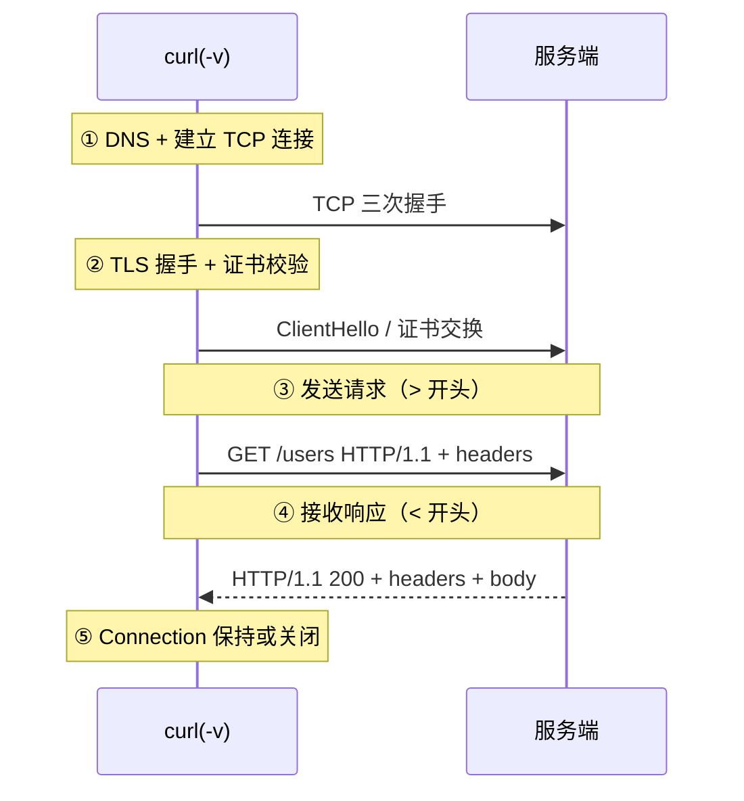

不打开浏览器，也能带各种 header、参数、认证直接验证一个接口。curl 覆盖
了 HTTP 调试九成日常。

## 核心参数

```bash
curl https://api.example.com/users        # 默认 GET，打印响应体
curl -i https://api.example.com/users     # -i 显示响应头
curl -v https://api.example.com/users     # -v 全部细节（握手/headers/体）
curl -X POST https://api.example.com/users -d '{"name":"a"}' -H 'Content-Type: application/json'
curl -X PUT ... -H 'Authorization: Bearer xxx'
curl -u user:pass https://...              # 基础认证
curl -k https://...                        # 忽略证书（自签测试）
```

关键记忆：`-X` 指定方法（但默认就能 POST），`-d` 带请求体，`-H` 加一个
header，`-i/-v` 看细节。

## 调试三板斧

1. **确认通的**：`-v` 看握手+状态码，先排除网络/证书问题。
2. **带上要测的头**：认证、超时 `--max-time 5`、跟随重定向 `-L`。
3. **只留响应**：`-s` 静默掉进度条，接 `-o -` 或管道处理。

```bash
# 只拿响应码
curl -s -o /dev/null -w '%{http_code}\n' https://api.example.com/health

# 把响应交给 jq 解析
curl -s https://api.example.com/users | jq '.data[] | .name'
```

## -v 到底打印了什么（深入）

`-v` 不神秘，它就是把你看到的"一次 HTTP 事务"从头到尾展开。读懂它，
几乎所有"接口调不通"都能定位：

```text
* Trying 1.2.3.4:443...                  ← ① DNS 解析 + 建 TCP 连接
* Connected to api.example.com port 443
* ALPN, offering http/1.1                 ← ② TLS 握手（或 http:// 无此段）
*  subject: CN=api.example.com            ← 证书链校验
> GET /users HTTP/1.1                     ← ③ 发出的请求行
> Host: api.example.com                   ← 请求头（> 表示"发送"）
> Accept: */*
...
< HTTP/1.1 200 OK                        ← ④ 响应行（< 表示"收到"）
< Content-Type: application/json          ← 响应头
...
* Connection #0 left intact              ← ⑤ 连接保持/关闭
```

**左手>右手<**：`>` 是你发出去的，`<` 是服务端回来的。卡在①→②多半网络/证书，
卡在③后没`<`多半服务端没回。**比抓包轻，却是日常够用**的协议学习器。

把 -v 的五个阶段画成一次事务的时序，排障时对照"看到哪个阶段没走完"：



## 常见失效与对应的排障参数（深入）

| 现象 | 原因 | 参数 |
|---|---|---|
| `SSL certificate problem` | 证书不信任/自签 | `-k`（临时）或 `--cacert` |
| `301/302` 但响应空 | 需要跟随重定向 | `-L` |
| 卡住半天超时 | 服务端慢/假死 | `--connect-timeout 5 --max-time 10` |
| `Connection refused` | 端口没起/方向错 | 核对 host:port、`-x` 代理 |
| `405 Method Not Allowed` | 方法不对 | `-X POST` |
| 走了不该走的代理 | 环境变量代理 | `--noproxy '*'` |
| 想存成文件 | 下载场景 | `-o file`（`-O` 用远端文件名） |

**给调试留完整证据**：`curl -sv --max-time 10 <url> 2>&1 | tee /tmp/curl.log`，
把 `2>&1`（-v 走 stderr）和超时参数一起留档——排查线上接口时这是黄金证据。

## 小结

- 常用 `-X / -d / -H / -i / -v / -u / -k`，加上 `-s` 静默、`-L` 跳转。
- HTTP 调试思路：`-v` 排错 → `-H` 补场景 → 管道接 jq 读结果。
- 与 jq 搭配，curl 就是一台不依赖 GUI 的接口调试台。