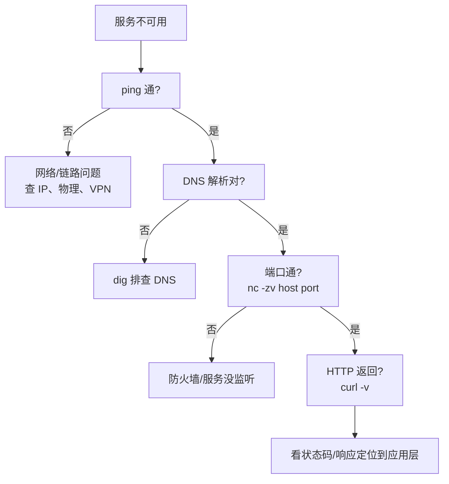

## 网络调试的思路

网络问题千奇百怪，但排查逻辑几乎固定——**自下而上逐层排除**：从物理链路、
IP、DNS、端口，一直到应用层协议。

## 工具链地图

| 层 | 工具 | 查什么 |
|---|---|---|
| 连通性 | `ping` | ICMP 通不通 |
| 路由 | `traceroute` / `mtr` | 数据包经过哪些跳 |
| DNS | `nslookup` / `dig` | 域名解析对不对 |
| 端口 | `nc` / `telnet` | 特定端口通不通 |
| HTTP | `curl -v` | 请求/响应完整过程 |
| 抓包 | `tcpdump` / 浏览器 F12 | 原始报文分析 |

## 排障流程



## 常用命令

```bash
# DNS 排查
nslookup example.com
dig example.com +short
dig example.com @8.8.8.8      # 指定 DNS 服务器

# 端口探测
nc -zv example.com 443        # 测 HTTPS 端口
nc -zv example.com 8000-8080  # 测一段范围

# HTTP 详细
curl -v https://example.com   # 看握手、请求头、响应头
curl -I https://example.com   # 只要响应头（HEAD）
curl -w "\n%{http_code} %{time_total}s\n" -o /dev/null -s URL  # 状态码+耗时

# 路由追踪
traceroute example.com
mtr example.com               # 持续的 ping+traceroute
```

## curl 的调试价值

`curl -v` 会打印完整交互过程（DNS 解析、TCP 连接、TLS 握手、请求头、响应头），
是 HTTP 层排查的信息量之王：

```text
*   Trying 1.2.3.4:443...
* Connected to example.com (1.2.3.4) port 443
* TLS handshake...
> GET / HTTP/1.1
> Host: example.com
< HTTP/1.1 200 OK
```

## 定位语速查

- **ping 不通** → 物理/链路/VPN/防火墙 ICMP。
- **DNS 错** → `dig`，看解析到哪个 IP。
- **端口连不上** → `ss -tlnp` 看监听，查防火墙。
- **HTTP 异常** → `curl -v` 看状态码与响应，抓包看报文。

## 小结

- 网络排障自下而上：连通 → DNS → 端口 → HTTP。
- 工具各司其职：ping/traceroute 测连通路由，nc 测端口，curl -v 看协议细节。
- 抓住"在哪一层断了"，就能缩小到正确方向。

## 延伸阅读

- [explainshell 交互式命令解释](https://explainshell.com/)