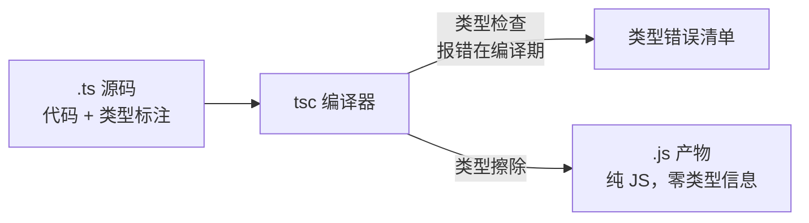

面试说「用过 TypeScript」很容易，追问两层就见真章：「TS 编译后类型去哪了」
「为什么两个类型名字不一样却能互相赋值」。这一篇讲 TS 的第一性：它是
**JS 的开发期外壳**，类型系统的一切设计都从这个定位推出来。

## TS 是什么：只在编译期存在的类型

TypeScript = JavaScript + 静态类型标注。运行的关键认知是**类型擦除**
（type erasure）：`tsc` 编译输出的是纯 JS，所有类型标注被剥掉，运行时
对类型一无所知：



两个直接推论，面试常考：

- **类型不能当运行时逻辑用**：`if (typeof x === User)` 不存在——运行时
  拿不到类型，判断只能基于值（typeof/instanceof/in）。
- **TS 不提供运行时安全**：接口返回的数据被断言成什么类型，运行时就是
  什么都没发生——边界数据（HTTP 响应、JSON.parse）的校验要靠运行时
  方案（zod 等），TS 类型只是「你声称的形状」。

## 结构化类型：看形状，不看名字

TS 的类型兼容是**结构化类型**（structural typing，也叫鸭子类型）：只要
形状匹配就能赋值，与类型叫什么名字无关：

```ts
interface Point { x: number; y: number }
type Vec = { x: number; y: number };
const a: Point = { x: 1, y: 2 };
const b: Vec = a; // ✅ 形状一致，名字不同照样赋
```

对比 Java/C# 的名义类型（nominal typing）——不同类即使字段全同也不兼容。
结构化带来 TS 特有的两个行为：

- **多余属性检查只发生在字面量**：变量赋值多余字段不报错，对象字面量
  直接赋值会报错（字面量没有「以后可能加字段」的借口）。
- **接口不如想象中「密封」**：想约束「只能这几个键」得用映射类型/联合
  字面量，光靠 interface 做不到。

## 四兄弟：any / unknown / never / void

四个「不像类型的类型」，辨析是高频题：

| | 含义 | 能赋给别的类型吗 | 检查强度 |
| --- | --- | --- | --- |
| `any` | 关闭检查 | ✅ 随意 | 零，逃生门 |
| `unknown` | 未知但安全 | ❌ 先收窄才能用 | 强，any 的安全替身 |
| `void` | 没有返回值 | 几乎不能 | 函数返回位专用 |
| `never` | 永不发生 | ✅ 赋给谁都行 | 兜底穷尽检查 |

记忆锚点：`any` 是「放弃治疗」，`unknown` 是「先怀疑再求证」；`never`
在**穷尽性检查**里最有用——`switch` 处理完联合类型的所有分支后，
default 分支拿到 `never`，漏了分支编译期就报错：

```ts
type Shape = Circle | Square;
function area(s: Shape) {
  switch (s.kind) {
    case 'circle': return Math.PI * s.r ** 2;
    case 'square': return s.a ** 2;
    default:
      const _exhaustive: never = s; // 漏分支时这里编译报错
      return _exhaustive;
  }
}
```

## 类型收窄：让联合类型可用

联合类型（`string | number`）在分支里没法直接当 `string` 用——收窄
（narrowing）就是 TS 根据判断语句自动缩小型别的机制。四种常用手法：

- **`typeof`**：原始类型分支（`typeof x === 'string'`）；
- **`in`**：属性存在性区分对象形状（`'run' in animal`）；
- **字面量判别字段**：`s.kind === 'circle'`——上面的 Shape 例子，
  联合类型每个成员带一个字面量 kind 字段，是 TS 建模的标准姿势；
- **`instanceof`**：类实例分支。

收窄成立的前提回到「类型擦除」：所有判断必须是**运行时真实执行**的
逻辑，TS 只是跟着你的分支推理——写运行时判断才有收窄，硬断言（`as`）
是跳过推理的强扭，滥用断言等于回到 any。

## 面试答法框架

「你了解 TypeScript 吗」的分层答法：

1. **定位**：类型擦除的开发期静态检查，不改变运行时；
2. **核心思想**：结构化类型，形状兼容而非名字兼容；
3. **实战价值**：联合类型 + 判别字段 + 收窄，把「字符串传参」变成
   「编译期可校验的状态机」；
4. **边界清醒**：TS 不管运行时数据校验，边界层配 zod/校验函数。

## 小结

- TS = JS + 开发期类型，`tsc` 做检查并擦除类型，运行时零类型信息。
- 类型擦除的两个推论：类型不能进运行时逻辑，TS 不替代运行时校验。
- 结构化类型看形状不看名字；字面量赋值有多余属性检查。
- any 放弃检查、unknown 先收窄再用、never 服务穷尽检查、void 是函数
  返回位。
- 收窄四手法：typeof/in/判别字段/instanceof，前提是运行时判断真实存在。

## 延伸阅读

- [TypeScript 官方手册：日常类型](https://www.typescriptlang.org/docs/handbook/2/everyday-types.html)
- [TypeScript 官方：类型收窄](https://www.typescriptlang.org/docs/handbook/2/narrowing.html)
- [TypeScript 官方： never 与穷尽检查](https://www.typescriptlang.org/docs/handbook/2/narrowing.html#exhaustiveness-checking)
