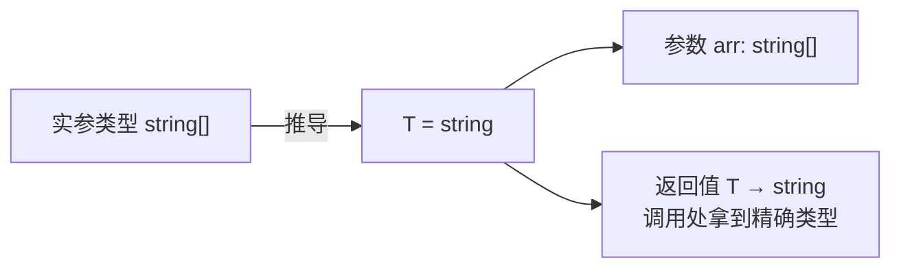

[类型系统第一性](/typescript/basic/core/01-type-system/)篇讲了 TS 的世界
观，这篇讲日常写类型时最先撞上的两个问题：**interface 和 type 到底用哪个**
**泛型什么时候值得写**。前者是「选型题」，后者是「第一性题」。

## interface 与 type：等价为主，各有独门

大多数场景两者可以互换——声明对象形状这件事，`interface Point {...}` 和
`type Point = {...}` 几乎完全等价，都能 extends/交叉组合，报错信息也无
本质差别。真正的差异在各自的能力边界：

| 能力 | interface | type |
| --- | --- | --- |
| 对象/函数形状 | ✅ | ✅ |
| 继承扩展 | `extends` | 交叉 `&` |
| **声明合并** | ✅ 同名自动合并 | ❌ 重名报错 |
| 联合类型 / 元组 | ❌ | ✅ |
| 映射类型 / 条件类型 | ❌ | ✅ |
| 基本类型别名 | ❌ | ✅（`type ID = string`） |

两个独门各有含义：

- **interface 的声明合并**：同名 interface 的成员自动合并成一个。它是
  「给第三方库补类型」的官方机制——给 `window` 加自定义属性、给 Express
  `Request` 挂扩展字段，全靠 interface 重名合并；但它也是双刃剑，无意
  撞名会把两个不相关的类型悄悄缝在一起。
- **type 的类型运算**：联合、映射、条件类型只有 type 能写——凡是
  「从已有类型算出新类型」的场景，interface 表达不了。

选型口径一句话：**团队统一比规则更重要**；社区常见惯例是「对外契约
（对象结构、公共 API）用 interface，需要类型运算用 type」。

## 泛型第一性：把类型当参数传

泛型解决的问题一句话：**类型之间的关联无法用具体类型表达时，把类型参数化**。

```ts
// 无泛型：参数和返回值的关联丢了
function firstWrong(arr: any[]): any;

// 泛型：入参是 T[]，返回值就是 T——关联被类型系统记住
function first<T>(arr: T[]): T {
  return arr[0];
}
const s = first(['a', 'b']); // s: string，推导出来的
```

调用 `first(['a', 'b'])` 时你**没有写 `<string>`**——TS 按实参推导出
T = string。绝大多数时候泛型参数靠推导，显式写 `<T>` 只在推导不了
（空数组、多态返回）时才需要。



## extends 约束：给类型参数立规矩

裸 `T` 太自由——`first(5)` 这种实参直接编译错，但泛型函数内部也可能
需要 T 满足最低要求。`extends` 给 T 设上界：

```ts
// T 必须至少有 length：字符串、数组都行，数字不行
function logLen<T extends { length: number }>(v: T): T {
  console.log(v.length);
  return v;
}
logLen('abc');   // ✅
logLen([1, 2]);  // ✅
logLen(123);     // ❌ 编译期拦截
```

「`extends` 一个形状」读作「T 至少长这样」——泛型约束和[结构化类型](/typescript/basic/core/01-type-system/)是同一套世界观：约束的不是名字，是形状。

## 工具类型：官方提供的泛型范例

标准库的工具类型就是泛型的最佳教材，四个最常用：

- `Partial<T>`：所有字段变可选——「更新时只传一部分」的入参类型；
- `Record<K, V>`：键集合到值类型的映射——`Record<string, number>`；
- `Pick<T, K>`：从 T 里挑几个字段——列表接口只要 id 和 name 时；
- `Omit<T, K>`：从 T 里排除几个字段——「新建时不要 id」的表单类型。

它们全是 type + 映射类型写的，interface 一个都表达不了——这就是上面
选型表的注脚。

## 什么时候才该写泛型

泛型是工具不是装饰，判据一句话：**当且仅当「参数与返回值（或多个参数
之间）的类型存在关联」时写泛型**。返回值类型和入参毫无关联的函数写
`function f<T>(x: T): boolean` 是噪音——直接 `f(x: unknown): boolean`。
面试答「泛型的作用」时先说关联表达，再说复用，顺序反了会显得在背概念。

## 小结

- interface 与 type 日常等价：interface 有声明合并（补第三方类型的
  机制），type 有联合/映射/条件等类型运算。
- 泛型 = 类型参数化，价值是让类型系统记住「参数与返回值的关联」；
  实参自动推导，显式标注是兜底。
- `T extends X` 给类型参数立形状约束，与结构化类型同一世界观。
- Partial/Record/Pick/Omit 是官方泛型教材，全是 type 写的。
- 判据：类型间有关联才写泛型，无关的泛型是噪音。

## 延伸阅读

- [TypeScript 官方手册：泛型](https://www.typescriptlang.org/docs/handbook/2/generics.html)
- [TypeScript 官方：工具类型](https://www.typescriptlang.org/docs/handbook/utility-types.html)
- [TypeScript 官方：interface vs type 别名](https://www.typescriptlang.org/docs/handbook/2/everyday-types.html#differences-between-type-aliases-and-interfaces)
