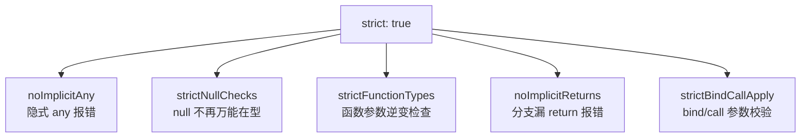

「你们 tsconfig 开 strict 了吗」是 TS 工程化的第一问。默认配置为了兼容
旧代码是宽松档——严格模式才是 TS 的完整战力。这一篇把 strict 拆开看它
到底拦了什么，以及工程里最常被滥用的两个「逃逸口」。

## strict 是一组开关的总和

`"strict": true` 不是单个检查，而是一组开关的缩写。理解它 = 理解每个
子开关拦哪类错误：



两个主力开关值得单独展开：

- **`noImplicitAny`**：TS 推导不出类型的参数不再默认放行为 `any`，而是
  直接报错。它堵住的是「类型系统静默失效」的最大洞——代码里每多一个
  隐式 any，就多一块 TS 管不到的法外之地。
- **`strictNullChecks`**：关闭时 `null/undefined` 是所有类型的合法成员，
  类型系统对「最常发生的运行时错误」视而不见；开启后 `string` 不含
  null，可能为空就必须写成 `string | null` 并处理——把空值问题从运行时
  搬到编译期。这是 strict 里收益最大的一项。

配套推荐单独开 **`noUncheckedIndexedAccess`**（不在 strict 里）：索引
访问 `arr[i]` / `obj[key]` 的结果自动带 `| undefined`——JS 里越界索引
本来就是 undefined，默认不开是为了迁移平滑，新项目建议开。

## null 安全与两个逃逸口

strictNullChecks 开启后，处理可空值有两件正牌工具和一个逃逸口：

```ts
const el = document.querySelector('#main'); // HTMLElement | null
el.textContent = 'hi'; // ❌ 编译报错：可能为 null

// 正牌 1：可选链 ?.——null/undefined 就短路，返回 undefined
const t = el?.textContent;

// 正牌 2：空值合并 ??——左侧为 null/undefined 时取右侧默认值
const name = input ?? '匿名';

// 逃逸口：非空断言 !——我赌它非空，别查了
el!.textContent = 'hi';
```

`!` 和 `as` 是同一类东西：**告诉编译器闭嘴**。它们不改变运行时行为、
不产生任何检查——赌错了就是运行时崩溃。使用纪律一句话：断言合法的
唯一场景是「**你比类型系统掌握更多信息**」（比如先用正则验证过字符串
格式、或框架文档保证非空），凡是「图省事消除报错」的断言都是埋雷。

「真的没办法」时的双重断言 `as unknown as T`（TS 禁止两个不相关类型
直接互断）是强味道标志——出现它基本说明上游类型建模错了，正确解法
往往是运行时校验（zod 等）+ 类型收窄，而不是更凶的断言。

## 路径别名：编译与运行是两个世界

```json
{
  "compilerOptions": {
    "baseUrl": ".",
    "paths": { "@/*": ["src/*"] }
  }
}
```

`import { x } from '@/lib/x'` 解决相对路径地狱。但有个必踩的坑：
**`tsc` 编译输出不会重写 import 路径**——产物里还是 `@/lib/x`，
Node 直接跑会找不到模块。别名能生效靠的是下游配合：前端由 bundler
（Vite/Webpack 的 resolve.alias）解析，测试要给 Vitest/Jest 单独配
`alias`，纯 Node 运行需要 `tsc-alias` 或 Node 的 `imports` 字段。
「编辑器跳转正常 = 运行时正常」是这个坑的错觉来源——编辑器认 tsconfig，
运行时认 bundler/Node。

## 渐进迁移：新项目与老项目的不同打法

- **新项目**：strict + `noUncheckedIndexedAccess` 直接全开——迁移成本
  是零时刻的，欠账是复利的。
- **老项目**：`allowJs` 让 `.js` 共存渐进改后缀；先开 strict 到「文件
  级」控制（`// @ts-nocheck` 兜底存量，新增代码一律严格）；CI 加
  `tsc --noEmit` 把类型检查变成门禁，防止越改越糟。

## 小结

- strict 是开关组合：noImplicitAny 堵静默失效，strictNullChecks 把
  空值问题搬进编译期，收益最大。
- `?.` 与 `??` 是正牌 null 工具；`!` 和 `as` 是逃逸口，只在「比编译器
  更懂数据」时合法，双重断言是建模错误的味道。
- 路径别名只骗过编译器和编辑器，运行时靠 bundler/测试框架/Node 各自
  配置解析。
- 新项目 strict 全开，老项目文件级渐进 + CI 门禁。

## 延伸阅读

- [TypeScript 官方：编译选项总表](https://www.typescriptlang.org/tsconfig/)
- [TypeScript 官方：strict 相关开关](https://www.typescriptlang.org/tsconfig#strict)
- [TypeScript 官方手册：paths 与模块解析](https://www.typescriptlang.org/docs/handbook/modules/reference.html#paths)
