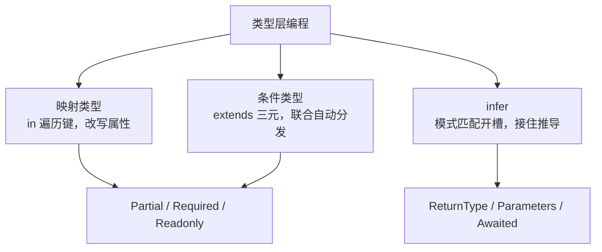

[interface、type 与泛型](/typescript/basic/core/02-interfaces-generics/)篇
说过「类型运算只有 type 能写」。这篇把类型运算正面讲掉：映射类型、条件
类型、`infer`——三者合起来是一门**跑在类型层的小型函数语言**，工具类型
Partial/Omit 都是用它写出来的。

## 映射类型：遍历键并改写

映射类型就是「类型层的 for 循环」：`in` 后面跟一个联合类型，逐个键
生成属性：

```ts
type MyPartial<T> = {
  [K in keyof T]?: T[K]; // 遍历 T 的每个键，值取原类型，加 ? 修饰符
};

type User = { id: number; name: string };
type UserPatch = MyPartial<User>; // { id?: number; name?: string }
```

三个要点：`keyof T` 取键的联合；`T[K]` 按键取值类型（索引访问）；
修饰符控制可选/只读——`?` 加可选、`-?` 去可选、`readonly`/`-readonly`
同理（`Required<T>` 就是 `-?` 写出来的）。

## 条件类型：类型层的三元表达式

```ts
type IsString<T> = T extends string ? true : false;
type A = IsString<'hi'>;  // true
type B = IsString<42>;    // false
```

`extends ? :` 读作「T 能赋值给 string 吗」。真正的高频考点是
**分布式条件类型**：当 T 是裸的联合类型时，条件类型会自动分发到每个
成员再合并——

```ts
type ToArray<T> = T extends unknown ? T[] : never;
type R = ToArray<string | number>; // string[] | number[]
// 而不是 (string | number)[] —— 每个成员各自分发
```

这个「自动分发」是特性也是坑：想关掉分发就把 T 包一层（`[T] extends
[unknown] ? ...`）。`never` 在分发里会被吸收成 never（空联合没有成员
可分发）——所以 `IsNever<T> = [T] extends [never] ? true : false` 必须
用元组包住，直接写会永远得 never，这是类型编程最著名的陷阱题。

## infer：在条件里开一个「待推导槽位」

`infer` 只能出现在 `extends` 右侧，意思是「如果这里能匹配出某个类型，
就把它绑定到这个名字」：

```ts
// 手写 ReturnType：匹配函数返回值的位置，用 infer 接住
type MyReturn<T> = T extends (...args: never[]) => infer R ? R : never;

// 取数组元素类型：匹配数组的元素槽位
type Element<T> = T extends (infer E)[] ? E : never;
type E = Element<string[]>; // string
```

`infer` 的本质是**模式匹配**：把类型结构想成模板，`infer R` 是模板里
的通配符，整个条件类型就是一次「解构赋值」。内置的 `ReturnType`、
`Parameters`、`Awaited` 全是这个套路。

## 一张图记住三类构件



## 可读性税：什么时候别写

类型编程是元能力，也是负担：类型报错一层套一层、同事看不懂、调试只能
靠编辑器悬停。纪律一句话：**业务代码里类型编程服务于「精确描述数据
形状」，超过两层的嵌套条件类型就该收进一个命名良好的工具类型并加
注释**。「类型体操」炫技题（拿类型写四则运算、汉诺塔）面试娱乐可以，
工程代码里是负资产。

## 小结

- 类型编程 = 类型层的小型函数语言；工具类型都是它的产物。
- 映射类型 `in` 遍历键，`T[K]` 取值，修饰符 `?`/`-?`/`readonly` 可加可减。
- 条件类型 `extends ? :`；裸联合参数自动分发，包 `[T]` 关闭；never
  分发吸收是著名陷阱。
- `infer` 是条件类型里的模式匹配通配符，ReturnType/Parameters 都是
  这个套路。
- 业务代码给类型编程收可读性税：两层以上封装成命名工具类型。

## 延伸阅读

- [TypeScript 官方：映射类型](https://www.typescriptlang.org/docs/handbook/2/mapped-types.html)
- [TypeScript 官方：条件类型](https://www.typescriptlang.org/docs/handbook/2/conditional-types.html)
- [TypeScript 官方：类型挑战练习](https://github.com/type-challenges/type-challenges)
