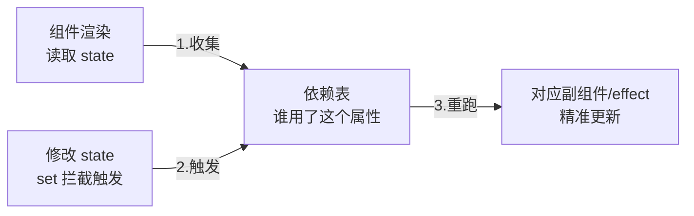

## 两种驱动模式的分野

React 靠「重新执行组件函数」推导变化（拉模式，见
[渲染流程](/react/basic/core/03-render-flow/)）；Vue 走另一条路：
**劫持数据的读写，改了哪个数据就精确更新用到它的地方**（推模式）。



## Proxy 劫持（Vue 3）

```js
const state = reactive({ count: 0 });
// Vue 3 用 Proxy 包一层：get 时收集依赖，set 时触发更新
state.count++;   // 框架知道 count 变了、谁在用它 → 精准重渲染
```

- Vue 2 用 `Object.defineProperty`：只能劫持初始化时存在的属性，
  新增/删除属性要靠 `$set`，数组下标赋值监听不到——这些历史包袱
  在 Proxy（拦截一切操作）下消失，代价是不兼容 IE11
- **依赖收集**：组件渲染时读到 `state.count`，把「这个组件/effect
  用了 count」记进依赖表；修改时按表精准通知——不需要整组件树
  重跑，这是 Vue 渲染粒度细的根源

## ref 与 reactive

```js
const count = ref(0);            // 基本类型：包一层，.value 读写
const user = reactive({ name: 'a' });  // 对象：Proxy 深度劫持
count.value++;                   // .value 是代理的入口
```

- 基本类型没法被 Proxy 包，所以有 `ref` 包装（访问经 `.value`，
  也就是依赖收集的钩子位置）
- `reactive` 的限制：解构会**丢失响应性**（解构出来的是普通值），
  需要保持响应时用 `toRefs` 或始终通过对象访问

## 与 React 模式的对照

| 维度       | Vue（响应式）        | React（重渲染）        |
| -------- | --------------- | ----------------- |
| 变更通知      | 精确到属性级，自动追踪     | setState 显式触发整函数重跑 |
| 心智负担      | 改数据即可，框架兜底      | 必须理解快照与不可变性       |
| 性能边界      | 依赖粒度细，默认够快      | 大列表需 memo/虚拟滚动配合  |

两种模式殊途同归：**状态到 UI 的单向数据流**——区别只在「变化怎么
被发现」。理解这一点，切换框架时只是换语法，不是换思维。

## 要点备忘

- Vue 3 = Proxy 劫持 + 依赖收集 + 按依赖精准触发，不需要整树 diff 重跑
- ref 是基本类型的包装（.value 是钩子），reactive 是对象代理（解构丢响应）
- Vue 2 defineProperty 的历史坑（新增属性/数组下标）在 3 里已根除
- 与 React 对照记：推 vs 拉，精准通知 vs 整树重跑

## 延伸阅读

- [Vue 官方文档 · 深入响应式系统](https://cn.vuejs.org/guide/extras/reactivity-in-depth.html)
