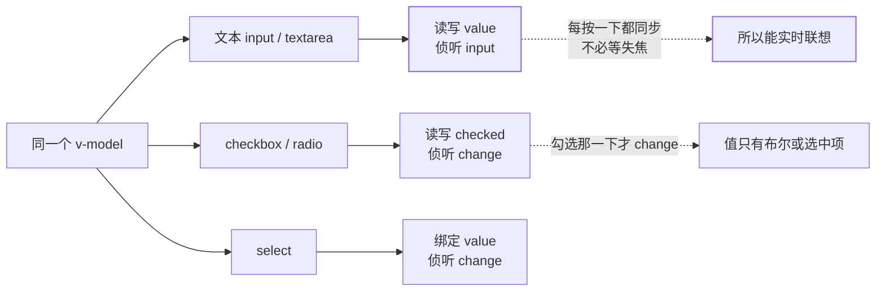
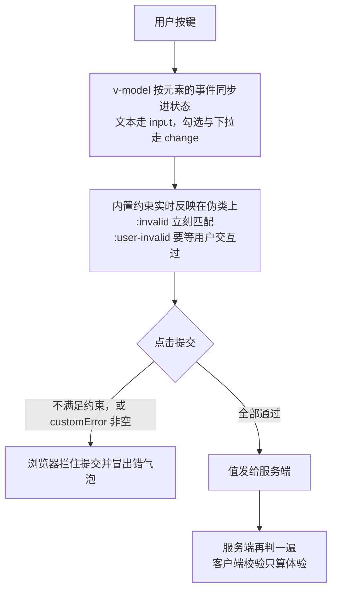

官方「表单输入绑定」一页的开篇就把这件事说成了痛点：「在前端处理表单时，我们
常常需要将表单输入框的内容同步给 JavaScript 中相应的变量。手动连接值绑定和更改
事件监听器可能会很麻烦」，于是给了 `v-model`。但把 `v-model` 写上并不等于同步
这件事就交代完了——**一段输入从按键到发出去，有三方在改同一个值**：

- **Vue 的指令**：决定接哪一个 DOM property、听哪一个事件，以及什么时候把值
  写回你的状态；
- **DOM 自己**：`value` / `checked` 是元素上的实时状态，浏览器还有一套「这个值
  合不合格」的判据；
- **校验与提交**：内置约束会实时反映在 CSS 伪类上，并在点击提交那一刻拦住表单。

三方各有一条边界，越界的表现不是报错，而是**值看着对、拿出来不对**。本篇按五道
关卡把账算清：值走的是哪一对属性与事件、绑进去的是什么类型、什么时候算同步好了、
自定义组件要接住的是什么契约、合格由谁来判——最后那一半 Vue 确实没管。

## 关卡一：同一个 v-model，接的不是同一对东西

`v-model` 不是一条固定的「`value` + `input`」规则。官方原话是「它会根据所使用的
元素自动使用对应的 DOM 属性和事件组合」，三组规则逐字列在这里：

| 元素 | 绑定的 property | 侦听的事件 |
| --- | --- | --- |
| 文本类型的 `<input>`、`<textarea>` | `value` | `input` |
| `<input type="checkbox">`、`<input type="radio">` | `checked` | `change` |
| `<select>` | `value` | `change` |



两条最容易踩的边界都在这张表上。

**其一：复选框上的 `value` 不是绑定的那个值。** `v-model` 在 checkbox 与 radio 上
读写的都是 `checked`，`value` 只决定「勾上时把什么写进去」——绑数组时写进数组，
绑单选变量时赋给它：

```vue-html
<input type="checkbox" v-model="checked" />
<!-- 这里 checked 是布尔：勾了 true，没勾 false -->

<input type="checkbox" value="Jack" v-model="checkedNames" />
<input type="checkbox" value="John" v-model="checkedNames" />
<!-- checkedNames 是数组：官方原话「将始终包含所有当前被选中的框的值」 -->
```

**官方还有一条更容易忘的前提：`v-model` 会忽略初始 attribute。** 原话是「`v-model`
会忽略任何表单元素上初始的 `value`、`checked` 或 `selected` attribute。它将始终
将当前绑定的 JavaScript 状态视为数据的正确来源。你应该在 JavaScript 中使用 `data`
选项或响应式 API 来声明该初始值」。

```vue-html
<!-- 无效：这个 value 会被吃掉，输入框是空的 -->
<input v-model="text" value="默认标题" />
```

```vue
<script setup>
// 有效：初始值声明在 JS 侧
const text = ref('默认标题')
</script>

<template>
  <input v-model="text" />
</template>
```

凡是「静态 HTML 里已经带好 `value`」的写法都在这里不作数——复制别人的静态表单
加上 `v-model` 时最容易误判，以为初值会显示出来。

**其二：`<textarea>` 里不能用插值。** 官方写法直接给了正反例：「注意在 `<textarea>`
中是不支持插值表达式的。请使用 `v-model` 来替代」。

```vue-html
<!-- 错误 -->
<textarea>{{ text }}</textarea>

<!-- 正确 -->
<textarea v-model="text"></textarea>
```

## 关卡二：绑进去的值通常不是字符串

静态 `value="abc"` 只够应付「后端收到的就是一段字符串」。官方在「值绑定」一节给的
出口是：「但有时我们可能希望将该值绑定到当前组件实例上的动态数据。这可以通过使用
`v-bind` 来实现。此外，使用 `v-bind` 还使我们可以将选项值绑定为非字符串的数据
类型」。三处各自解决一件事。

**下拉框直接绑对象。** 官方例子里选中项就是把对象字面量交出去：

```vue-html
<select v-model="selected">
  <option :value="{ number: 123 }">123</option>
</select>
<!-- 选中后 selected 就是 { number: 123 } 这个对象 -->
```

选项多的时候用 `v-for` 渲染，`:value` 绑 `option.value`、文本单独显示，这是官方
给的动态选项写法——好处是「显示文案」和「提交的值」第一次不再是同一个字符串。

**复选框想存「yes / no」而不是 true / false：`true-value` / `false-value`。**

```vue-html
<input type="checkbox" v-model="toggle" true-value="yes" false-value="no" />
<input type="checkbox" v-model="toggle"
       :true-value="dynamicTrueValue" :false-value="dynamicFalseValue" />
```

官方明确「`true-value` 和 `false-value` 是 Vue 特有的 attributes，仅支持和
`v-model` 配套使用」——它们是模板层的约定，不是 HTML 属性。

> **失效边界**：这两个 attribute **不会**改变元素的 `value` attribute。官方给的
> 原因和对策连在一起：「`true-value` 和 `false-value` attributes 不会影响 `value`
> attribute，因为浏览器在表单提交时，并不会包含未选择的复选框。为了保证这两个值
> (例如："yes"和"no") 的其中之一被表单提交，请使用单选按钮作为替代」。
>
> 也就是说：走 `v-model` + `fetch` 提交，`no` 拿得到；走原生 `<form>` 提交，
> 未勾选的复选框根本不在请求里，`no` 永远不会出现——这时该换成 radio。

**下拉框还有一个只有移动端才会咬人的坑。** 官方提示：「如果 `v-model` 表达式的
初始值不匹配任何一个选择项，`<select>` 元素会渲染成一个"未选择"的状态。在 iOS 上，
这将导致用户无法选择第一项，因为 iOS 在这种情况下不会触发一个 change 事件。因此，
我们建议提供一个空值的禁用选项」：

```vue-html
<select v-model="selected">
  <option disabled value="">请选择</option>
  <option>A</option>
  <option>B</option>
</select>
```

第一项能不能被选中，取决于你有没有这一行占位项——`selected` 初始为 `undefined`
或一个不存在的值时，iOS 上用户点了第一项也不会触发 `change`。

## 关卡三：值什么时候「进来」

默认时机官方写得很清楚：「默认情况下，`v-model` 会在每次 `input` 事件后更新数据
(IME 拼字阶段的状态例外)」。三个内置修饰符里，`.lazy` 改的是时机，`.number` 与
`.trim` 改的是值的形态。

| 写法 | 同步时机 / 转换 | 官方给的兜底行为 |
| --- | --- | --- |
| `v-model` | 每次 `input` 事件 | IME 拼字阶段例外，不更新 |
| `v-model.lazy` | 改为每次 `change` 事件后 | 需失焦或回车才同步 |
| `v-model.number` | 尝试 `parseFloat()` | 解析不了返回**原始字符串**；空输入返回**空串** |
| `v-model.trim` | 去掉两端空格 | — |

**中文输入法的「联想不跳字」是官方规则，不是 bug。** 原话：「对于需要使用 IME
的语言 (中文，日文和韩文等)，你会发现 `v-model` 不会在 IME 输入还在拼字阶段时
触发更新。如果你的确想在拼字阶段也触发更新，请直接使用自己的 `input` 事件监听器和
`value` 绑定而不要使用 `v-model`」——官方给的对策是退回手写绑定，而不是加监听。

```vue-html
<!-- 拼字阶段不触发同步：msg 仍是上一次「上屏」的值 -->
<input v-model="msg" />

<!-- 真要跟随拼字阶段：按官方对策绕开 v-model，自己接 input -->
<input :value="msg" @input="msg = $event.target.value" />
```

**`.number` 的两个反直觉处，正好是两句话**：「如果该值无法被 `parseFloat()`
处理，那么将返回原始值。特别是当输入为空时 (例如用户清空输入字段之后)，会返回一个
空字符串。这种行为与 DOM 属性 `valueAsNumber` 有所不同」。

```vue-html
<input v-model.number="age" />
```

- 键入 `abc`：`parseFloat('abc')` 失败 → `age` 里存的是字符串 `"abc"`，**不报错、
  不是 NaN**；
- 清空输入框：`age` 是 `''`，不是 `null` 也不是 `NaN`；
- 所以 `if (typeof age === 'number')` 不能当「填了合法数字」用，判空也要按字符串判。

另外官方补了一条自动规则：「`number` 修饰符会在输入框有 `type="number"` 时自动
启用」——所以 `type="number"` 的输入框上不必再显式挂 `.number`。

> **失效边界**：`.lazy` 会把「实时联想」变成「失焦才联想」；`.trim` 只去两端空格，
> 中间的空格照旧留着。三个修饰符改的都是**同步**这一环，都不判合格——合格与否是
> 关卡五的事。

## 关卡四：换到自定义输入组件上，要接住的是同一套契约

HTML 内置输入类型不够用时，官方让你自己造输入组件，并要求它照样能吃 `v-model`。
`02-component-model` 已经给过父侧的展开（`v-model` 是「传值 + 监听更新事件」的糖），
本篇把子侧的账补齐。

3.4 起官方推荐的写法是 `defineModel()` 宏。它返回值「是一个 ref……它的 `.value`
和父组件的 `v-model` 的值同步；当它被子组件变更了，会触发父组件绑定的值一起更新」，
于是可以直接把这个 ref 再绑回原生元素——官方原话是「你也可以用 `v-model` 把这个
ref 绑定到一个原生 input 元素上，在提供相同的 `v-model` 用法的同时轻松包装原生
input 元素」：

```vue
<script setup>
const model = defineModel({ required: true })
</script>

<template>
  <input v-model="model" />
</template>
```

**底层机制就是关卡一那对东西换了名字。** 官方拆开给你看：「`defineModel` 是一个
便利宏。编译器将其展开为以下内容：一个名为 `modelValue` 的 prop，本地 ref 的值与
其同步；一个名为 `update:modelValue` 的事件，当本地 ref 的值发生变更时触发」。
3.4 之前手写等价实现要四步（`defineProps(['modelValue'])`、
`defineEmits(['update:modelValue'])`、`:value` 绑 prop、`@input` 里 emit），
父组件的 `v-model="foo"` 编译成 `:modelValue="foo"` 加 `@update:modelValue`。
另一个官方认可的实现是**可写 `computed`**：getter 返回 `modelValue`，setter
emit 事件——这条和 `state/02` 里「setter 该写回源字段」是同一条纪律的两面：
这里要写回的正是「父组件那份值」。

**带参数就是换一对 prop/事件名。** `v-model:title="bookTitle"` 对应子组件的
`title` prop 与 `update:title` 事件；官方对选项位置只给了一句「如果需要额外的
prop 选项，应该在 model 名称之后传递」，即
`defineModel('title', { required: true })`。多个 `v-model` 靠这个能力叠出来，
官方原话是「组件上的每一个 `v-model` 都会同步不同的 prop，而无需额外的选项」：

```vue-html
<UserName v-model:first-name="first" v-model:last-name="last" />
```

```vue
<script setup>
const firstName = defineModel('firstName')
const lastName = defineModel('lastName')
</script>
```

**修饰符要自己接。** 关卡三那三个是内置在原生元素上的；自定义组件想要
`v-model.capitalize` 这种自定义修饰符，得从返回值里解构出来：

```vue
<script setup>
const [model, modifiers] = defineModel({
  set(value) {
    return modifiers.capitalize
      ? value.charAt(0).toUpperCase() + value.slice(1)
      : value
  }
})
</script>

<template>
  <input type="text" v-model="model" />
</template>
```

官方给的两个挂钩是 `get` / `set`，「这两个选项在从模型引用中读取或设置值时会接收
到当前的值，并且它们都应该返回一个经过处理的新值」。不用 `defineModel` 时官方另有
出口：「添加到组件 `v-model` 的修饰符将通过 `modelModifiers` prop 提供给组件」，
并且「对于又有参数又有修饰符的 `v-model` 绑定，生成的 prop 名将是 `arg +
"Modifiers"`」——`v-model:title.capitalize` 对应 `titleModifiers`。

> **失效边界**：`defineModel({ default: 1 })` 而父组件没传值时，官方警告的是
> 「会导致父组件与子组件之间不同步」——它给的例子正是「父组件的 `myRef` 是
> undefined，而子组件的 `model` 是 1」。**默认值只补子组件这一侧的读数，不会把
> 值推回父组件**；要父子一致得在父侧给初值。官方在同一段还提醒：可变引用类型
> （数组、对象）的默认值应当包成函数，避免意外修改与外部副作用。

## 关卡五：合格不合格，Vue 没管，浏览器管

先把取证结论摆明：**官方「表单输入绑定」一页只有四节**——基本用法、值绑定、
修饰符、组件上的 `v-model`，**没有校验小节**；`v-model` 也不提供任何「这个值合
不合格」的语义。判据来自浏览器的约束校验（constraint validation），MDN 把它切成
三块：HTML attribute 声明约束、CSS 伪类反映状态、API 供脚本查询与改写。



**伪类这一层，坑在「太早」。** MDN 三句话连着读就明白：元素满足不了约束时匹配
`:invalid`；「If the user has interacted with the control, it also matches the
`:user-invalid`」；而 `:user-invalid` 的定义正是「用户与它交互过之后，值仍不合法」
（*represents any validated form element whose value isn't valid based on their
validation constraints, after the user has interacted with it*）。

```css
/* 反例：required 的必填项在页面加载那一刻就红 */
input:invalid { border-color: var(--err); }

/* 要「用户碰过才红」，得用带交互语义的那一个伪类 */
input:user-invalid { border-color: var(--err); }
```

MDN 在讲 `required` 时特意点了这条现象：「While empty, the input will also be
considered invalid, matching the `:invalid` UI pseudo-class」——**空值即无效**，
所以 `:invalid` 不含「用户填过」这一层，用它上色必然一打开页面就满屏红。

**判据与状态字段一一对应**（下表按 MDN 列出的 `validity`（`ValidityState`）字段
整理）：

| attribute | 何时判不合格 | 对应 `validity` 字段 |
| --- | --- | --- |
| `required` | 有该 attribute 但没值 | `valueMissing` |
| `type="email"` / `url` | 值不符合该类型的语法 | `typeMismatch` |
| `pattern` | 值不匹配正则 | `patternMismatch` |
| `minlength` / `maxlength` | 长度越界 | `tooShort` / `tooLong` |
| `min` / `max` | 数值越界（还会匹配 `:out-of-range`） | `rangeUnderflow` / `rangeOverflow` |

三条只在表单里才看得出来的边界：

1. **`pattern` 拦不住空值。** MDN 原话是「If empty, and the element is not
   required, it is not considered invalid」——只写 `pattern` 不写 `required`，
   用户什么都不填就是一次合法提交。
2. **`type="email"` 自带模式校验**，不需要再挂 `pattern`；带 `multiple` 时按
   逗号分隔的地址列表校验。
3. **程序写入的值不报长度约束。** 「Length constraints are never reported if the
   value is set programmatically. They are only reported for user-provided input」
   ——用 `v-model` 回填一段超长文本，`maxlength` 不会报警，它是拦用户输入的，
   不是拦你赋值的。

**脚本层三个入口的分工**（MDN 原文）：`checkValidity()`「Returns true if the
element's value has no validity problems; false otherwise」，并且「If the element
is invalid, this method also fires an invalid event on the element」；
`reportValidity()`「Reports invalid field(s) using events」，MDN 明说它「useful in
combination with `preventDefault()` in an onSubmit event handler」；
`setCustomValidity(message)`「Adds a custom error message to the element; if you set
a custom error message, the element is considered to be invalid, and the specified
error is displayed」，用途是「establish a validation failure other than those
offered by the standard HTML validation constraints」。

MDN 给的标准写法是**先看内置判据、再叠自定义约束**，而不是覆盖：

```js
// email 输入框：内置校验先跑，通过之后再叠一条「必须 @example.com」
if (email.validity.typeMismatch) {
  email.setCustomValidity('我需要一个邮箱地址！')
} else if (!email.value.endsWith('@example.com')) {
  email.setCustomValidity('请输入 @example.com 的邮箱地址')
} else {
  email.setCustomValidity('')
}
```

关键在于**最后一定要有那行空串**：MDN 在同一个例子里解释得很直白——「During
validation, if any form control has a customError that is not the empty string,
form submission is blocked」。只 `set` 不 `clear`，表单会永远提交不出去。

**`novalidate` 关掉的只是一半。** 想自己渲染错误消息时 MDN 让你加它，并写明边界：
「Setting the novalidate attribute on the form stops the form from showing its own
error message bubbles, and allows us to instead display the custom error messages
in some manner of our own choosing」，紧接着那句是关键——「However, this doesn't
disable support for the constraint validation API nor the application of CSS
pseudo-classes like :valid, etc」。

```vue-html
<form novalidate @submit.prevent="onSubmit">
  <input v-model.trim="email" required type="email" />
  <span class="err">{{ errors.email }}</span>
  <button type="submit" :disabled="submitting">提交</button>
</form>
```

于是自绘错误的标准配方是：`novalidate` 关掉气泡 → 提交处理器里 `preventDefault()`
→ 用 `checkValidity()` / `validity` 字段取判据 → 把消息写进自己的状态渲染。
`willValidate` 是这条链的前提位：MDN 在讲 `validationMessage` 时明写——控件
「is not a candidate for constraint validation (`willValidate` is false)」或值已
满足约束时，返回的是空字符串。先确认这个控件真的在参与判据，再去读它的错误消息。

至于「点了提交要防重复」——Vue 与 MDN 都没给规则，按本篇外推处理：把 `submitting`
做成一份**独立状态**（不是判据），请求发出置真、回来置假，按钮 `:disabled` 跟着它；
至于「当前表单是否合格」那份读数，它是从各字段推出来的，按 `state/02` 的分界该用
`computed`。防抖与节流是另一件事（见 `06-debounce-throttle`），别拿它当防重复提交。

> **失效边界**：客户端校验永远只是体验层。MDN 给两条线的定义摆在这里——「Validation
> done in the browser is called client-side validation, while validation done on
> the server is called server-side validation」，浏览器这条可以整条绕过（改 DOM、
> 直接发请求），**服务端那一份才是边界**，站内后端侧的对应篇是
> [参数校验：@Valid 与 JSR-303](/java/intermediate/spring-mvc/03-validation/)。

## 一张表收尾：五道关卡各管什么

| 问题 | 归谁 | 官方给的硬边界 |
| --- | --- | --- |
| 值走哪一对属性与事件 | Vue 指令层 | 文本 `value`+`input`；勾选 `checked`+`change`；下拉 `value`+`change` |
| 初始值从哪来 | JS 状态 | `v-model` 忽略初始 `value`/`checked`/`selected` attribute |
| 绑进去的是什么 | `v-bind` 值绑定 | 支持非字符串；`true-value`/`false-value` 不改 `value` attribute |
| 什么时候同步 | 修饰符 | 默认每次 `input`；IME 拼字阶段例外；`.number` 兜底返回原串或空串 |
| 组件怎么接住 | `defineModel` | 展开为 `modelValue` + `update:modelValue`；`default` 不回推父级 |
| 合不合格 | 浏览器 | Vue 不管校验；`:invalid` 不等用户，`customError` 非空即拦提交 |

## 面试答法

- **「`v-model` 在 checkbox 上绑的是什么？」** `checked` property、侦听 `change`
  事件；单个复选框绑布尔，多个复选框绑同一个数组（或 Set）时，数组里是所有当前被
  选中框的 `value`。想让选中/未选中落到两个自定义字符串，用 `true-value` /
  `false-value`，但注意它们只与 `v-model` 配套，且不改变元素的 `value` attribute。
- **「为什么表单初始值不显示？」** 官方明写 `v-model` 会忽略表单元素上初始的
  `value`/`checked`/`selected` attribute，只认 JS 侧声明的状态；静态 HTML 里带来的
  attribute 同理不作数。
- **「中文输入法下 `v-model` 为什么慢一拍？」** 拼字阶段官方不触发更新，这是设计。
  要跟随拼字阶段就按官方对策退回 `:value` + `@input`；`.lazy` 不是解法，它把同步
  推到了 `change`。
- **「`.number` 等于把值变成 number 吗？」** 是「尝试 `parseFloat()`」：解析不了
  返回原始字符串，清空输入框返回空字符串，官方还点明这与 `valueAsNumber` 不同；
  `type="number"` 时该修饰符自动启用。所以别用 `typeof` 当「已填合法数字」。
- **「自定义输入组件怎么支持 `v-model`？」** 3.4+ 用 `defineModel()`，编译器展开成
  `modelValue` prop + `update:modelValue` 事件；带参数 `defineModel('title')` 换成
  `title` 与 `update:title`，多个 `v-model` 就是多对 prop/事件。自定义修饰符靠解构
  `[model, modifiers]` 加 `get`/`set`，选项式则从 `modelModifiers`（带参数时是
  `titleModifiers`）读。
- **「`defineModel` 能给默认值吗？」** 能，但官方警告：父组件没传值时父子会不同步
  （父 `undefined`、子 `1`）——默认值只补子组件侧，不回推父级；数组/对象这类可变
  默认值要包成函数。
- **「表单校验放前端还是后端？」** 前端只是体验：内置约束拦不住直接发请求的人，
  服务端必须再判一遍。前端这一层的三个要点是「`:invalid` 不含交互语义、`pattern`
  不拦空值、`setCustomValidity` 之后一定要有置空串的那一步」。
- **「`novalidate` 是不是把校验关了？」** 关的是浏览器自己的错误气泡；约束校验 API
  和 `:valid`/`:invalid` 伪类照样生效——这正是「自绘错误消息」的标准起点。

## 要点备忘

- 一个 `v-model` 三对规则：文本 `value`+`input`、勾选 `checked`+`change`、
  下拉 `value`+`change`
- 初始值只能声明在 JS 侧，元素上的 `value`/`checked`/`selected` attribute 会被忽略
- `<textarea>` 不支持插值，必须 `v-model`
- 多选复选框绑数组或 Set，数组里放的是各框的 `value`
- `true-value`/`false-value` 是 Vue 特有 attribute，仅配 `v-model`，不影响原生提交
- 走原生 `<form>` 提交时未勾选的复选框不在请求里，要「二选一必有值」就换 radio
- `<select>` 初始值不匹配任何项时渲染为「未选择」，iOS 上选不到第一项——给一个
  `disabled` 的空值选项
- 默认每次 `input` 同步；IME 拼字阶段例外，要跟随就绕开 `v-model`
- `.lazy` 换 `change`；`.number` 兜底返回原串或空串；`.trim` 只去两端
- `defineModel()` 的 ref 可以直接再绑回原生 `<input v-model="model" />`
- 自定义修饰符要自己接：`[model, modifiers]` + `get`/`set`，或 `modelModifiers`
- `defineModel` 的 `default` 不回推父组件，父子读数会不一致
- Vue 不提供校验：判据在浏览器，`:user-invalid` 才带「用户交互过」这一层
- `pattern` 不拦空值，必须和 `required` 配对；程序写入的值不报长度约束
- `setCustomValidity()` 设了消息即视为无效，判据解除后一定要置回空串
- `novalidate` 只关气泡，不关约束校验 API 与伪类；服务端仍要再判一遍

## 延伸阅读

- [Vue 官方文档 · 表单输入绑定](https://cn.vuejs.org/guide/essentials/forms.html)
  ——按元素展开的规则、忽略初始 attribute、IME 与三个修饰符、值绑定
- [Vue 官方文档 · 组件 v-model](https://cn.vuejs.org/guide/components/v-model.html)
  ——`defineModel()` 与底层机制、参数与多绑定、修饰符透传、`default` 的警告
- [MDN · Client-side form validation](https://developer.mozilla.org/en-US/docs/Learn_web_development/Extensions/Forms/Form_validation)
  ——约束校验三块（attribute / 伪类 / API）、`ValidityState` 字段、`novalidate` 边界
- [MDN · `:user-invalid` 伪类](https://developer.mozilla.org/en-US/docs/Web/CSS/:user-invalid)
  ——「用户交互过」这一层的规范定义与上色时机
- 站内互链：[组件模型与单向数据流](/vue/basic/core/02-component-model/)（父侧
  `v-model` 展开的那三行）、
  [响应式系统](/vue/basic/core/01-reactivity/)（值写回状态为什么能触发更新）、
  [该存、该算，还是跟着变化做一件事](/vue/intermediate/state/02-store-compute-or-react/)
  （「表单是否合格」是派生值、「提交进行中」是独立状态的分界）、
  [一次更新到底重做了什么](/vue/intermediate/rendering/01-update-cost/)（每按一键
  都同步带来的重渲染账）、
  [防抖与节流：控制执行频率](/js/basic/core/06-debounce-throttle/)（联想请求的
  节流位，与防重复提交是两件事）、
  [参数校验：@Valid 与 JSR-303](/java/intermediate/spring-mvc/03-validation/)
  （服务端那一遍判据的落点）
