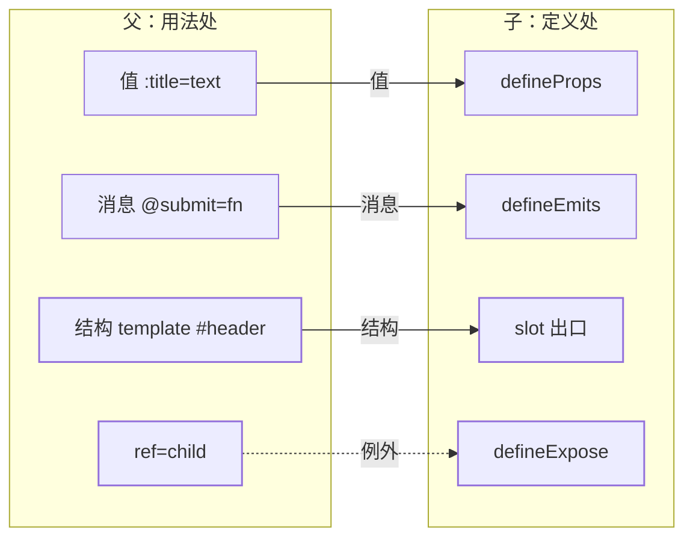
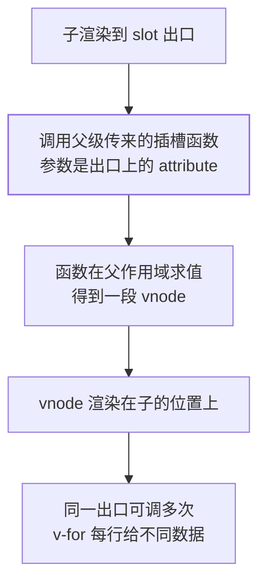

「组件模型与单向数据流」把正路立起来了：props 下行、事件上行，`v-model` 是这两件事的糖
（见[组件模型与单向数据流](/vue/basic/core/02-component-model/)）。但它留了一个没答的问题——
**组件能接收任意类型的 JavaScript 值作为 props，那模板内容怎么传？** 官方在插槽章节开头
问的就是这句。本篇把跨组件边界的通道数清：值、消息、结构三条正路，「没声明的东西」一条
自动的暗线，外加一条官方明确劝退的例外通道，每条各给一条失效边界。跨多层的状态归属不在
本篇，在[状态放在哪一层](/vue/intermediate/state/01-where-to-put-state/)。

## 关卡一：先数清「要传的东西」有几种

这五条通道不是同一件事的不同写法，它们传的是**不同类型的数据**，声明的位置、求值的作用域、
能不能被校验，全都不同。

| 要传的东西 | 通道 | 声明在哪一侧 | 在哪一侧求值 | 一句话判据 |
| --- | --- | --- | --- | --- |
| 一个值（字符串、对象、函数） | props | 子的 `defineProps` | 父 | 只读、可校验、改不回去 |
| 一段消息（「某事发生了」） | `emit` | 子的 `defineEmits` | 子发、父听 | 不冒泡，只到直接父级 |
| 一段模板（元素 + 指令 + 子组件） | slot | 子的 `<slot>` 出口 | 内容归**父**，默认内容归子 | 出口在子，结构归父 |
| 未声明的 attribute 或监听器 | 透传 `$attrs` | 谁都不用声明 | 自动落到子的根元素 | 一声明就被「消费」 |
| 子实例上的某个方法 | `ref` + `defineExpose` | 子显式暴露 | 父命令式调用 | 官方：只在绝对需要时用 |



> 这张表与图是本篇的归纳——官方没有把这五条并成一节讲。但每一格都能在下面对应关卡里
> 找到出处，引用了官方原话的地方都用「」标出。高亮那一行是本篇的主战场，虚线那条是
> 例外通道：不是「不能用」，而是官方明确要求把它当最后手段。

## 关卡二：插槽买的是「一段模板」，不是「一个值」

官方的提法很直接：组件能收任意 JS 值作为 props，但组件要如何接收**模板内容**。于是有了
`<slot>`——**「`<slot>` 元素是一个插槽出口 (slot outlet)，标示了父元素提供的插槽内容
(slot content) 将在哪里被渲染」**（官方原话，括号里是官方一并给出的英文术语）。

用官方给的函数类比最容易建立心智模型：

```js
// 父组件把「内容」当参数传进去
FancyButton('Click me!')

// 子组件在自己的模板里决定这段内容渲染在哪个位置
function FancyButton(slotContent) {
  return `<button class="fancy-btn">${slotContent}</button>`;
}
```

这样一来，`<FancyButton>` 只负责外层的 `<button>` 和它的样式，内部长什么样由父组件决定。
官方补了两句关键的：**插槽内容可以是任意合法的模板内容，不局限于文本**（多个元素、甚至
另一个组件都行）；而组件因此「更灵活和更具复用性」——同一个壳，不同地方渲染不同内容。

具名插槽就是把类比里的「一个参数」换成「一张以名字为键的对象」：

```vue-html
<!-- 子组件模板：三个出口，中间的没写 name -->
<header><slot name="header"></slot></header>
<main><slot></slot></main>
<footer><slot name="footer"></slot></footer>
```

```vue-html
<!-- 父组件用法：v-slot 有简写 # -->
<BaseLayout>
  <template #header><h1>标题</h1></template>
  <template #default><p>正文……</p></template>
  <template #footer><p>联系方式</p></template>
</BaseLayout>
```

四条硬规矩，全部有官方出处：

- **「没有提供 `name` 的 `<slot>` 出口会隐式地命名为 "default"」**——所以 `<slot/>` 与
  `<slot name="default"/>` 是同一个出口，`#default` 是它的名字
- `v-slot` **只能用在 `<template>` 上**（唯一的例外是只传一个默认插槽时可以直接写在组件
  标签上，见关卡三的编译错误那条）
- **「所有位于顶级的非 `<template>` 节点都被隐式地视为默认插槽的内容」**——混写时，你
  随手放在组件标签下的一段裸文本会落进 `default`，而不是你以为的那个具名插槽
- 插槽名可以是动态的：`v-slot:[dynamicSlotName]`，缩写 `#[dynamicSlotName]`；官方提醒
  这句「表达式和动态指令参数受相同的语法限制」

**默认内容是这条边界的最好教材**：

```vue-html
<button type="submit">
  <slot>Submit <!-- 父组件没传内容时才渲染这里 --></slot>
</button>
```

父组件传了 `Save` 就取代 `Submit`。注意两段内容的**归属不同**：默认内容写在子组件模板里，
它可以自由使用子组件的数据；父组件传来的插槽内容写在父组件用法处，它拿不到子组件的任何状态。
这正是下一关的分界线。

## 关卡三：渲染作用域与「把数据交还回去」

官方对插槽最容易搞错的一点写得极其明确：

> 「插槽内容可以访问到父组件的数据作用域，因为插槽内容本身是在父组件模板中定义的。」
> 「插槽内容**无法访问**子组件的数据。Vue 模板中的表达式只能访问其定义时所处的作用域，
> 这和 JavaScript 的词法作用域规则是一致的。」
> ——「父组件模板中的表达式只能访问父组件的作用域；子组件模板中的表达式只能访问子组件的
> 作用域。」（三段均为官方原话）

```vue-html
<span>{{ message }}</span>
<FancyButton>{{ message }}</FancyButton>
<!-- 官方：这两个 {{ message }} 渲染的内容是一样的 -->
```

一句话记法：**看这段模板写在哪个文件里，它就用谁的变量**。位置（渲染在子的哪个坑）和
作用域（能用谁的变量）是两件事，插槽正是「位置在子、作用域归父」的组合。

要同时用两边的数据，就得靠**作用域插槽**——子组件在渲染时把数据作为 attribute 交给出口，
父组件用 `v-slot` 接住：

```vue-html
<!-- 子级模板：像传 props 一样把数据交给出口 -->
<slot text="hello" :count="1" />
```

```vue-html
<!-- 父级模板：v-slot 的值就是那一包数据，可以解构 -->
<ChildComponent v-slot="{ text, count }">
  {{ text }} {{ count }}
</ChildComponent>
```

官方把这件事类比成函数，并点明这不是修辞：

```js
ChildComponent({
  default: (receivedProps) => `${receivedProps.text} ${receivedProps.count}`,
});

function ChildComponent(slots) {
  return slots.default({ text: 'hello', count: 1 }); // 带着 props 调用
}
```

> 「实际上，这已经和作用域插槽的最终代码编译结果、以及手动编写渲染函数时使用作用域插槽的
> 方式非常类似了。」（官方原话）

把插槽看成函数，几条结论就不需要背了：



- **可以多次渲染**：官方的高级列表示例就是 `<li v-for="item in items">` 里放
  `<slot name="item" v-bind="item" />`——每渲染一行，就调用一次那个函数、给一批新数据。
  这是「列表组件把每行的展示权交回使用者」的标准做法
- **`name` 不会进 props**：官方明写「插槽上的 `name` 是一个 Vue 特别保留的 attribute，
  不会作为 props 传递给插槽」，所以 `<slot name="header" message="hello"/>` 让
  `headerProps` 得到 `{ message: 'hello' }`，里面没有 `name`
- **具名与默认同时存在时，默认插槽必须写成显式 `<template>`**：官方给的「该模板无法编译」
  例子是把 `v-slot="{ message }"` 直接写在组件标签上又同时用了 `#footer`，理由是
  「避免因默认插槽的 props 的作用域而困惑」
- **要不要这一格内容，问 `$slots`**：官方给的卡片例子用 `v-if="$slots.header"` 决定
  要不要渲染外层包装，即「条件插槽」

顺着这条线会碰到**无渲染组件**（只管逻辑、视图全交给作用域插槽）。官方的态度值得原样记住，
因为它替你划了「什么时候不该用插槽」：

> 「虽然这个模式很有趣，但大部分能用无渲染组件实现的功能都可以通过组合式 API 以另一种更
> 高效的方式实现，并且还不会带来额外组件嵌套的开销。」（官方原话）

判据于是很清楚：**只复用逻辑 → 组合式函数**（见
[Composition API 与逻辑复用](/vue/basic/core/03-composition-api/)）；**要同时封装逻辑和
视图的组合方式 → 作用域插槽**。

## 关卡四：事件上行这条线，声明买的是什么

触发与监听的最短路径：

```vue-html
<!-- 子组件模板里可以直接用 $emit -->
<button @click="$emit('someEvent')">Click Me</button>
```

```vue-html
<!-- 父组件用 v-on（缩写 @）监听 -->
<MyComponent @some-event="callback" />
```

四条边界：

**一、`<script setup>` 里不能写 `$emit`。** 官方原话：「我们在 `<template>` 中使用的
`$emit` 方法不能在组件的 `<script setup>` 部分中使用，但 `defineEmits()` 会返回一个
相同作用的函数供我们使用」。并且 **`defineEmits()` 宏不能在子函数中使用，必须直接放在
`<script setup>` 的顶级作用域下**。

**二、事件名有自动格式转换，但方向和 `$attrs` 相反。** 官方：「注意这里我们触发了一个以
camelCase 形式命名的事件，但在父组件中可以使用 kebab-case 形式来监听」，并推荐模板里用
kebab-case 写监听器。也就是说 `emit('someEvent')` 与 `@some-event` 对得上。

**三、组件事件没有冒泡。** 官方原话：「和原生 DOM 事件不一样，组件触发的事件**没有冒泡
机制**。你只能监听直接子组件触发的事件。平级组件或是跨越多层嵌套的组件间通信，应使用一个
外部的事件总线，或是使用一个全局状态管理方案。」——想把消息发过两三层，`emit` 这条路
走不通，那是状态层的事。

**四、参数是「直传」的，不是包在事件对象里。** 「所有传入 `$emit()` 的额外参数都会被直接
传向监听器。举例来说，`$emit('foo', 1, 2, 3)` 触发后，监听器函数将会收到这三个参数值。」
这跟原生 DOM 监听器第一个参数是 `Event` 完全不同，也是官方那句「推荐 kebab-case 监听器」
旁边值得一并记住的形状差异。

声明事件的写法与收益：

```vue
<script setup lang="ts">
const emit = defineEmits(['inFocus', 'submit']);

// 对象语法可以带校验：返回布尔值表示事件载荷是否合法
const emit2 = defineEmits({
  click: null, // 不校验
  submit: ({ email, password }) => !!email && !!password,
});

// 纯类型标注（TS）声明事件与载荷
const emit3 = defineEmits<{
  (e: 'change', id: number): void;
  (e: 'update', value: string): void;
}>();
</script>
```

官方对「为什么不声明也行、却仍然推荐声明」给了两个理由，第二个理由才是真正容易出事的：

> 「尽管事件声明是可选的，我们还是推荐你完整地声明所有要触发的事件，以此在代码中作为文档
> 记录组件的用法。同时，事件声明能让 Vue 更好地将事件和透传 attribute 作出区分，从而避免
> 一些由第三方代码触发的自定义 DOM 事件所导致的边界情况。」（官方原话）

配套的反直觉规则也来自官方，值得单列：

> 「如果一个原生事件的名字 (例如 `click`) 被定义在 `emits` 选项中，则监听器只会监听组件
> 触发的 `click` 事件而不会再响应原生的 `click` 事件。」（官方原话）

也就是说，`emits: ['click']` 是一句「这个组件自己发 click，父级别再接根元素的原生 click」，
写下去之后原来的原生监听会**失效**，不是「两者都能收到」。

修饰符这一侧，官方在「组件事件」一节明确「组件的事件监听器也支持 `.once` 修饰符」
（`@some-event.once="callback"`）。DOM 侧那组修饰符有两条官方点名的坑：

```vue-html
<!-- 顺序不同，结果不同（官方 tip 原例） -->
<a @click.prevent.self="doThat"></a>  <!-- 阻止元素及其子元素的全部默认行为 -->
<a @click.self.prevent="doThat"></a>  <!-- 只阻止对元素本身的点击的默认行为 -->

<!-- 官方：请勿同时使用 .passive 和 .prevent -->
<div @touchstart.passive.prevent="onMove"></div>  <!-- .prevent 被忽略并告警 -->
```

## 关卡五：没声明的东西去哪——透传 attributes

官方给的定义可以直接当筛子用：

> 「"透传 attribute" 指的是传递给一个组件，却没有被该组件声明为 props 或 emits 的
> attribute 或者 `v-on` 事件监听器。最常见的例子就是 `class`、`style` 和 `id`。」
> （官方原话）

```vue-html
<MyButton class="large" @click="onClick" />
<!-- <MyButton> 的模板根元素是 <button class="btn">Click Me</button> -->
<!-- 结果：<button class="btn large">，监听器也挂在同一个原生 button 上 -->
```

三条机制加一条不对称，构成本关的全部要点：

- **单根组件自动透传到根元素**，`class` 与 `style` 是和根元素已有的值**合并**，不是覆盖
- **`v-on` 监听器走同一套规则**：父组件的监听器加到子的根元素上；如果那个原生元素自己
  也绑了同名监听器，**两个都会触发**
- **深层继续传**：子的根节点若渲染的是另一个组件，透传值继续往后传；但官方补了一句关键
  限定——「透传的 attribute 不会包含 `<MyButton>` 上声明过的 props 或是针对 `emits`
  声明事件的 `v-on` 侦听函数，换句话说，声明过的 props 和侦听函数被 `<MyButton>` "消费"
  了」。**这一条正是关卡四「声明让 Vue 区分事件与透传」的落点**：不声明，父传进来的
  `@click` 就可能变成根元素上的原生监听器
- **`$attrs` 保留原始大小写**，这是与 props、事件名都不一样的地方：「像 `foo-bar` 这样
  的一个 attribute 需要通过 `$attrs['foo-bar']` 来访问」，而「像 `@click` 这样的一个
  `v-on` 事件监听器将在此对象下被暴露为一个函数 `$attrs.onClick`」

想把 attribute 挪到根元素以外的地方，就禁用自动继承、手动绑：

```vue
<script setup>
// 3.3 起可直接在 <script setup> 里写
defineOptions({ inheritAttrs: false });
</script>

<template>
  <div class="btn-wrapper">
    <!-- class / style / 监听器都落到内层 button，而不是外层 div -->
    <button class="btn" v-bind="$attrs">Click Me</button>
  </div>
</template>
```

两个必须背下来的边界：

- **多根节点没有自动透传**：「有着多个根节点的组件没有自动 attribute 透传行为。如果
  `$attrs` 没有被显式绑定，将会抛出一个运行时警告。」解法就是挑一个根元素写
  `v-bind="$attrs"`
- **`$attrs` 不是响应式的**：官方写明「虽然这里的 `attrs` 对象总是反映为最新的透传
  attribute，但它并不是响应式的（考虑到性能因素）。你不能通过侦听器去监听它的变化。如果
  你需要响应性，可以使用 prop。或者你也可以使用 `onUpdated()` 使得在每次更新时结合最新的
  `attrs` 执行副作用」。这一条和[一次更新到底重做了什么](/vue/intermediate/rendering/01-update-cost/)
  里的依赖收集是同一套机制的正反两面——**没进响应式系统，就不会驱动更新**

## 关卡六：例外通道——ref 拿子实例与 defineExpose

`ref` 也能加在子组件上，拿到的不是 DOM 元素而是**组件实例**：

```vue
<script setup>
import { useTemplateRef, onMounted } from 'vue';
import Child from './Child.vue';

const childRef = useTemplateRef('child');
onMounted(() => {
  // childRef.value 是 <Child /> 的实例
});
</script>

<template>
  <Child ref="child" />
</template>
```

官方在这里的语气和别处不一样，是明确劝退的：

> 「如果一个子组件使用的是选项式 API 或没有使用 `<script setup>`，被引用的组件实例和该
> 子组件的 `this` 完全一致，这意味着父组件对子组件的每一个属性和方法都有完全的访问权。
> 这使得在父组件和子组件之间创建紧密耦合的实现细节变得很容易……应该只在绝对需要时才使用
> 组件引用。大多数情况下，你应该首先使用标准的 props 和 emit 接口来实现父子组件交互。」
> （官方原话）

`<script setup>` 把这条通道收窄了一档，也是它的默认安全姿态：

> 「使用了 `<script setup>` 的组件是**默认私有**的：一个父组件无法访问到一个使用了
> `<script setup>` 的子组件中的任何东西，除非子组件在其中通过 `defineExpose` 宏显式
> 暴露。」（官方原话）

```vue
<script setup>
import { ref } from 'vue';
const b = ref(2);

// 编译器宏不需要导入；ref 会在实例上自动解包
defineExpose({ b }); // 白名单：只暴露 b
</script>
```

两个容易栽的点：官方补了一句 **「defineExpose 必须在任何 await 操作之前调用。否则，在
await 操作后暴露的属性和方法将无法访问」**；选项式 API 一侧还有对称的 `expose` 选项，
`expose: ['publicData', 'publicMethod']` 写下去，父组件通过实例就只能看到这两样。

判据：需要「命令式」调用（播放器 focus、表单 reset、动画 restart）才走这条路；能用
props + emit 表达的一律先表达。

## 一张表收尾：这几种写法各买了什么

| 写法 | 买到的东西 | 失效边界（官方口径） |
| --- | --- | --- |
| `:prop="值"` | 可校验的只读数据 | 子组件改它不会同步回去，且会告警 |
| `@event="fn"` | 一条消息 + 直传的多个参数 | 组件事件不冒泡，只能监听直接子组件 |
| `emits: [...]` 声明 | 文档 + 与透传 attribute 的分界 | 声明了原生同名事件，原生监听即失效 |
| `<slot>` 出口 + 默认内容 | 一段由父提供的模板；缺省时兜底 | 出口内容拿不到子组件数据 |
| 作用域插槽 | 子把渲染期数据交还给那段模板 | 具名 + 默认混用时必须显式写 `#default` |
| `v-if="$slots.x"` | 「有没有传这一格」的判断 | 靠 `$slots`，属低层用法，随版本可能调整 |
| `$attrs` / `v-bind="$attrs"` | 没声明的 attribute 落点可控 | 多根节点不自动透传；`$attrs` 非响应式 |
| `ref` + `defineExpose` | 命令式访问子实例 | 官方劝退；`<script setup>` 默认私有 |

## 面试答法

- **「Vue 组件之间怎么通信？」** 先按「传的东西类型」切，别按 API 名字罗列：值走 props
  （只读、可校验、改不回去）、消息走 emit（多个参数直传给监听器）、结构走 slot（出口在子、
  内容在父作用域编译）、没声明的 attribute 和监听器自动透传进 `$attrs`、跨多层的共享状态
  才轮到 provide/inject 或全局 store。最后一句要补上：组件事件**没有冒泡机制**，只能监听
  直接子组件，这是很多人答漏的那一条。
- **「props 和 slot 怎么选？」** 官方的划分是 props 收 JS 值、slot 收模板内容。要传的是一段
  带指令、带组件、带样式的模板片段，props 传不了；反过来，只传一个值却开插槽，就把可校验的
  接口换成了匿名模板。默认内容（`<slot>兜底</slot>`）还能区分归属：兜底部分写在子里能用
  子的数据，父传来的部分不能。
- **「作用域插槽的原理讲一下？」** 官方直接给了函数类比，并说这就是编译后的形状：父级那段
  模板编译成一个函数，随插槽名一起传进子组件；子组件渲染到出口时调用它，把出口上的 attribute
  作为参数传进去。所以它能被多次调用、每次给不同数据（`v-for` 里 `<slot name="item"
  v-bind="item"/>`），所以 `name` 是 Vue 保留 attribute 不会进这包参数，所以具名和默认混用
  时默认插槽必须显式写 `<template #default>`，否则编译报错。
- **「`emits` 声明有什么用，不声明会怎样？」** 不声明也能跑，但两件事会出问题：一是失去
  组件对外事件的文档；二是 Vue 无法区分「这个 `@click` 是组件自己发的」和「这是要透传到
  根元素的原生监听器」，官方原话是能避免「由第三方代码触发的自定义 DOM 事件所导致的边界
  情况」。副作用也要说得出：一旦把 `click` 写进 `emits`，父组件的 `@click` 只响应组件触发
  的 `click`，不再响应原生 `click`。
- **「`class` 传给子组件，跑到哪里去了？」** 单根组件自动透传到根元素，`class`、`style`
  与根元素已有值合并；`v-on` 监听器同理，且原生元素自己绑的同名监听器也照样触发。想改落点
  就 `inheritAttrs: false`（3.3 起可在 `<script setup>` 里用 `defineOptions`）加
  `v-bind="$attrs"`。多根节点没有自动透传，不显式绑 `$attrs` 会抛运行时警告。
- **「`$attrs` 能 watch 吗？」** 不能。官方明写它「不是响应式的（考虑到性能因素）」，也不
  能通过侦听器监听变化。需要响应性就用 prop，或者在 `onUpdated()` 里结合最新的 `attrs` 做
  副作用。另外它保留原始大小写，`foo-bar` 得写 `$attrs['foo-bar']`——而 props 与事件名是
  有 camel/kebab 自动转换的，这个不对称是真实踩坑点。
- **「父组件想直接调子组件的方法，怎么办？」** 官方口径是先劝退：应该首先用 props 和 emit，
  组件引用只在绝对需要时用，因为拿到的是子组件 `this` 的完全访问权，容易焊死实现细节。
  真要走就在子里 `defineExpose`——`<script setup>` 组件默认私有；并且 `defineExpose` 必须
  在任何 `await` 之前调用，否则之后暴露的属性访问不到。

## 要点备忘

- 通道的分类依据是「传的东西的类型」：值 / 消息 / 结构 / 未声明的东西 / 实例方法
- `<slot>` 是插槽出口，父提供的是插槽内容；官方函数类比就是编译后的形状
- 没有 `name` 的出口隐式叫 `default`；`v-slot` 的简写是 `#`
- 组件标签下的裸顶级节点会被隐式当成默认插槽内容——混写时最容易投错坑
- 默认内容写在子里能用子的数据，父传来的内容不能用：归属不同，别指望兜底能读子的状态
- 官方三句式作用域规则：父模板表达式只看得到父作用域，子模板只看得到子作用域
- 作用域插槽 = 子组件在渲染期调用父级传来的函数，所以可以一行调一次、每次给不同 props
- `slot` 上的 `name` 是 Vue 保留 attribute，不会作为插槽 props 传出去
- 具名与默认插槽同时用时，默认插槽必须写显式 `<template #default>`，否则编译报错
- 条件插槽用 `v-if="$slots.header"`；无渲染组件官方劝退——纯逻辑复用走组合式函数
- `$emit` 只能写在模板里，`<script setup>` 里用 `defineEmits()` 返回的那个函数
- `defineEmits` / `defineProps` 这类编译器宏必须在顶级作用域，不能放进子函数
- 事件名 camelCase 触发、kebab-case 监听都能对上；但 `$attrs` 保留原始大小写
- 组件事件不冒泡，只能监听直接子组件；跨层通信属状态层，不靠事件链接力
- `$emit('foo', 1, 2, 3)` 的三个参数直接进监听器形参，中间没有 Event 对象
- 声明 `emits` 的真实收益是让 Vue 分清「组件事件」与「透传监听器」；写了 `emits: ['click']`
  之后原生 `click` 监听即失效
- `.once` 在组件事件上可用；`@click.prevent.self` 与 `@click.self.prevent` 语义不同；
  `.passive` 与 `.prevent` 互斥，后者被忽略且浏览器告警
- 透传 attribute 的定义：未声明为 props 或 emits 的 attribute 或 `v-on` 监听器
- 单根自动透传、`class`/`style` 合并、监听器两个都触发；声明过的 props 与 emits 被「消费」
- `inheritAttrs: false` + `v-bind="$attrs"` 改落点；多根节点不显式绑定就抛运行时警告
- `useAttrs()` / `$attrs` 不响应式；要响应性改用 prop，或在 `onUpdated()` 里读最新值
- 组件上的 `ref` 拿到的是实例，官方要求「只在绝对需要时用」，先用 props + emit
- `<script setup>` 组件默认私有，须 `defineExpose` 显式暴露；且必须在任何 `await` 之前调用
- 与站内两篇的分工：数据流与 `v-model` 的糖在组件模型篇，跨层状态归属在状态篇，本篇只管
  跨边界的通道

## 延伸阅读

- [Vue 官方文档 · 插槽 Slots](https://cn.vuejs.org/guide/components/slots.html)
  ——插槽内容与出口、渲染作用域、默认内容、具名 / 动态 / 条件 / 作用域插槽、无渲染组件
- [Vue 官方文档 · 组件事件](https://cn.vuejs.org/guide/components/events.html)
  ——触发与监听、事件参数、声明触发的事件（含校验）
- [Vue 官方文档 · 透传 Attributes](https://cn.vuejs.org/guide/components/attrs.html)
  ——attribute 继承与合并、监听器继承、深层继承、禁用继承、多根节点、`useAttrs()`
- [Vue 官方文档 · 事件处理](https://cn.vuejs.org/guide/essentials/event-handling.html)
  ——六个事件修饰符、顺序那条 tip、`.passive` 与 `.prevent` 的冲突
- [Vue 官方文档 · 模板引用](https://cn.vuejs.org/guide/essentials/template-refs.html)
  ——组件上的 ref、`defineExpose` 与 `expose` 选项
- [Vue 官方文档 · 组件基础](https://cn.vuejs.org/guide/essentials/component-basics.html)
  ——props 与事件、插槽的入门段落
- 站内互链：[组件模型与单向数据流](/vue/basic/core/02-component-model/)
  （props 下行、事件上行与 `v-model` 的糖，本篇的起点）、
  [Composition API 与逻辑复用](/vue/basic/core/03-composition-api/)
  （无渲染组件的另一半解法）、
  [一次更新到底重做了什么](/vue/intermediate/rendering/01-update-cost/)
  （依赖收集：`$attrs` 非响应式的反面证据）、
  [状态放在哪一层](/vue/intermediate/state/01-where-to-put-state/)
  （组件事件不冒泡之后，跨层通信归这里管）
