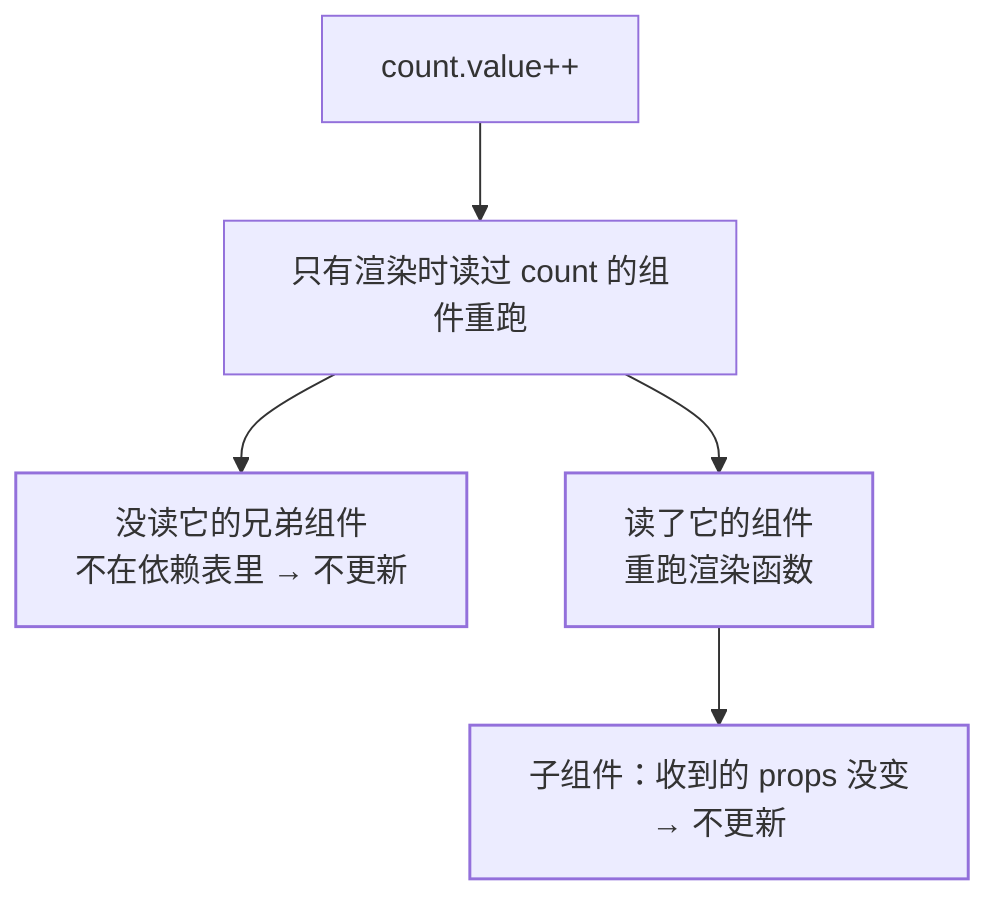
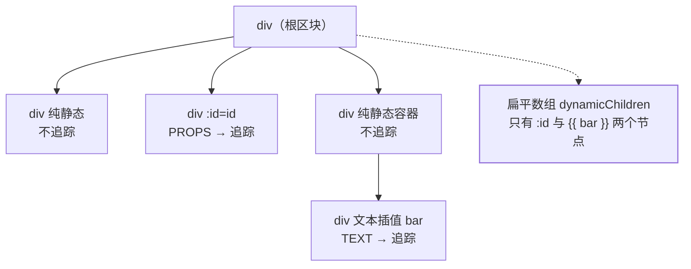

`basic` 层已经把「改了数据为什么会更新」讲清了：Proxy 劫持读写、渲染时收集
依赖、修改时按表通知（见[响应式系统](/vue/basic/core/01-reactivity/)）。但那只
回答了**谁会被通知**，没回答面试官紧接着问的那句——**通知之后，框架到底重做了
多少工作**。Vue 3 的性能故事有一半不在响应式上，而在编译器：它能把「模板里
哪里会变」提前算好、写进生成的代码，让运行时只干必要的事。这一篇就把这笔账
从「一次赋值」一路算到「一次 DOM 更新」。

## 先拆成本：一次更新要过三道闸

改一个响应式数据之后，工作依次落在三段上，每段都可能被收窄：

| 成本段        | 做什么                    | Vue 的收窄手段        |
| ---------- | ---------------------- | ----------------- |
| ① 谁重渲染      | 跑哪些组件的渲染函数            | 组件级依赖追踪 + props 稳定性 |
| ② 重渲染时 diff | 创建 vnode、比对新旧树         | 编译期三条 hint        |
| ③ 落到 DOM     | 改属性、增删节点               | 按标记只改对应的那一项       |


三段是相乘关系，不是相加：组件跑得快但整棵子树都在 diff，成本照样高；diff 很省
但每个节点都全量比属性，也省不到点上。下面逐段看。

## 第一段：谁跟着重渲染

官方对依赖追踪的描述只有两句，但它们决定了粒度：

> "When a component is rendered for the first time, Vue **tracks** every ref
> that was used during the render. Later on, when a ref is mutated, it will
> **trigger** a re-render for components that are tracking it."
> —— 首次渲染时记录这个组件读了哪些 ref；ref 被改时，只让**正在追踪它的组件**
> 重渲染。

主语是 component，不是 application。所以「Vue 精准更新」这句话的准确版本是
**以组件为最小单位**：同一个父组件里没读这个 ref 的部分不会单独更新，它要么整个
组件重跑、要么不跑。理解到这一层，就能预判两类实际会发生的事：



- **同组件内多次修改只更新一次**：官方把这条写得很明确——DOM 更新不是同步
  应用的，*Vue buffers them until the "next tick" in the update cycle to
  ensure that **each component updates only once** no matter how many state
  changes you have made.* 所以一次事件里连着改三个 ref，不会让组件跑三遍。
- **子组件的闸门是 props**：*In Vue, a child component only updates when at
  least one of its received props has changed.* 官方给的反例正是长列表最常见的
  写法——把 `activeId` 原样传给每一行，让每行自己判断 `item.id === activeId`：
  于是 `activeId` 一变，**每一行都收到新 props、每一行都更新**。把比较挪到父级、
  只传一个 `active` 布尔值，绝大多数行收到的 props 就没变，自然不更新。官方把这
  条总结成一句通用原则：*keep the props passed to child components as stable
  as possible.*
- **computed 从 3.4 起只在值真的变了才触发**：*In Vue 3.4 and above, a
  computed property will only trigger effects when its computed value has
  changed from the previous one.* 所以 `const isEven = computed(() => count.value
  % 2 === 0)` 在 `count` 从 0 变 2、再变 4 时不会重复通知订阅者——依赖它的应用
  不用自己做等值判断。

**这一段的结论**：Vue 通常不需要像 React 那样手工给组件套 `memo`，因为「谁读了
什么」是运行时记录下来的事实，不是需要开发者声明的假设。React 那边要靠
[重渲染传播与 memo 三件套](/react/basic/core/04-rerender-perf/)把边界画出来，
差别就来自这里。

## 第二段：虚拟 DOM 的账为什么要编译器来还

虚拟 DOM 本身是通病，官方没有回避：

> "In addition, even if a part of the tree never changes, new vnodes are
> always created for them on each re-render, resulting in unnecessary memory
> pressure."
> —— 哪怕某部分树永远不变，每次重渲染都要为它创建新 vnode，白白制造内存压力。

同一页把它称为虚拟 DOM 最被诟病的一点：*the somewhat brute-force reconciliation
process sacrifices efficiency in return for declarativeness and correctness.*
（ somewhat 暴力的协调过程，用效率换声明式写法和正确性。）而 React 这类实现做不
了更好，是结构原因而非能力原因：

> "The virtual DOM implementation in React and most other virtual-DOM
> implementations are purely runtime: the reconciliation algorithm cannot make
> any assumptions about the incoming virtual DOM tree, so it has to fully
> traverse the tree and diff the props of every vnode in order to ensure
> correctness."
> —— 纯运行时的实现对传入的虚拟树做不了任何假设，为保证正确性只能遍历整棵树、
> 比对每个 vnode 的属性。

Vue 的出路是把编译器和运行时绑在一起：*In Vue, the framework controls both the
compiler and the runtime. This allows us to implement many compile-time
optimizations that only a tightly-coupled renderer can take advantage of. The
compiler can statically analyze the template and leave hints in the generated
code so that the runtime can take shortcuts whenever possible.* 官方给这个混合
方案起的名字是 **Compiler-Informed Virtual DOM**（带编译时信息的虚拟 DOM）。

前提条件是**用模板**：*Templates are easier to statically analyze due to their
more deterministic syntax.*（模板语法确定性强，因此更容易做静态分析。）这就是
「为什么官方默认推荐模板而不是渲染函数」的第二个理由——第一个理由是更贴近 HTML。

## 三条 hint 之一：缓存静态内容

模板里常有完全不含动态绑定的部分：

```vue
<div>
  <div>foo</div> <!-- cached -->
  <div>bar</div> <!-- cached -->
  <div>{{ dynamic }}</div>
</div>
```

官方描述的行为是：**渲染器在首次渲染时就把这些 vnode 创建并缓存起来，后续每次
重渲染复用同一批 vnode**；而且——这是关键——*The renderer is also able to
completely skip diffing them when it notices the old vnode and the new vnode
are the same one.* 新旧是**同一个对象**，比对整段跳过。缓存命中的节点还会带一个
`CACHED` 标记，按源码注释，它同时是给 hydration 的信号：静态内容永远不需要更新，
整棵子树直接跳过。

再往前一步：*when there are enough consecutive static elements, they will be
condensed into a single "static vnode" that contains the plain HTML string for
all these nodes*，这些静态 vnode 的挂载方式是**直接设置 `innerHTML`**。一大段
静态结构从「逐个创建 vnode 再逐个挂载」塌缩成「一次 innerHTML」，② 和 ③ 两段
成本同时被削掉。

## 三条 hint 之二：更新类型标记（Patch Flags）

动态部分不缓存，但要告诉运行时**它动态在哪**。官方给的生成代码长这样：

```js
// 模板：<div :class="{ active: isActive }"></div>
createElementVNode("div", {
  class: _normalizeClass({ active: _ctx.active })
}, null, 2 /* CLASS */)
```

最后一个参数就是 patch flag。一个元素可以有多个标记，**按位或合并成一个数字**，
运行时按位与来判断要不要做事：

```js
if (vnode.patchFlag & PatchFlags.CLASS /* 2 */) {
  // 只需要更新元素的 class
}
```

官方对这一步的评价很直白：*Bitwise checks are extremely fast.* 常用标记与取值
（取自 `vuejs/core` 源码 `packages/shared/src/patchFlags.ts`）：

| 标记                | 值    | 什么时候出现                       |
| ----------------- | ---- | ---------------------------- |
| `TEXT`            | 1    | 动态文本插值，children 走快速路径         |
| `CLASS`           | 2    | 动态 class 绑定                  |
| `STYLE`           | 4    | 动态 style（静态字符串样式会被预编译成静态对象）  |
| `PROPS`           | 8    | class/style 之外的动态 props      |
| `FULL_PROPS`      | 16   | props 的**键**本身是动态的           |
| `STABLE_FRAGMENT` | 64   | 子节点顺序不变的 fragment            |
| `UNKEYED_FRAGMENT`| 256  | 无 key 的 `v-for` 子节点          |
| `DYNAMIC_SLOTS`   | 1024 | 组件的插槽内容是动态的                 |
| `CACHED`          | −1   | 被缓存的静态 vnode                 |
| `BAIL`            | −2   | 退出优化模式，回到全量 diff             |

这张表的价值在**边界**那一列，而不在数字：

- 带 `PROPS` 的 vnode 还会额外挂一个 `dynamicProps` 数组，里面是**可能变的键名**，
  运行时按这份名单去比，不用操心被删掉的键——这是②③段省下来 micro 账。
- `FULL_PROPS` 与 `CLASS`/`STYLE`/`PROPS` **互斥**：键不确定时只能退回全量比对，
  否则删不掉旧键。动态属性名（`v-bind` 一个键会变的对象）就是这条的触发场景。
- `DYNAMIC_SLOTS` 的注释写明「带此标记的组件**总是被强制更新**」。上一段那条
  「props 没变就不更新」在这里失效：插槽内容里读了外层的响应式数据，父组件一重跑，
  带动态插槽的子组件就被拖着更新。这是「我明明没改 props 为什么它还渲染」的常见答案。

## 三条 hint 之三：树结构打平（Block Tree）

缓存与标记都解决了「单个节点」，但遍历本身还是整棵树。第三步是把树**拍扁**，
让每次 patch 只走需要走的那几个节点。官方给的生成代码根节点用的是特殊调用：

```js
export function render() {
  return (_openBlock(), _createElementBlock(_Fragment, null, [
    /* children */
  ], 64 /* STABLE_FRAGMENT */))
}
```

一个 **block（区块）**概念上是「模板中内部结构稳定的部分」；不含 `v-if`、`v-for`
这类结构指令的模板，整体就是一个 block。每个 block 会记录**所有带 patch flag 的
后代节点（不只是直接子节点）**：



于是官方的结论成立：*When this component needs to re-render, it only needs to
traverse the flattened tree instead of the full tree.* 静态部分被整体跳过。
`v-if` 和 `v-for` 会产生新的 block 节点，子 block 被记进父 block 的动态后代数组里，
从而让父 block 的结构保持稳定——结构会变的部分单独成块，是「稳定」这个词的代价。

这套 hint 在 SSR 上也照收：官方「对 SSR 激活的影响」一节两条——单个元素的激活可以
按 vnode 的更新类型标记走更快路径；激活时只需遍历区块节点及其动态子节点，*effectively
achieving partial hydration at the template level*（在模板层面实现部分激活）。

## 三条 hint 什么时候不生效

优化全部来自编译期的静态分析，所以**编译器没参与的地方就没有 hint**：

- **手写渲染函数 / JSX**：官方承认模板编译可以跳过，直接写 render function
  换来的是 JavaScript 的全部表达能力，代价正是失去静态分析——`BAIL` 注释里点名的
  「非编译器生成的插槽（即手写渲染函数）**应当始终全量 diff**」就是这条的实现。
- **结构不稳定的模板**：`v-if`/`v-for` 越碎，动态后代越多，打平的收益越薄；这类
  内容不会因为「看起来差不多」而被缓存。
- **动态键与动态插槽**：`FULL_PROPS`、`DYNAMIC_SLOTS` 都是把「我说不清哪里会变」
  如实交给运行时的信号，退化成保守路径。

## 第三段之外：v-once、v-memo 与浅层响应

编译期已经做了大部分工作，官方留的两个手动开关因此定位很窄。**`v-once`**：
*Render the element and component once only, and skip future updates.* 后续
重渲染时该元素及其所有子节点被当作静态内容跳过——它适合「依赖运行时数据但从此
不再变」的内容。**`v-memo`**：条件性地跳过一棵子树的更新，官方原文给了三条
必须一起读的前提：

- 数组必须**写对**，否则会跳过本该发生的更新；`v-memo="[]"` 在功能上等价于
  `v-once`。
- 它*is provided solely for micro optimizations in performance-critical
  scenarios and **should be rarely needed***（只为性能关键场景的微优化提供，
  平时不该需要它）。官方给的典型场景是 `length > 1000` 的 `v-for`：状态一变，
  即使绝大多数项没变也会创建大量 vnode，`v-memo="[item.id === selected]"` 让未
  受影响的项复用上一份 vnode 并整段跳过比对——依赖数组里不用写 `item.id`，Vue
  会从 `:key` 自动推断。
- 与 `v-for` **必须在同一个元素上**，官方以警告形式写明：*v-memo does not work
  inside v-for.*（写在 `v-for` 内部不生效。）

最后一个常被漏掉的账是**响应式本身**：Vue 的深度响应是默认行为，官方说它直观但
有代价——*because every property access triggers proxy traps that perform
dependency tracking*，当一次渲染要访问十万级嵌套属性时才明显。逃生阀是
`shallowRef()` / `shallowReactive()`：只有根层级是响应式的，嵌套对象原样暴露，
代价是嵌套对象必须当成不可变来对待——`shallowArray.value.push(x)` 不会触发更新，
`shallowArray.value = [...shallowArray.value, x]` 才会。

## 面试答法

- **「Vue 3 性能比 React 好，是因为没有虚拟 DOM？」** 前提就错了：Vue 一样有虚拟
  DOM 和 diff。差别在于 React 的对齐算法是纯运行时的，不能对传入的树做任何假设，
  只能全量遍历；Vue 同时掌握编译器和运行时，能静态分析模板、在生成代码里留下
  hint，让运行时走捷径。
- **「缓存静态内容、Patch Flags、Block Tree 各解决什么？」** 分别收窄三段成本：
  静态 vnode 首次创建后复用、新旧同一对象即整段跳过比对；标记告诉运行时这个节点
  动态在哪，按位判断只改对应属性；block 把所有带标记的后代拉平成数组，重渲染只遍历
  打平后的树而不是整棵树。
- **「为什么 Vue 组件一般不用写 memo？」** 因为依赖关系是渲染时记录下来的事实，
  没读这个数据的组件不会收到通知；子组件还有一道 props 闸门。React 需要 `memo`
  是因为重渲染是「重新执行函数」，边界得由开发者声明。
- **「列表选中一个项，为什么所有行都重渲染了？」** 优先怀疑 props 稳定性：把
  `activeId` 原样透传给每行，每行都收到新 props。把比较挪到父组件、只传
  `active` 布尔值。若行组件用了动态插槽，还要记得 `DYNAMIC_SLOTS` 会强制更新。
- **「v-memo 该不该用？」** 默认不用。官方把它定位成性能关键场景的微优化，典型
  是长度大于 1000 的 `v-for`；依赖数组写错会漏更新，且必须和 `v-for` 同元素。

## 要点备忘

- 一次更新的账分三段：谁重渲染 → diff 走多少节点 → 每个节点改什么，三段相乘
- 依赖追踪以**组件**为最小单位；同一次事件里改多个 ref 也只更新一次
- 子组件的闸门是 props 稳定性：能传布尔就别传 id 让每行自己算
- computed 在 3.4+ 只在返回值变化时才触发订阅者的 effect
- 编译器留三条 hint：缓存静态内容、更新类型标记、树结构打平
- 静态 vnode 复用靠「新旧是同一个对象」跳过比对，够多连续静态还会合成一次
  `innerHTML` 挂载
- `FULL_PROPS` 意味着动态键、`DYNAMIC_SLOTS` 意味着强制更新——两者都是退化信号
- 手写渲染函数拿不到 hint，官方源码里对应 `BAIL`（全量 diff）
- `v-once` 用于「用了运行时数据但永不再变」，`v-memo` 是大列表的微优化且要写对数组
- 大对象响应式本身的成本用 `shallowRef` / `shallowReactive` 换，代价是嵌套不可变

## 延伸阅读

- [Vue 官方文档 · 渲染机制](https://cn.vuejs.org/guide/extras/rendering-mechanism.html)
- [Vue 官方文档 · 响应式基础（依赖追踪与更新时机）](https://cn.vuejs.org/guide/essentials/reactivity-fundamentals.html)
- [Vue 官方文档 · 性能最佳实践](https://cn.vuejs.org/guide/best-practices/performance.html)
- [Vue 官方文档 · 内置指令 v-memo / v-once](https://cn.vuejs.org/api/built-in-directives.html)
- [vuejs/core · PatchFlags 定义（含各标记的注释）](https://github.com/vuejs/core/blob/main/packages/shared/src/patchFlags.ts)
- 站内对照：[响应式系统](/vue/basic/core/01-reactivity/)、
  [重渲染传播与 memo 三件套](/react/basic/core/04-rerender-perf/)
